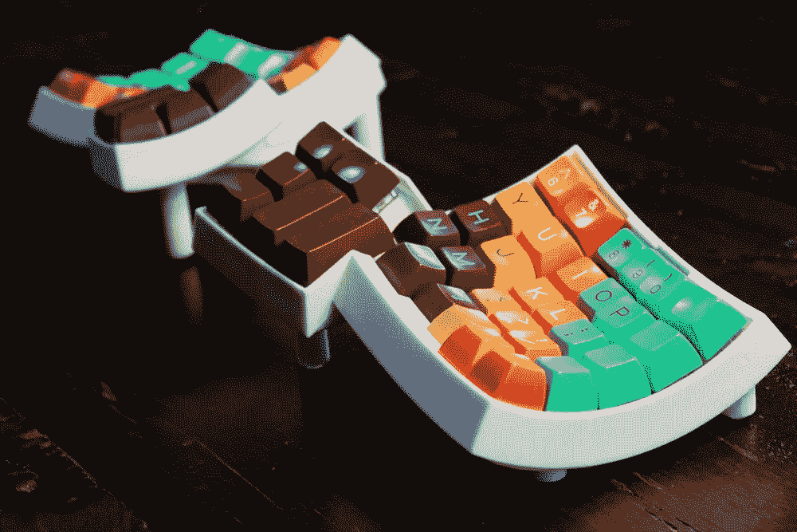
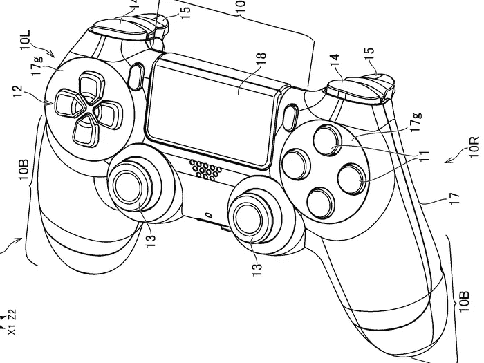
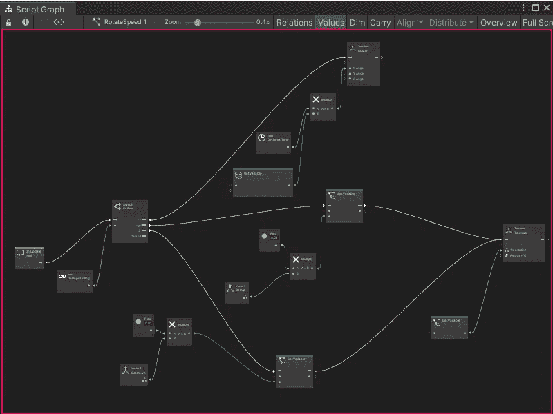
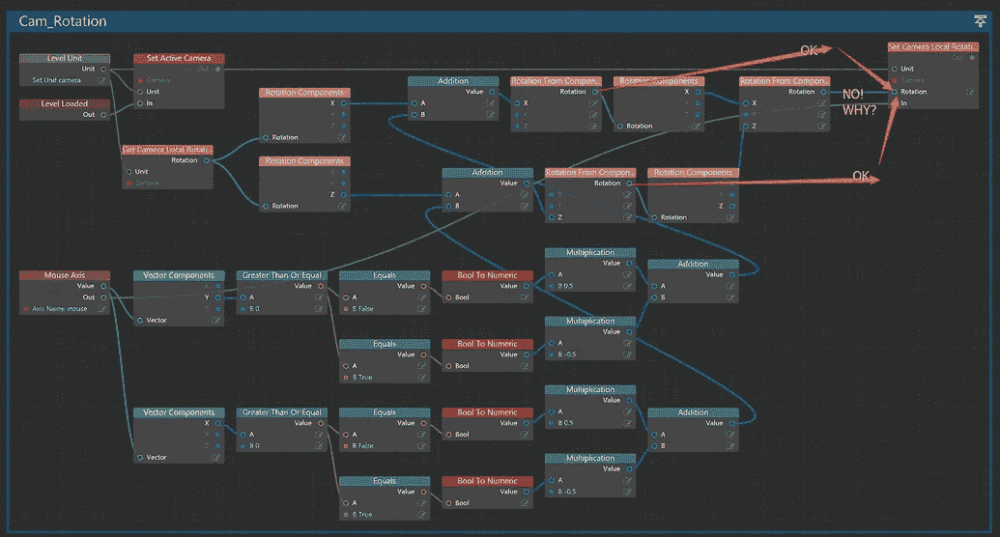
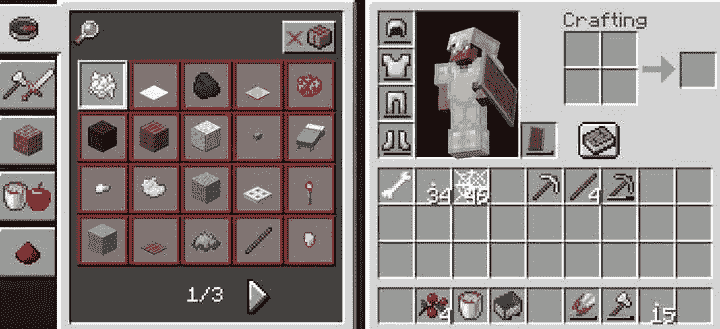
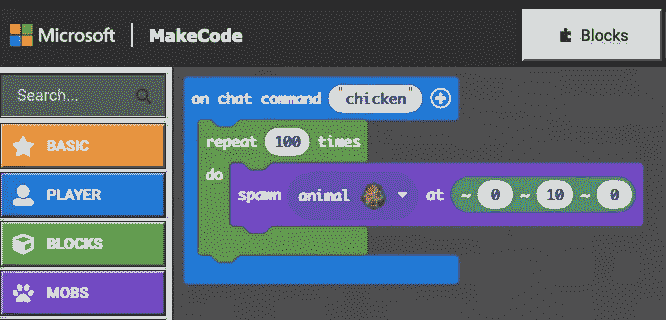
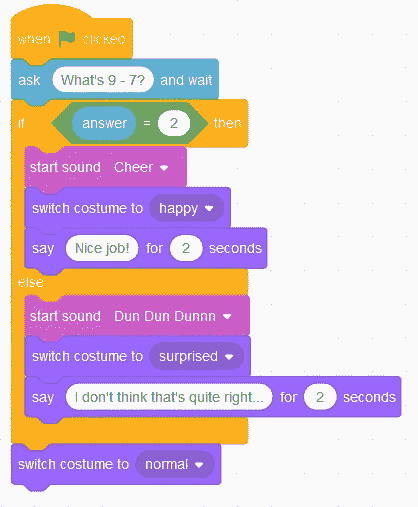
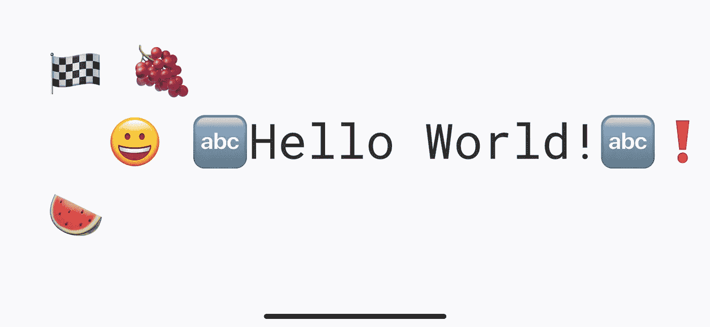

# 如果我们用游戏控制器来编写软件会怎么样？

> 原文：<https://medium.com/codex/what-if-we-used-game-controllers-to-program-software-f3731b874b6c?source=collection_archive---------28----------------------->

这对工具和语言设计会有什么影响？

昨天一位 redditor 提出了这个问题。乍一看，这似乎很荒谬:我们大多数人用看起来像英语或受英语启发的数学的语言编程。使用按钮数量有限的游戏控制器无法取代字母键盘。

[Dactyl](https://github.com/adereth/dactyl-keyboard) ，一个符合人体工程学的直形键盘，带有用于字母表中所有字母、数字、符号和一些控制信号的按钮。

# 但是一定要这样吗？

电脑不会用英语思考。CPU 被赋予一个广泛而有限的指令集，其中包含长度从 1 到 9 个字母的“单词”。例如，AArch64 (ARM64) CPU 的[指令集文档长达 4000 页，但描述了大约 400 条指令。](https://documentation-service.arm.com/static/6245e8f0f7d10f7540e0c054)

尽管其中一些指令最初看起来像英语(“MOV”:移动)，但许多是缩写、首字母缩略词或代码，与英语没有明显的联系。

[索尼 PS4 Dualshock 游戏手柄的专利艺术](https://patentscope.wipo.int/search/en/detail.jsf?docId=WO2019244995&tab=FULLTEXT)。

索尼为 Playstation 4 开发的标准游戏控制器有 17 个按钮，一个动作就可以按下，其中两个是具有无限方向的操纵杆，增加了大量选项，其中一个是高清触摸板。仅通过字长，人们可以编写 ARM64 指令集中的每条指令，而无需两次点击一个按钮。

(从技术上讲，只要任何指令包含重复的字母，这就不再是真的。)

# 但是指令集不是编程语言。

大多数软件开发人员不使用原始 CPU 指令编程。CPU 指令由创建编译器的专业程序员使用:编译器是将我们选择的编程语言转换成 CPU 指令的特殊程序。

我们大多数人使用的编程语言类似于我们的口语:这使得对程序进行推理变得容易。我们中的一些人使用深奥的语言，如 [brainfuck](https://en.m.wikipedia.org/wiki/Brainfuck) ，故意让这变得困难。

它只有 8 个命令:>

最容易推理的编程范例使用了遵循为其编写程序的知识领域的词语。这就是所谓的领域驱动编程，使用特定于领域的语言。一个很好的例子是为测试、构建和部署应用程序而设计的 [gradle](https://en.m.wikipedia.org/wiki/Gradle) DSL。

现在突然之间，我们面对的不再是一组有限的指令——我们可以使用任何已知的单词，甚至更多。一个控制器上的 17 个按钮是不够的。

# 或者他们是？

[说英语的人平均认识 20，000 到 30，000 个单词。](https://wordcounter.io/blog/how-many-words-does-the-average-person-know)17 个按钮组成了一大堆组合。17 个按下或不按下的按钮:这 17 个按钮中的每一个都有 2 个选项，这样 2 个⁷ = 131，072 个选项。我们甚至没有考虑到有着近乎无限可能性的 3 个旋钮。这是很多组合。

对吗？

不对。

我们不能同时按下所有 17 个按钮。我们这些有两只手和 10 个手指的人仍然必须抓住控制器。每侧(左侧或右侧)的 6 个按钮由同一个拇指操作，每只手剩下 2 个手指来操作另外 2 个按钮。这将我们的选择减少到(3 * 6)，只有 1156 种可能的组合。

这涵盖了 ARM64 CPU 指令集中的 400 条指令，但还不包括需要快速、毫不犹豫地被不熟悉编程语言但熟悉知识领域的人理解的 DSL。

因此:言语无法解决问题。

> 使用游戏控制器将迫使我们使用一种不同于书面语的符号，这种符号看起来像我们的口语。

# 不同的象征意义？比如什么？

喜欢 Unity 游戏开发框架中可用的[可视化编程工具？](https://docs.unity3d.com/Packages/com.unity.visualscripting@1.7/manual/vs-interface-overview.html)

Unity 游戏开发框架中的可视化脚本图。([形象信用](https://docs.unity3d.com/Packages/com.unity.visualscripting@1.7/manual/vs-interface-overview.html))。)

还是虚幻游戏开发框架中[可视化编程的方式？](https://docs.unity3d.com/Packages/com.unity.visualscripting@1.7/manual/vs-interface-overview.html)

游戏开发框架 Unity Engine 中的可视化蓝图。([形象信用](https://docs.unity3d.com/Packages/com.unity.visualscripting@1.7/manual/vs-interface-overview.html))。)

那些上面还有很多字，但是我们不用写那些了。我们从图书馆里挑选它们。智能的，只提供那些在图中任何给定节点有意义的选项。

但也许，更像是视频游戏[【《我的世界》】](https://www.minecraft.net/)中[制作](https://guides.gamepressure.com/minecraft/guide.asp?ID=51609)的方式，由 [Mojang](https://en.wikipedia.org/wiki/Mojang_Studios) AB 制作？

Mojang AB 在《我的世界》视频游戏中制作界面。([形象信用](https://guides.gamepressure.com/minecraft/guide.asp?ID=51609))。)

这个界面有一堆对建筑资源进行分类的标签，可以根据人们现在是否可以使用它们来过滤。切换标签发生在 2 个控制器按钮上，选择资源发生在运动操纵杆或触摸板上，放置资源发生在触发按钮上。如你所见:几乎没有任何文本。

组合的数量是无穷无尽的。上面的制作界面只显示了 4 个槽来放置制作资源，但是《我的世界》也提供了一个有 9 个槽的制作桌，以及一些其他的工具来将资源组合成其他的东西。有了可用的 319 种资源，如果不是因为根据游戏规则不能将所有这些组合在一起，那么将会有 319⁹ = 3.42e22(或 34 hexillion)种可能的组合。

# 34 Hexillion

是的，那就行了。如果你能想象出一种情况，其中 34 hexillion 的可能性不能涵盖所有你想做的软件编程，请评论！

全世界有数百万游戏玩家在使用《我的世界》的手工界面。它的设计和用户体验非常容易理解，作者认识的一个 8 岁的孩子可以在 15 分钟内学会如何使用它。

有趣的是，《我的世界》的当前所有者[微软已经实现了一种可视化编程语言，来创建 MakeCode](https://minecraft.makecode.com/) :

用微软 MakeCode 制作的程序样本，作者 A.E.Veltstra，2022。

这种表现形式让人想起类似的语言，比如麻省理工学院的 Scratch:

麻省理工学院用 Scratch 创建的程序。([形象信用](https://junilearning.com/blog/guide/what-is-scratch-easy-coding-for-kids/))。)

这里存在一种视觉语言，它通过提供可识别的形状来指示堆栈、循环和条件分支，这是从软件设计中使用的流程图和其他图表中得知的原理。颜色区分不同类别的语句和命令。(对于色盲的人来说，这可能没什么用，除非这些界面有色盲模式。)

这里的许多单词仍然是以英语为背景的，希望也是世界上其他程序员的母语。数学使用符号运算符来克服口语的局限性。许多编程语言允许我们表达数学陈述:

f(x，a，b): y = 2x + ab + c

现在我们可能认为游戏和商业管理软件执行的许多操作不能用数学来表达。但是只要有点想象力，我们就能走得很远。

例如，将游戏状态存储到游戏的数据存储中的动作可以被表达为元素成为集合的成员。在[数学中，元素隶属度](https://en.wikipedia.org/wiki/Element_%28mathematics%29)可以这样表示:

x ∈ ℕ

但这句话描述的是事实，而不是意图。

为了从事实转变为意图，我们可以在∈前面加上:，从而产生:

x :∈ ℕ

这个前缀是从 Pascal 和 Algol 编程语言中借用的，这两种语言区分了表示事实或比较的=运算符(x = 2，x 等于 2，还是 x 等于 2？)和:=运算符来表示赋值(x := 2，x 变成 2)。

因此，可以在数据尚不存在的情况下存储数据，如下所示:

(x ∉ ℕ **)** ？x **:** ∈ ℕ

要删除它:

(x ∈ ℕ **)** ？x **:** ∉ ℕ

数学使用符号和符号运算符来克服交流的主要障碍:翻译当地语言。如果我们把它应用到编程中，也许只用一个游戏控制器就能开发出软件。

话又说回来，也许我们的源代码最终会看起来像表情符号:

 [## 表情代码

### 无论你有什么背景，表情代码都是一种简单易学的语言。我们的文档被认为是…

www.emojicode.org](https://www.emojicode.org/) 

# 关于作者

Veltstra 拥有超过 40 年的 IT 工具使用经验，以及超过 20 年的专业软件工程和架构经验。在那段时间里，Veltstra 有幸使用了广泛的输入设备和编程语言。

> 最好的语言不只是容易写；它也很容易阅读和理解。