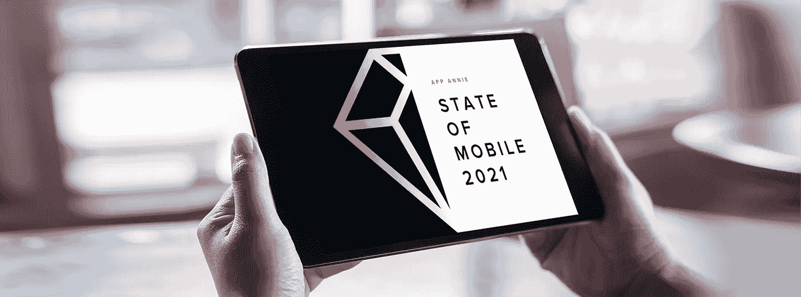
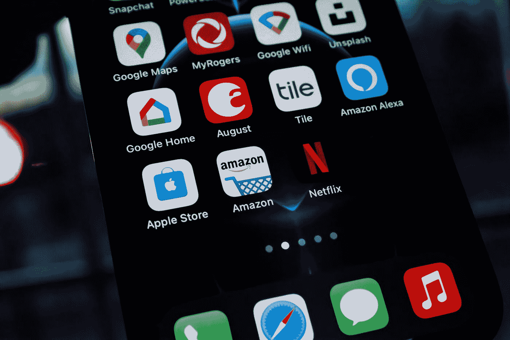

# 我将向我的客户介绍 2021 年的移动应用安妮状态

> 原文：<https://medium.com/codex/what-ill-be-telling-my-clients-about-the-app-annie-state-of-mobile-2021-d531f82e76eb?source=collection_archive---------7----------------------->

app Annie 2021 年移动状态

在过去的几年里，像应用行业的许多人一样，我一直在通过 App Annie 获取关于移动技术的新闻。特别是，我一直关注着他们著名的移动状态报告。在第一轮全国范围的锁定高峰期间，App Annie 发布了一些关于我们的移动行为如何变化的临时统计数据。

他们的最新数据揭示了 2020 年对我们日常行为的破坏程度，以及我们的手机如何越来越成为我们生活的中心。

# 但这不是我要和我的客户谈论的话题…

我们先把这个解决掉。App Annie 是一门生意。因此，虽然这是强大的数据，但你必须问他们为什么要放弃它。是营销。领导一代。对有点像 [Brewdog 让英国的每个人](https://www.thesun.co.uk/money/13706904/brewdog-free-beer-lost-lager/)在收集客户联系信息的同时要求免费啤酒。

是的，App Annie 现在有了我们的电子邮件地址，并且欢迎我们无休止地给他们发垃圾邮件，告诉他们有多聪明等等。他们报告的价值使它成为一个值得的交易。尽管我们更喜欢免费啤酒。

App Annie 和他们的见解的问题在于，他们并不倾向于抨击这个行业。我的意思是，这不是一个伟大的商业战略，是吗？显然，他们不会透露应用程序在哪些方面苦苦挣扎或节节败退。尤其是如果任何受影响的品牌也是他们的客户。

所以他们倾向于呈现一幅美好的画面。算了吧。这几乎是乌托邦。但是从字里行间可以看出一些有趣的细节。

以下是我将告诉我的客户的关于手机现状的严峻事实…

# 1.我们在应用程序上投入了更多的钱。那么为什么我们下载的越来越少了呢？

不要被大标题的支出数字所吸引。好吧，我们在应用上(和在应用中)花了 1430 亿美元。这是一个巨大的数字，同比增长 20%是不容小觑的。也就是说，在过去的几年里，我们一直在接近这些数字。是的，在过去的 12 个月里有一个突然的跳跃，但事实是我们在一年的大部分时间里都困在我们的休息室里。

靠近点看。我们花了更多的钱……但是没有下载更多的应用。我们的支出是通过正常渠道进行的。它没有被更均匀地分布。

# 2.风险资本正在涌入。暂时如此。

VC 是一只危险的野兽。一些创始人和初创企业将天使投资视为他们商业计划的全部。不要误解我。理论上 VC 没有错。他们支付工资，可以帮助企业发展。很快。

在过去的 12 个月里，投资总额已经达到了 730 亿美元。超过应用程序全年总收入的一半。

50%.

那是很多鸡蛋放在一个篮子里。现在，这笔钱花在哪里还没有详细的分类，但比上一年增加了四分之一。看看最近赢得播放时间的投资，相当数量的风险投资似乎都投在了处于成长阶段的初创企业或企业上。其中一大堆离盈利还有很长的路要走。或者可能永远不会盈利。

这不是一个可持续的模式。

手指会被烫伤。如果你的梦想是推出一家应用初创公司，吸引风险投资，在营销、增长黑客、墨西哥玉米卷和你豪华办公室的台球桌上烧钱——玩得开心。下一次当你回到手中的市值时，你可能会发现这些水龙头在收紧。

# 3.发现会杀死你的应用。

如果你正在开发一个 B2C 应用程序，你的想法有多棒或者你的应用程序有多独特和创新可能并不重要。

如果你建造了它，他们可能不会来。

已经有很多应用程序了。因此，如果你还没有一个固定的受众，你必须准备好花钱去建立一个。

看看这句来自谷歌应用管理总监的话。

> …应用应该专注于影响用户发现。我们调查的 37%的应用程序用户报告说，他们通过朋友或家人找到了一个新的应用程序……50%的用户只考虑知名应用程序。有凝聚力的品牌和声誉，结合无缝连接的用户体验，在竞争日益激烈的市场中继续推动新用户的获取。

一半的应用程序用户只会使用公认的品牌应用程序。近 40%的人通过口碑发现应用。没有多少回旋的余地，不是吗？

当谷歌应用程序的终极冠军承认这是一个竞争日益激烈的市场时，你知道事情很艰难。

让我给你翻译一下。实际上说的是，即使有一个客户会喜欢的非常出色的应用程序，你也需要很好的声誉和品牌意识(也就是营销支出)才有机会让客户使用你的应用程序。即使你做到了…这仍然非常困难，因为市场竞争非常激烈。

这就是为什么我的公司很少采用收入分成模式。除非你的应用程序背后有一些严肃的营销预算(以及一流的营销团队或数字机构非常明智地花费这些预算)，否则以目前的市场方式，扩展将是一个巨大的挑战。

当然，我们会为你建立一个基于未来收入的应用程序。前提是你每年要花 100 万美元来培养你的观众。

# 4.2020 年出现了前所未有的增长。这只是暂时现象。是的——一个巨大的他妈的光点。仍然是一个亮点。

谁知道(呃)“新常态”会是什么样子。有一点很明显，2020 年应用的增长是由疫情推动的。如果来自病毒的威胁开始消散，那么这种增长将很可能被证明是一次性的(希望如此)事件驱动的高峰。它将我们弹射到我们在 2-3 年内将有机到达的地方，并将不可避免地通过一些长尾理论来提升一些观众。

如果你的商业模式期望在更长的时期内保持这样的增长率…你在孤注一掷中冒了很大的风险。

事实上，我的团队认为(现在是水晶球时间),如果事情恢复正常越早越好，我们实际上可以看到一个应用程序的“衰退”,因为我们的观众接受了他们错过的东西。去更多的餐馆。剧院。电影院。和其他人一起出去玩。

你知道的。我们认为理所当然的有趣的事情，直到我们不能再做了。期待所有数字排毒运动之母。

毕竟，一旦酒吧重新开张，我们真的还会在周五晚上进行每周一次的变焦测试吗？

# 5.你的应用不会让你成为亿万富翁。甚至是百万富翁。

当然，App Annie 描绘了一幅性感的画面。超过 25%的应用程序发行商年收入超过 200 万美元。哇！太棒了。对吗？应用程序是新的石油。我要发大财了。移过麝香。杰夫，高尔夫俱乐部见。

没有。

靠近点看。97%的应用发行商收入低于 100 万美元。

App Annie 在这一点上做了一个狡猾的诱饵，并将其作为一个机会，跳上苹果最终推出的小企业计划。很棒的东西。现在你可以把付给他们的佣金减半了 App Annie 掩盖的事实是，93%的 iOS 出版商年收入不到 10 万美元。

他们不会再往下钻了，因为收益回报会大幅下降。

当你意识到 7%的巨额现金可能包括来自同一家公司或企业集团的多个应用程序时，情况会变得更糟。

形势对你不利。

# 6.美国英国人不是早期采用者。我们真的对天气很着迷。

鉴于(相对)较低的下载率增长，这并不完全令人惊讶。App Annie 根据英国人口统计划分的最可能使用的应用程序是……礼貌地说，这相当保守。X 一代/婴儿潮一代在他们最常用的五个应用程序中列出了两个而不是一个天气应用程序。还有 BBC 新闻应用和 BBC 声音。和 Adobe reader。然后你有千禧年摇摆哈利法克斯应用程序和贝宝？哎哟。

我们是一个很难打开的市场。

考虑到疫情支持的网上商店报告的巨额利润，或许更令人惊讶的是，在使用我们的手机购物和消费方面，英国落后于我们的一些欧洲竞争对手。我们甚至落后于德国，这有点令人难以置信，因为德国人喜欢冰冷的硬通货。我还没有在柏林找到一家接受信用卡的小型独立咖啡店(好吧，有点夸张，但你明白我的意思)。

这对应用程序客户端意味着什么？你只需要让人们尽可能不费力地用手机购物。这意味着你必须提供多种支付方式。贝宝。Google Pay。Apple Pay。和客人结账。出于对美好事物的热爱，为客人提供结账服务。

哦，如果你的计划是先征服伦敦，然后在全国其他地方推广……不要！每个人都尝试过。伦敦就像一个新的国家发射。是的，这是一个巨大的机会。但如果你想避开这种噪音，为什么不先看看 M25 号公路的外面；伦敦哪儿也不会去。

# 7.金融科技泡沫将继续增长。但监管方面的担忧可能会开始产生影响。

金融科技已经成为初创企业圈子里的时髦词汇好几年了。它吸引了大量的风险投资。我们甚至看到其他行业的一些初创企业，特别是共享经济中的初创企业，将自己重新定位为金融科技。在一年后，我们实际上有时间真正挖掘我们的投资(或缺乏投资)，但无法去银行，金融科技应用已经获得了自己的地位。最近对 Robinhood 和 Gamestop 的狂热将投资和股票应用推到了聚光灯下，但 challenger 和移动银行继续从传统的商业街银行吞噬市场份额。

也就是说，乌云可能即将来临。由于监管问题，传统银行最近对金融科技初创企业的几次收购都以失败告终。这会开始打击投资者的信心吗？

# 8.Tiktok 会留在这里。

不管前游戏节目主持人怎么说。它太大了，不能倒。和老男孩俱乐部(基督…脸书现在在老男孩俱乐部吗？)跟不上。不管他们在 Instagram 上加什么。

# 9.你想要一块外卖馅饼吗？艰难。你不能有一个。

仅仅在今年的前几周，我们已经有十几个客户就开发一款送餐应用与我们接洽。我们都拒绝了。如果你唯一的 USP 是收取比 JustEat 或 Deliveroo 更低的佣金，你将无法与老牌玩家竞争。当然，你可能有几个客户和几个顾客。但你不会打破市场主导地位。我们也不会给你开发一个应用来尝试。

实际上，严格来说那不是真的。JustEat 在 2019 年花了€1.53 亿英镑做广告。因此，如果你的营销预算在这个范围内，那么我们将为你开发一个应用程序。

听着，我知道过去的一年对于酒店行业的老板来说一定是难以置信的艰难。当你被迫关门时，JustEat 突然出现，然后吃掉你相当一部分利润，这种感觉会非常痛苦。我们向潜在客户解释的是，食品配送应用收取的佣金实际上是他们的广告费。

他们本身并不从事送餐业务。他们的工作是寻找可能想品尝美味咖喱的顾客。这又回到了可发现性。

我说过，同样的可发现性会扼杀你的 B2C 应用。只是吃，送，超级吃可以为这种发现买单。你不能。抱歉。

# 10.当地的经历和旅行将引导我们进入新常态。

这一个都是我送的。

我们想收拾行李，前往某个温暖的海滩。但是离开这个疫情的路线将意味着异国情调的喷气式飞机度假在更长一段时间内被排除在菜单之外。

这为利基、超本地应用程序产品留下了市场空白，这些产品旨在让人们以新的方式参与当地环境或社区。2020 年为数不多的一线希望之一是，我们都有更多的时间呆在自己的地方。探索我们以前从未探索过的城镇和城市，并在这些地区获得更强烈的公民自豪感。

我们已经在开发一个应用程序，它将在我们总部所在的城镇提供无接触、无接触的旅游体验。这款应用将有助于支持当地企业，并让人们深入了解我们镇上人迹罕至的地方。

类似的徒步旅行、户外探险和体验应用肯定会接踵而至。只要看看地理缓存应用在过去一年的表现就知道了。

无论一年后的应用程序世界是什么样子，我们仍然会为优秀的企业开发应用程序。

Thom Gibbons 是位于英国贝辛斯托克的应用开发机构 [Apptaura](https://www.apptaura.com) 的首席执行官。Apptaura 致力于通过为出色的企业和热情的客户开发出色的应用程序来改善世界。没有行话。没有公牛。只是很棒的应用程序。