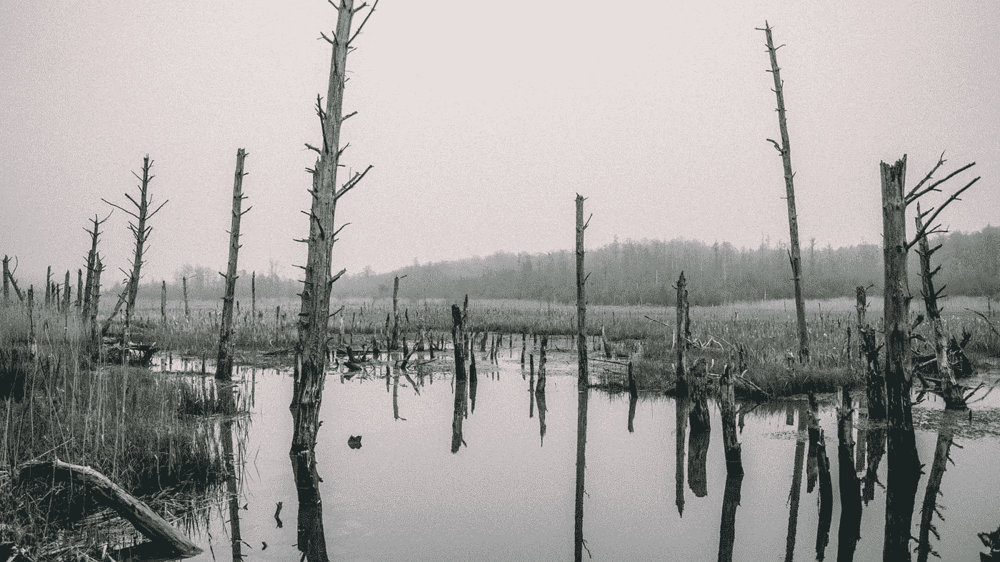

# 什么是数据沼泽？

> 原文：<https://medium.com/codex/what-is-a-data-swamp-38b1aed54dc6?source=collection_archive---------3----------------------->

## 如何让您的数据淹没在数据湖中

## 你应该避免它的原因

马克·兰德曼在 [Unsplash](https://unsplash.com/s/photos/swamp?utm_source=unsplash&utm_medium=referral&utm_content=creditCopyText) 上的照片

根据定义，数据沼泽是一个不受管理的数据湖，它要么是预期用户无法访问的，要么提供的价值很小。当没有实现足够的数据质量和数据治理措施时，就会出现数据沼泽。有时数据沼泽也可能来自数据…