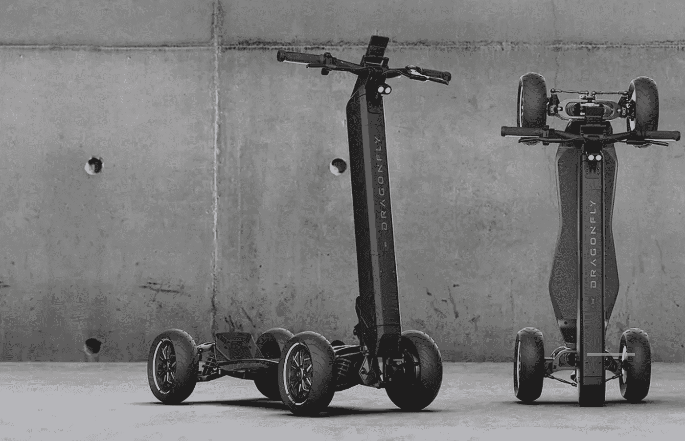

# 什么是超级电容器，你需要一个吗？

> 原文：<https://medium.com/codex/what-is-a-hyperscooter-and-do-you-need-one-c8c9b4db87c0?source=collection_archive---------16----------------------->

## D-Fly 集团的制造商相信你有！

[蜻蜓(媒体通过 D-Fly)](https://static.wixstatic.com/media/012316_4868c7ef4caf4300b5d0c88b94a0c4d7~mv2.jpg/v1/fill/w_3456,h_1600,al_c,q_90,usm_0.66_1.00_0.01,enc_auto/012316_4868c7ef4caf4300b5d0c88b94a0c4d7~mv2.jpg)

滑板车不再只是孩子们的专利！电动滑板车风靡全球，提供了一种既环保又有趣的方式在城镇中穿行。但是到底什么是“超级傻瓜”呢？你为什么要考虑买一个呢？在更早的一篇文章中，我写了关于 Kaabo 狼王 GT Pro(如下)，我会分类…