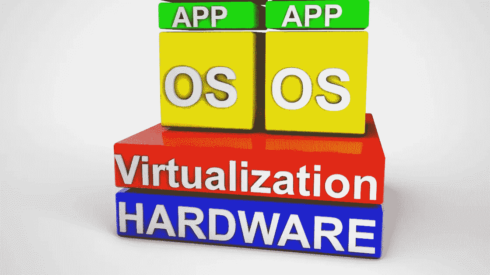

# 什么是虚拟机管理程序？

> 原文：<https://medium.com/codex/what-is-a-hypervisor-e7a847647883?source=collection_archive---------3----------------------->

虚拟化

虚拟机管理程序是创建和运行虚拟机(VM)的软件。使用虚拟机管理程序的好处在于，它可以安装在任何规模的系统上，从单用户机器到运行几十台机器的服务器群。虚拟机管理程序充当虚拟机和操作系统之间的中介，因此您可以同时运行许多虚拟机。

纯硬件虚拟化的想法来自英特尔，该公司于 1990 年申请了这一概念的专利。

术语“hypervisor”本身是由 IBM 在 2000 年引入的，尽管他们的 VTAM 早在 1974 年就已经这样做了。它提供了与今天的虚拟机非常相似的功能。

管理程序直接位于硬件上，就在主机操作系统的下面，负责硬件分区的创建、执行、管理和分配。

虚拟机管理程序允许在底层硬件之上构建虚拟环境或虚拟机。

虚拟机管理程序可以是独立的(意味着它们不需要额外的操作系统)，也可以是托管的(意味着它们运行在操作系统之上)。如果虚拟机管理程序是独立的，这意味着它不需要另一个操作系统来运行。

# 为什么要使用虚拟机管理程序？

虚拟机(VM)为 IT 管理员提供了一种利用系统可用资源和移动性的方式。由于来宾虚拟机独立于主机硬件，因此虚拟机管理程序可以使用更多的系统可用资源，并提供更高的 it 移动性。这意味着它们可以很容易地在不同的服务器之间移动。

虚拟机管理程序减少了空间、能源和维护需求。多个虚拟机可以在一台具有虚拟机管理程序的物理服务器上运行，从而减少空间、能源和维护需求。

据《连线》报道，“任何拥有移动计算机的公司，例如金融业，都可以通过使用虚拟机管理程序来节省成本。”

## 虚拟机管理程序的类型

有各种类型的虚拟机管理程序。第 1 类虚拟机管理程序有能力管理其他操作系统。这些虚拟机管理程序通常位于服务器中，它们通常需要裸机。相比之下，第 2 类虚拟机管理程序运行在另一个操作系统之上。这些虚拟机管理程序可以在大多数家用计算机上找到。

裸机虚拟机管理程序也称为本机虚拟机管理程序，因为它们直接在物理硬件上运行。这些虚拟机管理程序没有应用程序层，这使它们成为所有可能的虚拟机管理程序中最快、最轻量级的。它们还提供了对系统硬件的最直接的访问，这为开发人员提供了一个更熟悉的环境。

但是，裸机虚拟机管理程序不提供任何形式的抽象，并且限制了组织可以运行的虚拟机数量。但是，当好处大于限制时，所有其他类型的虚拟机管理程序相比之下就相形见绌了。

托管的虚拟机管理程序运行在主机的操作系统(OS)之上。尽管托管的虚拟机管理程序在操作系统中运行，但是可以在虚拟机管理程序之上安装其他(不同的)操作系统。

托管的虚拟机管理程序在主机的操作系统中运行，允许您从头开始创建整个虚拟机。这提供了几个不同的优点。首先，您可以从 VMWare 网站下载新的操作系统，并将其安装为虚拟机。但是，唯一的缺点是托管虚拟机管理程序支持的虚拟机资源不如非托管虚拟机管理程序多，后者更昂贵。

托管虚拟机管理程序的一些优势包括降低成本、硬件兼容性和更高的软件兼容性。托管的虚拟机管理程序在操作系统中运行，但是可以在虚拟机管理程序之上安装附加的(不同的)操作系统。

# 什么是云虚拟机管理程序？

云虚拟机管理程序是一种虚拟机管理器，使您能够在由中央服务器托管的基于云的平台上创建、运行和维护虚拟机。基于云的应用托管在由云服务平台提供商维护、支持和操作的服务器上。云服务平台提供商通常对在其服务器上托管其用户的基于云的应用收取费用。

云服务平台提供商通常对在其服务器上托管其用户的基于云的应用收取费用。

例如，云管理程序可以以安全有效的方式支持多个操作系统和工作负载，从而提高 IT 系统的效率和性能。

# 虚拟机管理程序是如何工作的？

虚拟机管理程序的主要作用是管理物理机的资源，并允许多个虚拟机在其上同时运行。多个版本的虚拟机(也称为客户操作系统和软件应用程序)可以使用两种方法中的任何一种在单个物理机器(主机操作系统和硬件平台)上运行:同时多线程(SMT)和动态分时(DTS)。

对于 SMT，处理器表现为虚拟机的逻辑处理器(线程)。借助 DTS，托管操作系统在每个物理处理器上为每个虚拟机提供一个时间片。虽然虚拟机管理程序通常直接在硬件上运行，但它也支持在主机操作系统之上的虚拟机上运行。

# 虚拟机管理程序的优势是什么？

使用虚拟机管理程序托管多个虚拟机的好处有很多。首先，它显著降低了硬件成本，这对于预算较小的企业或试图降低工资支出的组织来说是非常好的。第二，更容易维护运营。这是因为您可以使用本地硬件进行操作，而不是依赖托管公司提供的硬件。第三，这是减少停机时间的一种方式，因为您的虚拟机可以在一天的高峰时段重新启动，然后在网络流量较少时关闭并重新启动。

*   虚拟化可以提高效率、简化升级并提高可用性。
*   虚拟化是一个允许一台物理服务器托管许多其他服务器(称为虚拟机)的过程。它通过在一台物理服务器上运行多个虚拟机来帮助提高效率。这样，物理服务器只需将其资源花费在一项任务上，而不是多项任务上。
*   这也意味着当一台虚拟机停机时，服务器上的其他虚拟机能够继续工作。这提高了可用性。
*   此外，虚拟化服务器更容易升级，因为只需在一个位置升级操作系统。如果不再需要虚拟机，只需在几秒钟内将其终止即可。