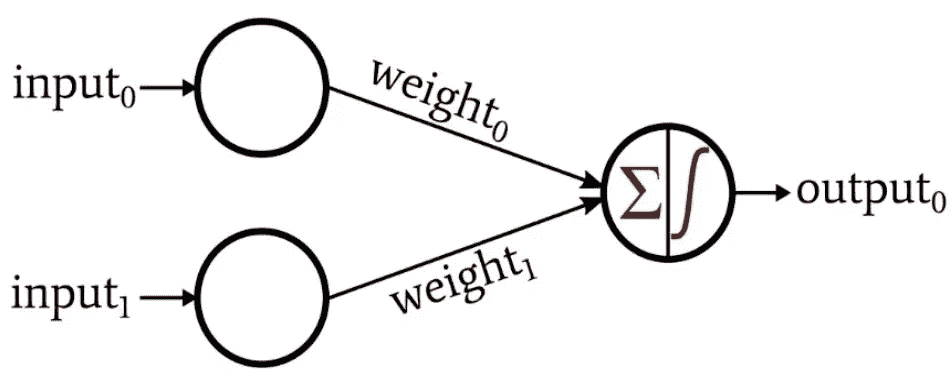
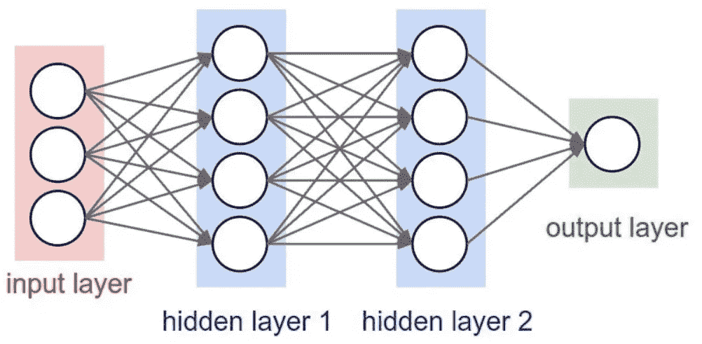
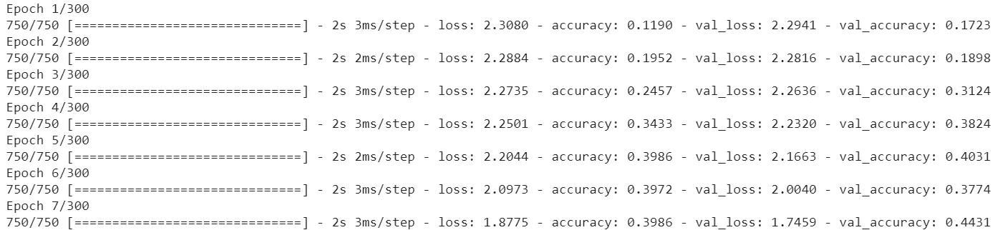
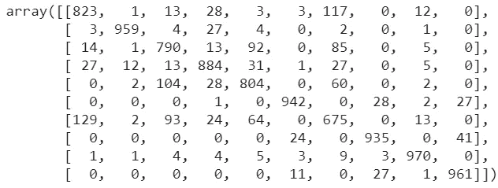

# 什么是神经网络？

> 原文：<https://medium.com/codex/what-is-a-neural-network-6b6a552f8e19?source=collection_archive---------11----------------------->

# 介绍

大家好，今天我想解释什么是神经网络，主要原因是因为许多人听说过神经网络，但不知道什么是神经网络，它如何工作和他的目的。这是一个为那些对 NN 概念有疑问的人工智能领域的新手而写的故事。

神经网络是一种结构，它试图模拟神经元的生物结构及其目的，获取关于刺激的信息(在 NN 情况下获取数据)，通过其他神经元传递该信息，并对该刺激生成适当的答案。

人类需要数据和经验来学习，神经网络如何学习？容易，神经网络也需要数据和经验来学习，但这个概念将在以后的培训部分解释。

# 感知器。

在我们深入研究什么是神经网络以及它是如何工作的之前，我们应该知道感知器的概念。感知器是神经网络中的基本单元，我们可以将其与其他感知器结合来构建一个大的神经网络。NN 与大脑结构有许多相似之处，我们知道，我们大脑的基本单位有一个叫神经元的基本单位，他的组合创造了一个生物神经网络。



感知器

正如我们看到的，感知器有许多部分:

*   输入:向输出节点提供数据。
*   权重:决定了输入对最终结果的影响，如果输入的权重很高，那么他对最终结果的影响也会很大。最初，神经网络不知道权重的适当值，因此，默认情况下，权重是随机初始化的(我们可以修改这一点)。
*   输出:使用数学函数来确定最终结果。

例如:假设我们想训练一个神经网络来确定一个人是否健康，而我们只有两个变量，性别和这个人是否从事任何运动(输入)。一旦我们有了这些值，我们就把它传递给输出节点，输出节点进行必要的计算以确定这个人是否健康。当我们向输出节点输入这两个变量时，权重应该被修改，因为性别不应该影响最终结果(在这种情况下)。

> 注意:权重的修改是通过一个名为“反向传播”的算法实现的。这是一个先进的概念，但我会在本文的训练神经网络部分尝试以简单的方式进行解释，但如果你想了解更多关于这种算法的信息，我建议你阅读一些关于深度学习的书籍，并观看一些关于这种算法的 YouTube 视频。

# 神经网络。

既然知道了什么是 percptron 以及它是如何工作的，我们就可以知道什么是 NN 了。神经网络是一组完全相连的感知器，它们一起工作以实现一个共同的目标。



神经网络。

正如我们所看到的，神经网络是它们之间完全连接的感知器，有三个主要部分。

*   输入图层:我们从中获取输入的图层，我们的数据集中的每个要素都有一个输入。
*   隐藏层:其主要目的是将权重应用于输入，并将其传播到下一层，该层可能是其他隐藏层或输出层。关于神经网络应该包含的隐层数和节点数没有规则，我们应该根据我们的训练结果来修改它。

> 注意:如果一个值足够高，那么这个值将被传播到下一层，否则，这个值将不会被传播。这可能导致“死”节点，这意味着对最终结果没有贡献的节点，因为他的值非常接近于零。如果我们有太多的死节点，神经网络就不会学习。

*   输出层:根据上一层的输出产生输出。如果我们面对二元分类问题，我们将有一个节点，但是在多类分类问题中，我们对每个类都有一个节点。例如:如果我们想确定一个人是否健康，我们有一个节点，但如果我们必须确定一个人是否患有某种疾病，我们将为每种疾病提供一个节点。

# 建立和训练神经网络。

恭喜你，你已经知道什么是神经网络和他的目的，但坏消息是你不知道如何建立它和如何训练它，但不要担心，我会尝试用一种简单的方式向你展示你如何做到这一点。这部分只是给对如何编写神经网络感兴趣的人看的，因此我假设你知道一些 python 编程的概念，也知道一些机器学习的概念。

利用 python 中的一个库来构建神经网络最简单的方法，这个库就是 tensorflow。要使用这个库，我们应该在开始之前做一些导入。

```
from tensorflow.keras.datasets import fashion_mnist
from tensorflow.keras import layers, Sequential
from tensorflow.keras.layers import Dense, Dropout
from tensorflow import keras
import tensorflow as tf
```

在下一个例子中，我们将使用 fashion_mnist 数据集来训练我们的模型，这是一个多类分类问题。数据集包含图像，我们将尝试预测服装的类型。

我们需要四套不同的设备，一套用于训练，一套用于测试。x 的集合包含“我们将提取特征”中的图像，y 的测试包含标签(即服装名称)。

```
(x_train, y_train), (x_test, y_test) = fashion_mnist.load_data()
```

现在我们有了数据，是时候开始构建神经网络了，第一步是创建一些将来会用到的变量。

```
batch_size = 64
num_classes = 10
epochs = 300
```

*   batch_size:将在神经网络的每次迭代中使用的样本数。在第一次迭代中，我们将使用 64 个样本，在下一次迭代中，我们将使用其他 64 个样本(随机)。通常我们用 2 的幂。
*   num_classes:数据集中不同类的数量。
*   次数:迭代的次数，或者同样的，在认为我们的神经网络训练良好之前，我们将通过神经网络多少次。这个值是一个超参数，我们应该根据我们的结果来调整历元的数量。

> 注意:下一个代码是使 NN 正常工作所必需的，但是对他的功能的解释超出了这个故事的范围。

```
# One-hot encoding of y
y_train = keras.utils.to_categorical(y_train, num_classes)
y_test = keras.utils.to_categorical(y_test, num_classes)# One array
x_train = x_train.reshape(60000, 784)
x_test = x_test.reshape(10000, 784)
x_train = x_train.astype('float32')
x_test = x_test.astype('float32')
```

现在是建立神经网络的时候了，为此我们将使用下一个代码:

```
#Building the model
model = Sequential()
model.add(Dense(128, activation='sigmoid', input_shape=(784,)))
model.add(Dense(128, activation='sigmoid'))
model.add(Dense(64, activation='sigmoid'))
model.add(Dense(num_classes, activation='softmax'))
model.summary()
```

我们正在利用一个序列模型，这意味着我们建立了一个多层的神经网络。

用方法。add(Dense())我们添加一个密集层，密集层是他的节点之间全连通的一个层，但是这个层包含了多少个节点呢？Dense()函数中的第一个数字决定了节点的数量。正如我们看到的，第一层包含一个名为“input_shape”的参数。这是包含输入层的节点数，因为我们正在构建隐藏层和输出层，但对于构建输入层，只需指定第一个隐藏层中的 input_shape 参数和他的大小(在我们的例子中为 784)。参数“激活”允许我们选择数学公式来确定如何将权重的总和转换为输出。我们可以在每一层中使用不同的激活函数，或者根据我们的目的或问题的类型选择一个激活函数。

您可以看到最后一层有变量“num_clases”作为节点数，这是因为这一层是输出层，您知道在这一层中，我们为每个要预测的类提供一个节点。这一层中的激活函数是不同的，因为“softmax”函数对于多类问题工作得很好。

现在是配置模型的时候了，我们将使用编译功能来完成。

```
from tensorflow.keras.optimizers import SGD#Compile the model
model.compile(loss='categorical_crossentropy',
optimizer='sgd',
metrics=['accuracy'])
```

*   损失:该参数允许我们选择损失函数。损失函数计算实际值和预测值之间的差异(该值称为误差值)，并试图最小化该误差值以获得精确的模型。这个误差将沿着神经网络传播，当输出层生成结果时，我们将把它与期望的结果进行比较，然后神经网络为每个输出节点生成误差值。基于这些误差，神经网络将这些值传播到前一层，并根据这些误差修改权重以获得更好的结果，这就是反向传播的概念。在我们的例子中，我们使用了“分类交叉熵”函数，因为它是处理多类问题的最佳函数。
*   优化器:确定修改权重的方式。
*   度量:我们评估模型性能的方式。

最后，是时候训练模型并观察结果了。我们将使用 fit 函数从 NN 训练开始。

```
history_sigmoid = model.fit(x_train, y_train, 
batch_size = batch_size, epochs=epochs, verbose=1, 
validation_split = 0.2)
```

我们使用训练集来训练带有他的标签(保存在 y_train 中)的模型。“verbose”参数用于显示我们的 NN 的训练进度,“validation_split”用于选择验证模型所需的百分比，在我们的示例中，我们使用 x_train 中的 20%样本进行验证。命令输出将类似于以下内容:



安装输出。

正如我们所见，损耗逐步降低，精度不断提高。在训练结束时，精度应该接近 1，损耗应该接近 0。

# 评估模型。

嗯，你知道如何训练神经网络，但你不知道网络是否工作良好，或者是否能以正确的方式预测结果。

评估我们的神经网络性能的一个简单方法是使用混淆矩阵。这个矩阵向我们展示了多少预测是正确的，多少预测是错误的。

下面是执行此操作的代码:

```
pred = model.predict(x_test) #Our predictionsfrom sklearn.metrics import confusion_matrix
confusion_matrix(y_test.argmax(axis=1), pred.argmax(axis=1))
```

结果会是这样的:



根据要预测的类的数量，我们将有许多行和列。第一行属于第一个标签，第一列也属于第一个标签，依此类推。预测正确的值是对角线上的值，对角线外的值是预测错误的值。

# 结论

在这篇文章中，我试图以一种简单易懂的方式解释什么是神经网络以及它是如何工作的，这只是对这种算法的一个温和的介绍，如果你想了解更多关于这个人工智能的迷人领域，你应该开始阅读书籍，参加课程，阅读其他文章，写下你自己的结论，等等。我希望我已经帮助你多了解了一点神经网络。感谢您的阅读。