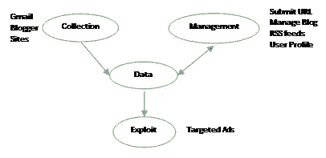
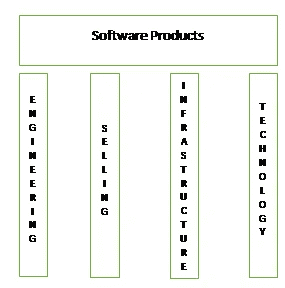

# 什么是产品—战略视角—五

> 原文：<https://medium.com/codex/what-is-a-product-a-strategy-perspective-v-18e070e6f3ea?source=collection_archive---------9----------------------->

产品为我们提供了规模经济。我们通过分散客户实现了这些目标:

*   营销和销售成本
*   产品开发成本
*   如果规划得当，甚至基础设施成本

是不是所有的公司都能达到类似的规模经济水平？为什么有些公司能够服务如此大规模的受众，而其他公司即使拥有适度的客户群也难以扩大规模？有业务的选择；同样重要的是技术的选择。我们将以技术如何实现现代商业规模来结束这一系列文章。

# 一个例子

几个学生做了以下事情:

*   他们在网上爬来爬去，通过文档的交叉链接找到他们能找到的所有网页
*   他们把所有的单词都放进了电子词典
*   如果这些文档有来自多个其他文档的链接，他们会给这些文档更高的排名(PageRank)。

结果是 1998 年的谷歌。你们中的一些人可能正在想象用笔记本电脑重新制作这个。有了所有可用的新技术，这个产品可能需要一个星期和一个月才能投入实际使用。利用今天的技术，人们可以很容易地创建那个时期的谷歌。那些认为 AI/ML 是最近发明的人，让我保证这是 90 年代末的 AI。完成这项任务所需的计算能力在当时是难以想象的。谷歌继续打造硬件，将成本降至最低。谷歌继续为机器学习(ML)设计其硬件，如张量处理单元(TPU)。

# 技术的进步

让我们看看上面的系统有多好。给定一个单词，以精确的形式，它返回存在这个单词的所有文档。对于这样的系统来说，*圈*和*圈*是两个完全不同的词，互不相关。谷歌做得比这更好，因为他们对此类场景有更多的处理。现代人工智能不搜索单词。它搜索概念。谷歌利用其强大的处理能力获取世界上所有的网页；试图为想法或概念建立一个数学模型。它不是识别已命名的概念，而是在每个句子中潜在的意义上创造未命名的想法。在文档中，潜在的想法被编码为单词顺序、字符顺序和句子顺序。现代人工智能网络对排序或单词关联进行建模，并从数十亿份文档中学习。在练习的最后，你会得到一个概念模型或知识空间。您的搜索现在将您的查询放在知识空间中，并试图找到最接近的匹配。您可以提出问题并找到答案，如下所示:

问:我把手机放在哪里了？

A.你*把*电话留在了桌子上。

如今，图像和文本算法中内置了上下文。我把剩下的留给有眼光的读者去读更多的书，从这个领域的研究中学习。处理能力和技术选择使这些复杂的问题在现代技术中变得容易处理。我们称所有这些为一揽子 AI-ML。尽管一些概念和算法来自旧的研究，但由于缺乏硬件资源，它们还不够好，无法尝试。硬件资源需求已经显著增加，以至于我们今天所知的人工通用智能(AGI)的研究已经成为少数几家大公司的权限。一个利用卓越技术为资源提供最佳价值的组织只能实现规模经济。

# 数据

正如你所看到的，搜索的改进需要分析所有的网页。搜索技术也需要大量的搜索字符串。当人们看到产品的价值时，就会被伟大的产品所吸引。谷歌正好提供了这一点。但它也收集了人们从搜索结果中获取的文件信息。他们是否在寻找特定的网站？这有助于他们向顾客投放广告。这成为他们最初近十年的商业模式。他们需要更多的数据和内容。他们提供了通过 Gmail、Blogger、YouTube、Google Sites 等产品收集数据的途径。谷歌鼓励客户在网站上添加追踪器。作为回报，客户可以免费获得优秀的产品。谷歌不是唯一的公司。任何为客户提供免费服务的公司都希望收集客户数据用于信息提取，并利用这些数据来创造收入。这是一个简单的示意图。

简而言之，公司采用非常狡猾的手段来收集数据。他们鼓励用户管理这些数据，并用相关信息对其进行删减。让我们想到谷歌地图。当用户开始使用谷歌地图时，谷歌会自动从用户的手机中收集地图数据。他们建议用户充当当地导游，提交评论，更新地图，并提交他们的照片。他们还提供游戏化来吸引用户，并发送礼物来增加用户数量。当他们的网站产生一个转换线索时，给他们的网站添加 AdWords 脚本的人会得到一个小奖励。本质上，谷歌鼓励用户提供数据，并设法提高其重要性。一些用户在社交网络时代以内容创作者和 YouTubers 为全职职业。有了清晰、管理良好的内容，谷歌现在可以提供额外的服务。例如，通过分析 Gmail 中的登机牌文档，谷歌向客户提供旅行解决方案。因为它可以搜索航空公司、酒店或旅游预订网站，所以它可以关联并提供端到端的旅游解决方案。谷歌跟踪求职模式，并提供招聘信息作为专业化服务。不仅仅是谷歌，如今任何拥有用户数据的组织都在利用这些数据提供额外的增值服务。这就是他们计划如何扩展他们的产品。简而言之，这就是他们对平台的定义。

# 现代平台

现代平台是一个吸引人群的平台。让用户把几乎所有的时间都花在平台上，而不去寻找任何其他的解决方案。最好的品种几乎已经结束了。亚马逊是 IaaS 领域的主要推动者，谷歌和微软是 PaaS 领域的主要推动者。最初，亚马逊落后于微软和谷歌提供的平台服务基础设施。今天，所有三个云平台 AWS、Azure 和 GCP 都提供几乎相似的一对一匹配服务。他们希望完全锁定供应商。一旦客户使用其中一种技术，他们不希望客户货比三家，寻找同类最佳产品。SalesForce 正在身份和访问管理方面进行投资，以阻止客户关注 Oracle。有了基于云的服务，交换的技术障碍正在慢慢消失。因此，供应商要确保每当客户需要某个特性时，都有可用的东西。Zoho 为大多数 ERP 和 CRM 流程提供解决方案。Adobe 为所有出版需求提供服务。简而言之，组织正与客户密切合作，以获取其运营的最佳实践，并向整个客户群体提供服务。这些是可以提供规模经济的新时代平台。

# 结论

我们意识到产品提供了企业盈利所需的规模经济。增强的销售和营销、工程、基础设施和正确的技术有助于产品的整体成功。这些可以被认为是构建一个盈利软件产品的真正支柱。

**注** : **Sambit Kumar Dash** 是[**Lenatics Solutions Pvt Ltd**](https://lenatics.in)的创始董事，该公司为企业提供产品管理服务以获得持续的竞争优势。你可以通过 [sambit@lenatics.in](mailto:sambit@lenatics.in) 联系到他