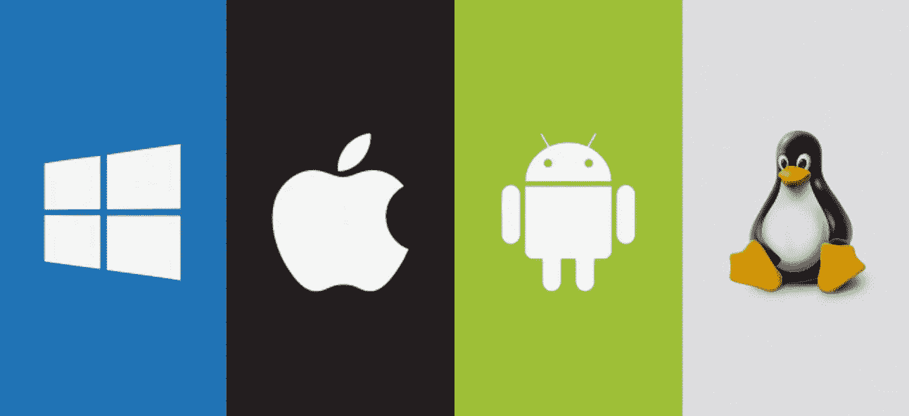

# DevOps 的简历是什么？

> 原文：<https://medium.com/codex/what-is-a-resume-for-a-devops-4090217fd317?source=collection_archive---------7----------------------->

DevOps 专家简化了软件创建和开发过程中开发部门和运营部门之间的联系。DevOps 是开发和运营两个词的组合，可以翻译为“开发运营”。

> 如果你想知道 DevOps 是什么，它的功能是什么，请访问链接:
> 
> 谁是德沃斯？？？

我们今天不讨论 duaps，但是我们要回答一个问题，什么是 duaps 专家的简历？

我对这份工作很感兴趣，我做了调查，但我问每个人简历需要什么？无话可说。

但是在许多问答之后，今天我将告诉你一个骗子需要什么样的简历…

## 实习

要成为一名专业的 DevOps 专家，您需要广泛了解许多技术。你可以通过各种技术工作岗位的实习来获得这些信息。Duaps 工程师需要专注于三个领域并加强自身:

## 操作系统

操作系统是任何技术的主要贡献。虽然 Duaps 专家应该熟悉 Windows、Android 和 iOS 操作系统，但他或她应该更多地关注 Linux 操作系统的学习机会。因为 Linux 是一个开源的操作系统，被很多 IT 人士和专业人士使用。(微软刚刚发布了自己的 Linux，这显示了 Linux 的强大)

## 编程；编排

今天，许多编程语言都用于这一目的，但是为了在 DevOps 专家工作中取得成功，学习和实践最有用的编程语言是 Python。Python 是一种适应性语言，广泛应用于编程领域，大多数雇主希望求职者熟悉这种语言的基础。(Python 在计算机世界的每一个部分都发挥着专业作用，这也是为什么 Python 无处不在的原因)

## 云计算

很快我们所有的程序都将在云空间中运行(微软正试图将其所有软件，包括 Windows，移至云空间)。云存储和处理技术的使用每天都在扩大。对于一个 DevOps 专家来说，熟悉跨不同平台的这类技术的基础知识是非常重要的。最受欢迎的云计算和存储服务是 Azure、谷歌云和亚马逊网络服务。

一个 duaps 专家必须能够每天都比前一天做得更好，并在短时间内强化他的技能，这是他区别于其他同事的技能…

## 技能

除了他拥有的技能，duaps 专家还必须拥有其他软技能，我将在标题中介绍这些软技能:

> C 沟通技巧。时间管理技巧。分析和复习技巧。解决问题的技巧

## 结论

这就是复制专家的简历，如果你像我一样在寻找答案，你会很高兴。一般来说，对于这份工作，你必须精通操作系统，当然，他们擅长编程，你必须精通云，一般来说，管理技能……(当然，有时大学教育也很重要，这种情况很少发生)。如果你想知道更多关于这份工作的要求，你可以通过工作网站和招聘信息来了解。

我希望这篇文章已经适合计算机爱好者，尤其是 DevObs 爱好者…

健健康康。。。