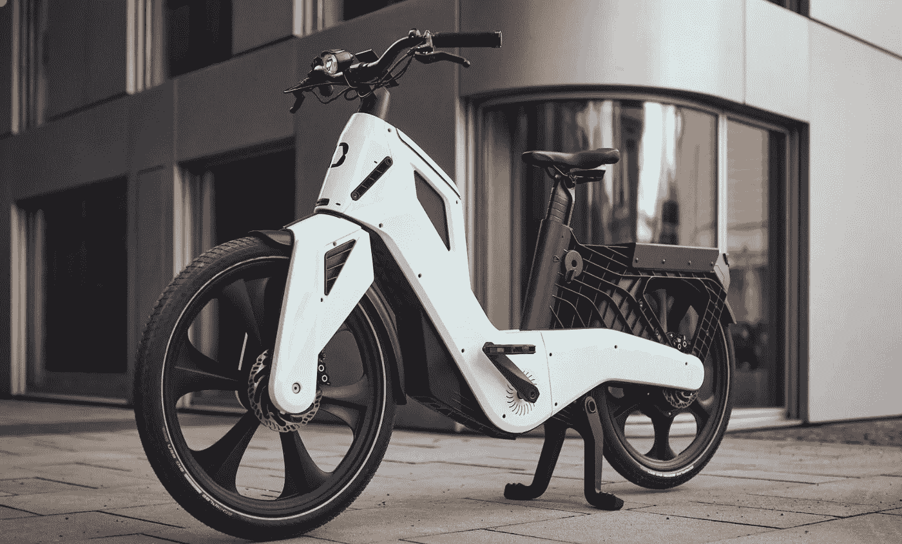

# 什么是智能踏板车辆(SPV)？

> 原文：<https://medium.com/codex/what-is-a-smart-pedal-vehicle-spv-b786ee33909d?source=collection_archive---------7----------------------->

## 提示:不仅仅是自行车！

[Mocci 智能踏板汽车(Mocci 媒体)](https://mocci.com/en/)

Mocci 也被称为神奇之旅，在德国慕尼黑设计和制造，早在 2014 年就有了这个想法。今天，Mocci 为自己开发了一个新的电动自行车类别而自豪。智能踏板车辆(SPV)将在骑车人踩踏板时向后轮马达提供能量。更令人惊讶的是，所有这些都是在没有…