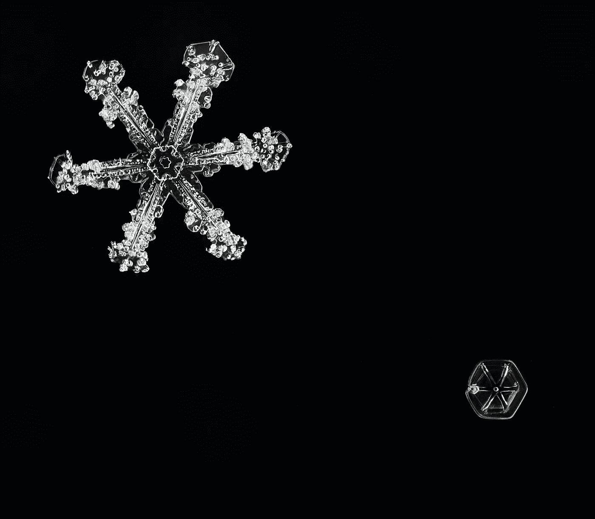

# 什么是雪花模式？

> 原文：<https://medium.com/codex/what-is-a-snowflake-schema-d310125c10e2?source=collection_archive---------4----------------------->

## 观点——经典的 OLAP 结构仍然适用吗？

## 星型模式有什么不同？

在 [Unsplash](https://unsplash.com/s/photos/snowflake?utm_source=unsplash&utm_medium=referral&utm_content=creditCopyText) 上由[zdenk macha ek](https://unsplash.com/@zmachacek?utm_source=unsplash&utm_medium=referral&utm_content=creditCopyText)拍摄的照片

在本文中，您将了解什么是雪花模式，它与[星型模式](/codex/what-is-a-star-schema-5a03e0f9ce6d)【1】有什么不同，以及最重要的事实。

## 简单地说，雪花模式