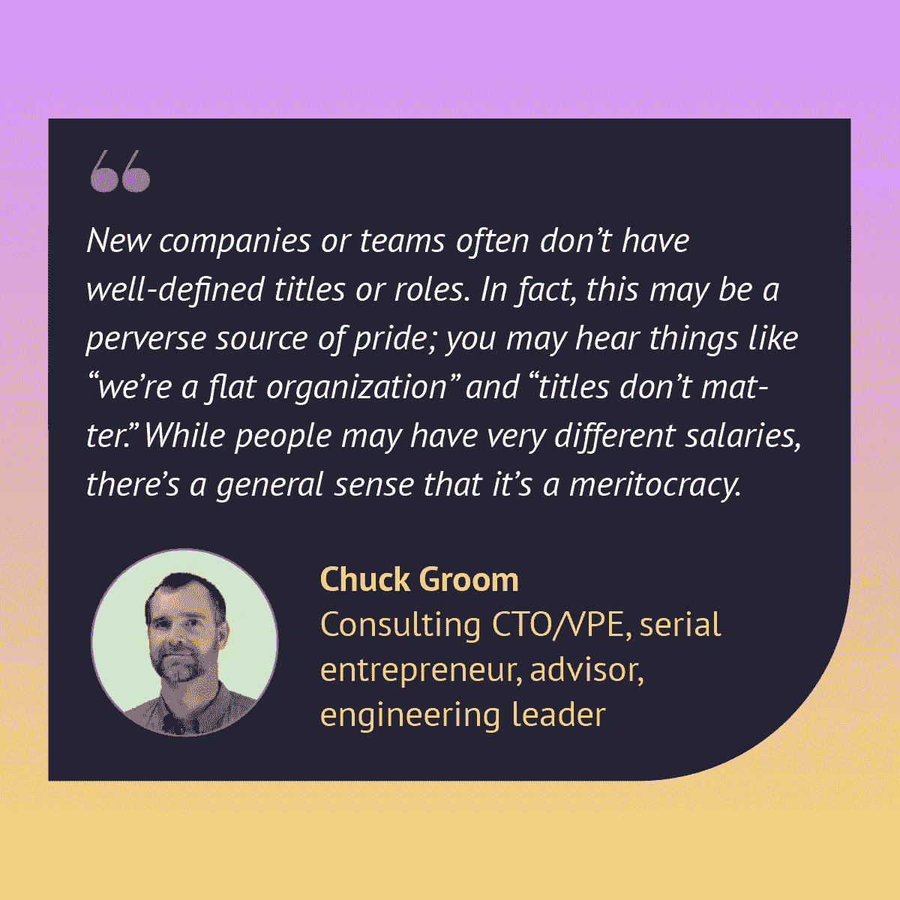
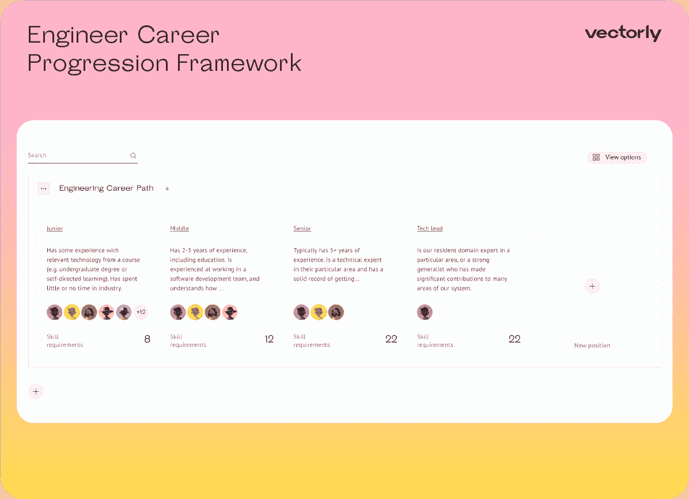
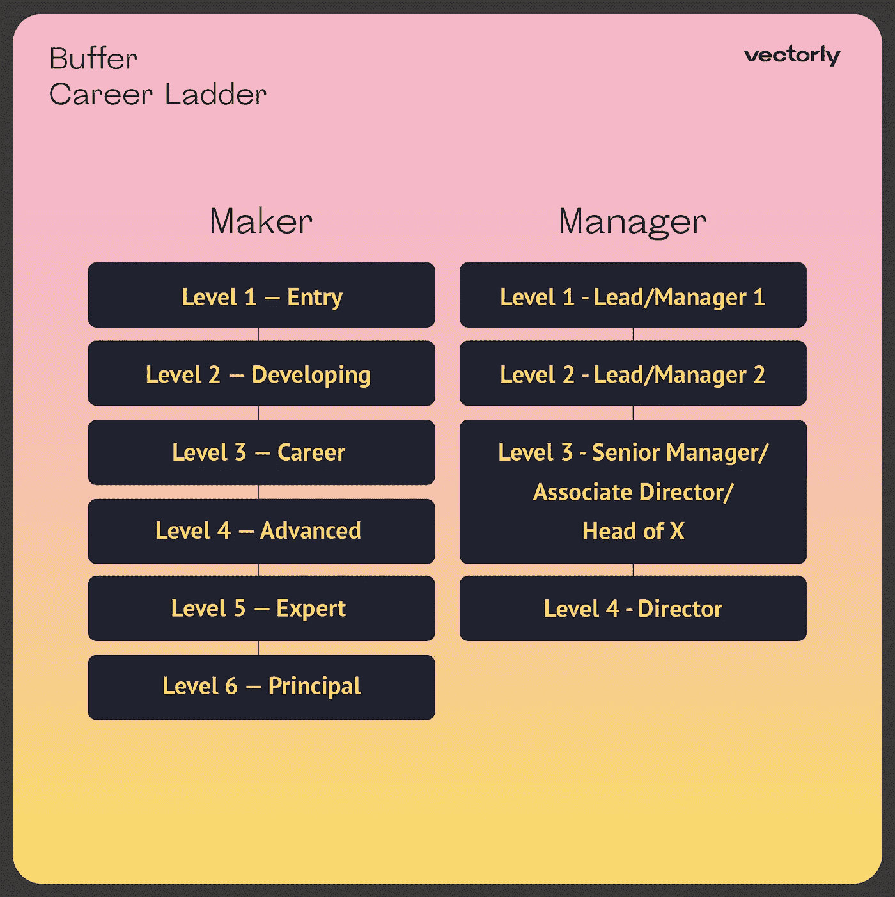
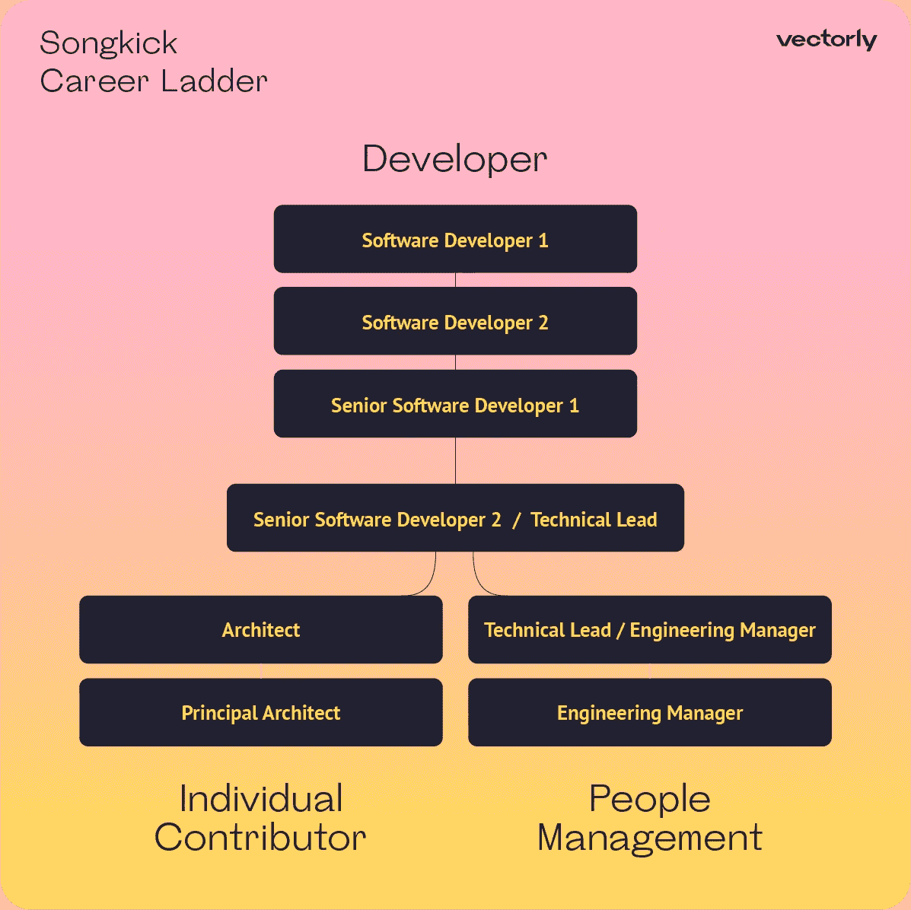
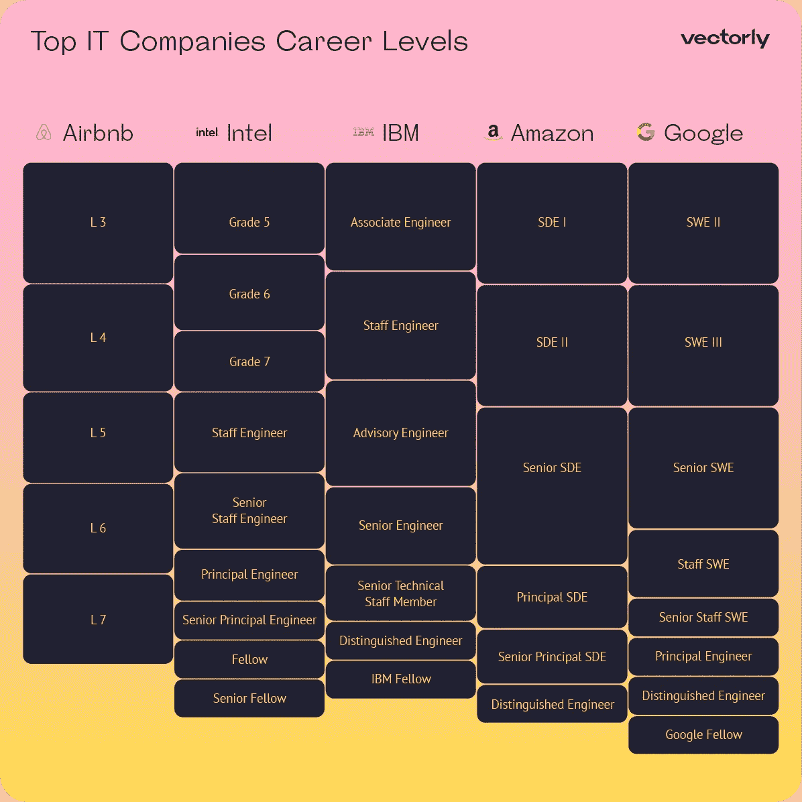
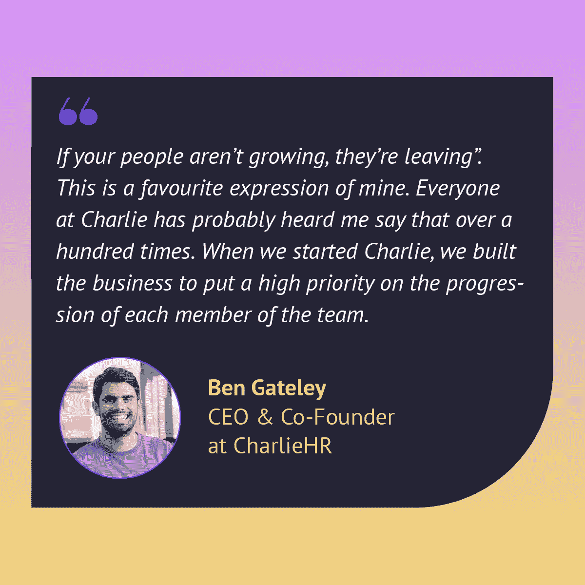
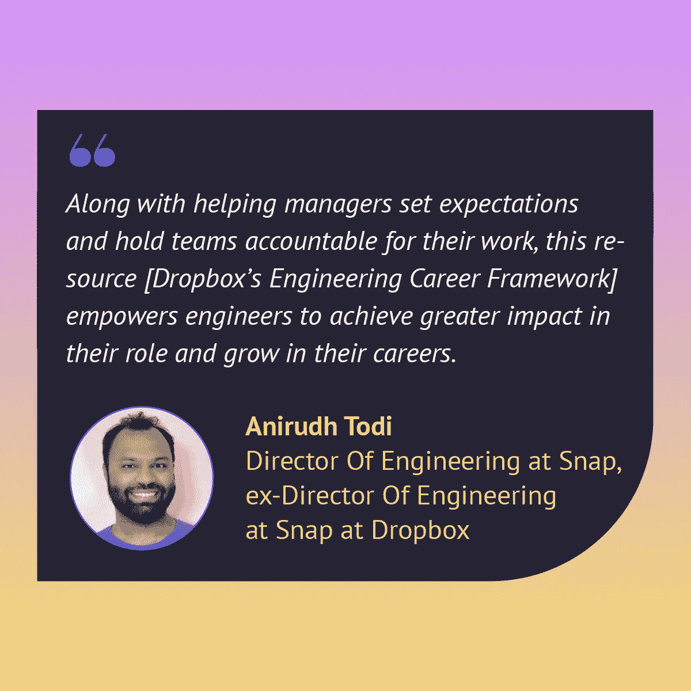
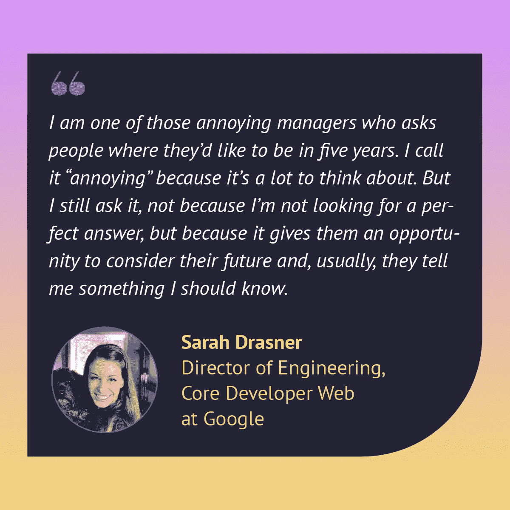
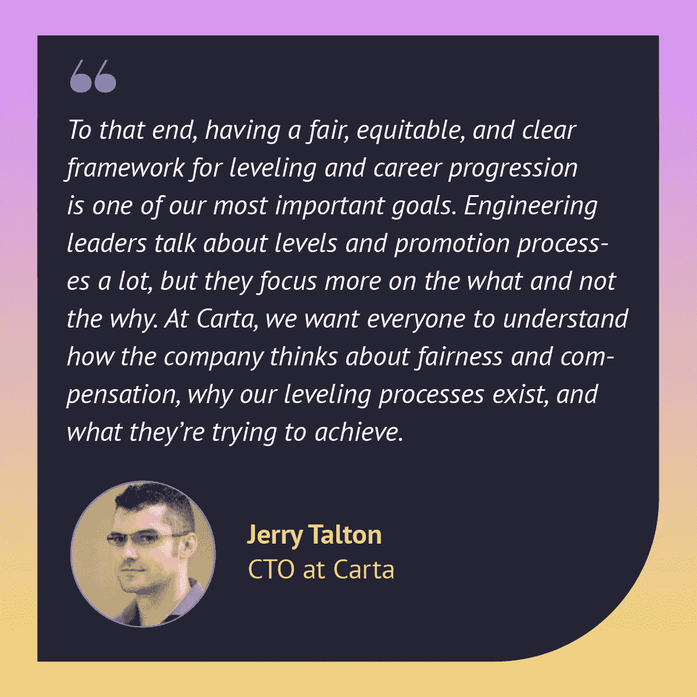
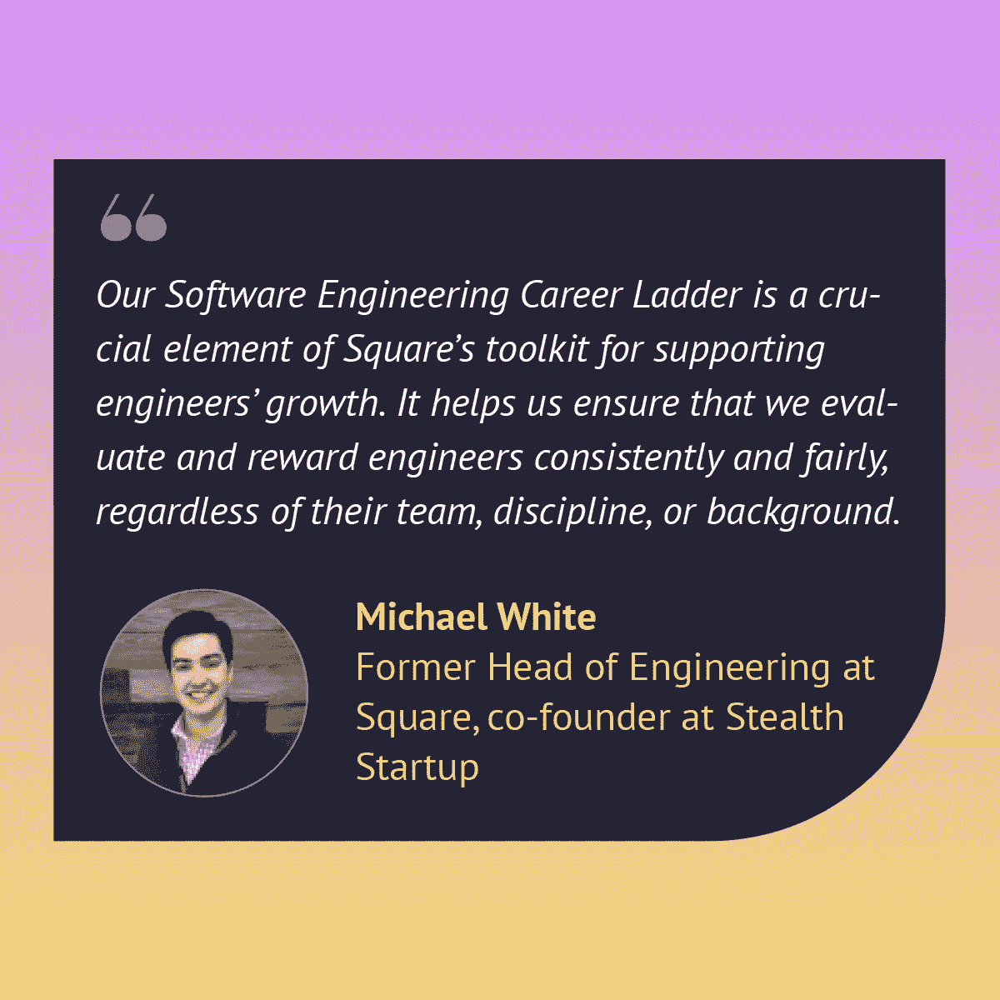

# 什么是软件工程师职业发展

> 原文：<https://medium.com/codex/what-is-a-software-engineer-career-progression-5efa1dc94f5f?source=collection_archive---------2----------------------->

## 在这篇文章中，你会发现职业阶梯的定义，职业阶梯的例子，以及为什么科技公司需要职业发展计划。

如果你正在寻找成为一名更好的经理的方法，并建立一个由积极的开发人员组成的高绩效团队，你肯定需要了解软件工程师的职业发展，以及如何建立一个软件工程职业阶梯。

Etsy、Dropbox、Spotify、Buffer、Songkick Technology 等成功的科技公司已经开发并实施了自己的职业道路框架，以留住顶尖工程师并做出更好的决策。

[Ace](https://www.vectorly.team/?utm_source=medium_partners&utm_campaign=codex) 将帮助你探索这些公司的经验，并帮助经理们建立自己的软件工程师职业发展框架，适应他们公司的需要。

这是软件工程师职业发展主题的第一篇文章，您将会发现:

*   职业阶梯的定义
*   职业道路框架示例
*   为什么科技公司需要职业发展计划

您还可以阅读职业发展主题的其他部分:

*   [技术团队职业规划的 5 个阶段](https://www.vectorly.team/vectorly-blog/5-stages-of-career-planning?utm_source=medium_partners&utm_campaign=codex)
*   [如何构建软件工程师职业阶梯(示例)](https://www.vectorly.team/vectorly-blog/how-to-build-a-software-engineer-career-ladder?utm_source=medium_partners&utm_campaign=codex)

## 职业阶梯定义(或职业发展)

在我们开始讨论如何在您的公司创建职业阶梯、决定晋升以及帮助工程师跳级和升级之前，您需要定义术语并了解什么是职业阶梯或职业发展？

工程职业阶梯不仅仅是开发人员职位和职责的列表。这是一个系统化的职业发展路线图，包括技能、职业目标、薪资期望和职业发展计划。简而言之，职业阶梯是记录个人职业进展的一种方式。

## 角色和头衔

角色和头衔是定义软件工程师在公司中的位置的术语。但是，也有不同之处:

*   **工作角色**是员工的职责范围，反映了他们在公司从事什么样的工作。责任领域定义了职责范围:员工每天在工作中做什么，他们有什么样的任务。工作角色示例:开发人员、设计师、产品经理。
*   **职位名称**是一个人在公司所担任的职位的名称。这通常包括一个工作级别(初级、中级、高级)和一个专业(QA 人工工程师、Python 开发人员、Go 开发人员)。如果工作角色涉及管理人员，这通常也反映在职位名称(团队领导、技术官员、项目经理)等。

这就是查克·格鲁姆[所说的](https://cgroom.medium.com/the-software-engineering-job-ladder-4bf70b4c24f3)在公司中定义头衔和角色的重要性:

> 通过 Ace 获得 60 多个技术角色的[技能矩阵模板和职业道路模板](https://www.vectorly.team/templates?utm_source=medium_partners&utm_campaign=codex#skill-matrix)。

## 级别(或等级)

工作级别(或工作等级)表示工作角色在公司中的责任级别。职位级别越高，公司对工程师的专业技能、独立性和主动性的要求就越高。

公司使用角色来建立等级，为达到下一个级别设置 okr，并激励员工达到新的高度。一个简单的软件工程师级别系统看起来像:工程师级别 1、2、3、4 或初级开发人员、中级开发人员、高级开发人员、技术主管，但随着公司的发展，它可以变得更大甚至分支。

这种系统允许开发人员沿着他们的职业道路前进，并在公司内部发展。这意味着，如果一家公司使用这种方法，开发人员有专业的成长机会，也有更多的动力留在公司。

接下来，我们将继续讨论不同类型的软件工程师职业阶梯的例子，并探索根据公司的规模，存在什么样的软件工程师职业发展框架。

## 软件工程师职业阶梯示例

正如我们前面所说的，软件工程师的职业阶梯可以或多或少的复杂，这取决于公司的结构和需求。

我们将给出不同类型的软件工程师职业框架的例子。在建立自己的职业框架时，重要的是不要只是复制现有的模式，而是要专注于公司的目标和价值观，以及在形成阶段与团队讨论其结构。

## 小公司(< 20)

通常，小公司和创业公司不会觉得有必要建立职业阶梯框架，并且仅限于职位头衔。职业发展的实施随着公司的成长而发生，通常是无计划的，并且必须基于工程师的技能和特质的 KPI 是不清楚的。

在这种情况下，开发人员没有专业的开发目标，随着时间的推移可能会失去动力。所以，最好的人才会去其他公司，在那里他们会得到职业发展的机会。

基本的(也是最常见的)软件工程师职业道路看起来像是级别的变化——工程师在一开始批准的角色框架内从一个级别跳到另一个级别:初级开发人员、中级开发人员、高级开发人员、技术主管。

[Ace 中的工程师职业道路模板](https://www.vectorly.team/templates?utm_source=medium_partners&utm_campaign=codex#skill-matrix)

> 免费为你的技术团队使用 Ace 的[工程师职业阶梯模板](https://www.vectorly.team/templates?utm_source=medium_partners&utm_campaign=codex#skill-matrix)。

## 中型公司(<100)

As the company grows, the career progression framework should become more complex — intermediate positions (levels) on the career path can be introduced.

But the most important point is to build a career progression for those engineers who want to develop professionally, but don’t have the desire to grow into managers and hone their people skills. Here, a branched career path becomes relevant. It often has two tracks — engineering career path technical or management, where a developer can become a manager and develop in leadership, or become an IC (individual contributor) and develop as an expert. This division of the career path is called the dual-ladder approach.

Some successful companies have developed this approach in building software engineer progression for their teams. Here are some examples worth exploring.

[Buffer](https://buffer.com/resources/career-framework/) 开发了自己的职业发展框架，允许员工在不成为经理的情况下获得职业发展和职业晋升。这个框架有两个平等的发展机会——个人贡献者轨道和管理轨道。

[缓冲职业阶梯模板](https://public.vectorly.team/skillboard/5d76de00-b9f5-11ec-9782-5948cf9c8402?utm_source=medium_partners&utm_campaign=codex)

> 您可以使用[缓冲职业道路模板](https://public.vectorly.team/skillboard/5d76de00-b9f5-11ec-9782-5948cf9c8402?utm_source=medium_partners&utm_campaign=codex)为您的技术团队构建工程师职业阶梯。

[Songkick Technology](https://www.songkick.com/downloads/growth-framework/sk-growth-framework.pdf) 开发了双阶梯方法的一种变体:

[Songsick 职业阶梯模板](https://public.vectorly.team/skillboard/f9a54410-b9f0-11ec-a273-6f01cebe2f96?utm_source=medium_partners&utm_campaign=codex)

> 您可以为自己的公司改编 [Songkick 开发人员职业道路模板](https://public.vectorly.team/skillboard/f9a54410-b9f0-11ec-a273-6f01cebe2f96?utm_source=medium_partners&utm_campaign=codex)。

## 更大的公司(> 100 家)

结构复杂的大公司会开发自己更复杂的职业发展框架。根据公司的需要，职业道路可能有几个层次。

[Levels.fyi](https://www.songkick.com/downloads/growth-framework/sk-growth-framework.pdf) 从世界领先的 IT 公司收集数据，了解他们的框架中存在哪些级别，以及从一个级别到另一个级别的过程。以下方案中的公司展示了软件工程师级别组织中的几个典型案例。

顶级 IT 公司工程师的职业水平

您可以探索顶级 IT 公司的经验，并获得有关其框架如何开发和实施的更多详细信息:

[Etsy](https://etsy.github.io/Etsy-Engineering-Career-Ladder/)

[收纳箱](https://dropbox.github.io/dbx-career-framework/)

[CircleCI](https://docs.google.com/spreadsheets/d/131XZCEb8LoXqy79WWrhCX4sBnGhCM1nAIz4feFZJsEo/edit#gid=0)

[Spotify](https://engineering.atspotify.com/2016/02/spotify-technology-career-steps/)

> 借助 Ace，您可以使用[现成的职业道路模板](https://www.vectorly.team/templates?utm_source=medium_partners&utm_campaign=codex#skill-matrix)为 60 多个技术职位构建职业发展框架。

## 为技术团队构建职业发展道路的好处

职业阶梯有助于在员工和公司的自我发展中取得最佳效果。让我们仔细看看参与者从该流程中获得了什么好处。

## 对于开发人员

职业道路有助于开发人员避免因开发不确定性而精疲力竭。在这家公司有前途吗？我在这里能是谁？怎么才能涨工资？如果公司有员工职业发展计划，这些问题不会没有答案。

*   **获得更广泛的技能基础。**一个完善的职业发展路径包括一个职业发展计划，在该计划中，员工将获得对其当前技能水平和任务的评估，以发展晋升所需的重点技能。

Ben Gateley [向](https://www.charliehr.com/blog/career-progression-framework-why-2/)讲述了他们实施职业发展框架的经历:

*   **释放收入潜力。**员工可以与经理一起定义职业发展目标和职业目标，包括他们的薪资期望。然后他们共同建立一个职业发展计划，这将有助于在最短的时间内实现这些目标。
*   **避免停滞不前。**一个明确的发展计划可以让工程师不断发展，以最快的方式实现他们的目标，同时提高工作满意度，感受他们对共同业务目标的贡献。

阿尼鲁德·托迪[分享](https://dropbox.tech/culture/sharing-our-engineering-career-framework-with-the-world) Dropbox 实施职业道路框架的经验:

*   **明确推广要求。这意味着员工明白获得晋升和加薪需要什么。如果职业发展框架组织得正确，那么每六个月就会提一次级，这使得软件工程经理能够规划开发人员的职业道路。**
*   **选择和规划职业道路的机会。有了职业发展框架，软件工程师可以自由选择他们的专业发展方向——走管理路线并提高软技能，或者通过沿着技术路线前进来积累专业知识。**

Sarah Drasner [解释了](https://css-tricks.com/the-importance-of-career-laddering/)为什么与员工进行职业规划谈话很重要:

## 对于经理

职位阶梯为讨论员工的职业发展提供了基础:它确保了关于职业发展、责任扩展和加薪的会议的规律性。实施工程师职业发展框架的主要好处如下:

*   **打造高绩效团队。**职业发展允许经理或团队领导在公司内建立并保持成长心态和持续学习。因此，总的来说，团队在不断成长，发展技能，表现更好。
*   **增加动力。**长期目标激励团队，有助于避免停滞。动机直接影响绩效，而高绩效团队是企业成功的因素之一。
*   **提高记忆力。**职业成长和专业发展是激励员工、留住顶尖人才、留住最优秀工程师的最佳途径。对于大多数开发人员来说，选择工作(或决定获得另一家公司的聘用)的关键因素之一是职业发展和获得新的专业视角的机会。
*   做出更好决策的能力。有了清晰的指导方针，经理就可以做出透明合理的加薪、加薪、招聘等决定。并且让这些决策变得透明，对团队、高层管理人员和人力资源都是如此。

Bradford Fults [谈到](https://bradfordfults.com/business/software-engineering-leveling-expectations/)工程师职业发展的重要性:

## 小时

每个级别都有一个招聘栏，这使得人力资源部门很容易决定选择哪个候选人。最好是用这个系统来比较不同的专家——这就是公司消除人为因素的方法。

*   **决策过程的公平和透明。招聘人员的任务之一是找到客观的标准来了解开发人员是否准备好晋升。在公司内实现职业目标的清晰步骤让员工明白他们的成长或缺乏成长是一个公平的决定。**

杰瑞·塔尔顿[向](/building-carta/engineering-levels-at-carta-d33db2a55a20)讲述了卡塔的经历:

*   **优化招聘流程。**了解潜在员工的专业水平可以让你更自信地确定招聘成本，确定技能组合，并明确开发人员是否适合团队，是否能为公司的目标做出贡献。
*   关于加薪的透明决定。如果职业发展道路明确，薪酬等级与具体水平挂钩，那么这将大大降低协商加薪决策的难度。

迈克尔·怀特[谈到](https://wetransfer.com/engineering/how-to-build-an-engineering-career-framework-everything-we-learned-along-the-way/)软件工程职业阶梯如何帮助支持 Square 的工程师:

*   **提升公司的品牌形象。当一家公司关心其员工的职业发展和福祉，并准备投资于他们的教育时，这总是会增加其在候选人中的可信度，使该公司成为每个人都想去工作的地方。**

> 阅读通过职业发展激励员工和留住最佳技术人才的成功案例研究— [如果你的开发人员带着另一家公司的邀请来工作，该怎么办？](https://www.vectorly.team/vectorly-blog/developer-comes-to-work-with-an-offer?utm_source=medium_partners&utm_campaign=codex)