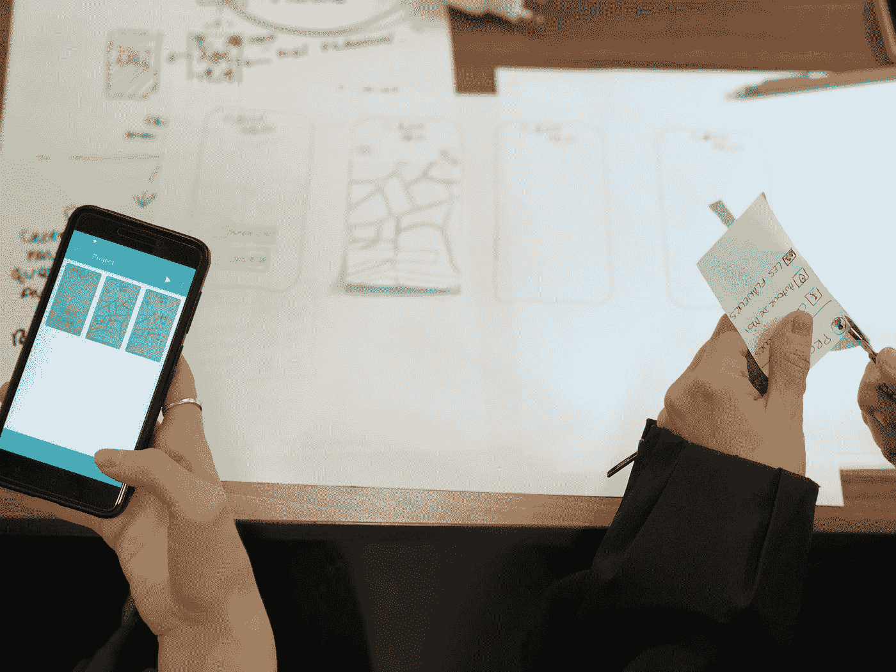

# 什么是 UI 原型？

> 原文：<https://medium.com/codex/what-is-a-ui-prototype-38902830bef5?source=collection_archive---------11----------------------->

## UI 是为你的应用或网站创建原型的完美方式。

照片由 [Unsplash](https://unsplash.com?utm_source=medium&utm_medium=referral) 上的[艾米利·莫里雄](https://unsplash.com/@amayli?utm_source=medium&utm_medium=referral)拍摄

UI 原型是 web 或移动应用程序的用户界面的可视化表示。它可以帮助你和你的团队在投入额外的时间和金钱来实现它之前，测试你提出的界面的外观、感觉和功能。