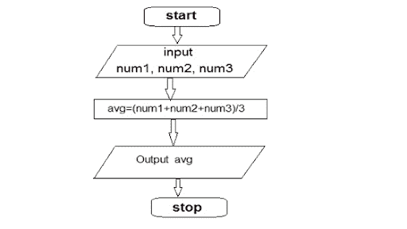

# 什么是算法？

> 原文：<https://medium.com/codex/what-is-an-algorithm-d321e1fc2055?source=collection_archive---------4----------------------->

你听过算法这个词吗？我想你们很多人可能都有过，无论是在网上还是在一些关于技术的对话中。这个词经常被提起。但这到底意味着什么？简单来说，算法就是解决问题的公式。你可以把它作为解决问题的一步一步的指南。现在，你可以把它理解为一个接受输入并产生输出的黑盒。现在，你可能会想，一个食谱做同样的工作。那是算法吗？嗯，是的！算法类似于食谱。菜谱告诉我们如何通过执行一些步骤来完成一项任务。然而，算法是一个具有更具体含义的技术术语。

> 用计算机编程术语来说，算法是一组定义明确的指令，用来解决特定的问题。它接受一组输入并产生期望的输出。

例如，搜索引擎是一种算法，它将搜索查询作为输入，并在其数据库中搜索与该搜索查询相关的项目。然后它输出结果。啊，那是一点行话。让我们用一个例子来简化它。

以下是将 3 个数字相加并打印其平均值的算法:

1.  **开始**
2.  声明 3 个整数变量 num1、num2 和 num3。
3.  将这三个数字分别作为变量 num1、num2 和 num3 的输入。
4.  声明一个整数变量 avg 来存储 3 个数的平均值。
    将这 3 个数字相加，除以 3，并将结果存储在变量 avg 中。
    打印变量 avg 的值。
5.  **结束**

流程图-可视化算法

## 算法分析

> 算法分析为解决给定计算问题的任何算法所需的资源(空间和时间)提供理论估计。我们可以用时间复杂度和空间复杂度来分析算法的效率。

*   **时间复杂度**:算法运行所花费的时间，作为输入长度的函数。时间是一个重要的因素，因为没有人会喜欢花 2-3 个小时返回结果的谷歌搜索。
*   **空间复杂度:**算法运行所占用的空间或内存量，作为输入长度的函数。众所周知，计算机内存是有限的，因此空间也是衡量算法效率的一个重要因素。

## 我们日常生活中的算法

从我们手中的手机到市场上的自动取款机，我们有意或无意地在我们周围的任何地方使用算法。以下是我们日常使用的一些著名算法:

1.  **Google PageRank 算法**——它是世界上应用最广泛的算法之一。当我们进行谷歌搜索时，这是决定结果显示顺序的因素之一。这是谷歌用来确定一个网站的*重要性*的算法，基于有多少网站链接到该网站。很想知道这是如何工作的吗？？让我更详细地解释一下。

该算法给每个网页分配一个数字，称为*页面排名*(或 *PR* )，范围从 1 到 10。数字越大，重要性越高，这意味着网页在搜索结果中出现的位置越高。当你搜索一个网站时，PR 是谷歌对搜索结果进行排序的主要因素之一。另一个重要因素是*相关性*。例如，如果我要搜索“足球”，请注意搜索结果中没有汽车的图片。这是因为汽车与我的搜索查询不相关，但足球、足球运动员和足球场相关。一般来说，谷歌会先给你展示最相关、PR 最高的网站。相关性实际上是由谷歌用来帮助组织数据的一种独立算法计算出来的。网站的 PR 越高，记住搜索的相关性，它在搜索结果中的位置就越高(如果它与你的查询相关的话)。为了计算 PageRank，谷歌实际上使用了一个非常聪明的计算机程序，该程序基于一个叫做“线性代数”的领域的数学概念。

2.**脸书时间线算法-** 这是另一种算法，它对我们生活的影响比我们想象的要大得多。馈入脸书时间线的一组算法决定了将在社交网络的最常访问的空间中显示的内容。因此，基于一系列参数(个人品味、对先前内容的反应等。)，算法决定社交网络将向我们展示哪些内容，以及以何种顺序展示。

还有很多算法，比如移动银行算法、自动取款机算法、高频交易算法等等

## 算法——商业成功的未来

算法已经允许组织以甚至在 5 年或 10 年前都不可能的方式扩展。不相信我？让我们看看统计数据！谷歌是一个掌握了数据和算法的组织。2002 年，他们的搜索算法一年为他们赚了 5 亿美元。以任何标准来看，这都已经是一大笔钱了，但他们对算法的投资现在真的有了回报。他们最新版本的搜索算法现在一天就能赚 10 亿美元。换句话说，他们现在用不到以前的百分之一的时间获得了同样多的收入。

随着技术的进步，在这个新世界的前沿出现了两个令人兴奋的领域:**机器学习**和**深度学习**。利用这些领域的一些例子是网飞电影推荐系统、脸书 DeepFace 项目、特斯拉自动驾驶汽车等等。随着技术的快速发展，可以挖掘的数据呈爆炸式增长，算法已经成为每个成功企业未来的关键组成部分。

哇哦。这是一大堆知识，但我希望你喜欢读这篇文章，现在你可以回答“什么是算法？”。如果是的话！，在[推特](https://twitter.com/intent/tweet?text=Check%20out%20this%20amazing%20article%20to%20understand%20what%20is%20an%20algorithm%3F%20https%3A%2F%2Flink.medium.com%2FWsPEQyaVBhb)上分享。

请随意连接。我活跃在 [Twitter](https://twitter.com/imdivi_jain) 和 [LinkedIn](https://www.linkedin.com/in/divyaaa123/) 上。

看我之前的文章[这里](https://divyaaa123.medium.com/)。

干杯！