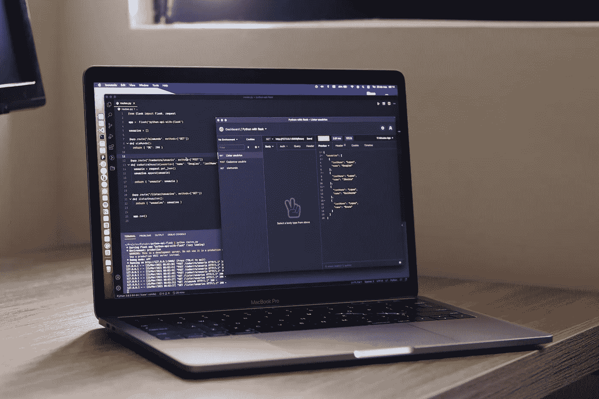

# 什么是 API？用简单的术语解释 API

> 原文：<https://medium.com/codex/what-is-an-api-apis-explained-in-simple-terms-2d56facfa0ac?source=collection_archive---------5----------------------->

# 介绍

如果你和程序员混在一起，你可能听说过 API 以及它们如何被用来执行特定的活动或访问数据。但是这些到底是什么，为什么会被创造出来？

用简单英语解释的 API

让我用一个基本的、非 IT 的例子来说明。

当你去餐馆点餐时，你与服务员互动。你可以点食物和饮料，查询菜单，要求和支付账单，以及做其他各种各样的事情。

在这种情况下，服务员会保护你免受幕后发生的所有复杂事情的影响。你不必处理炉子、烤箱、盘子、库存管理或倒饮料。

他是你和餐馆提供的所有服务之间的纽带。给你一个与餐厅联系的方法，同时让你远离所有幕后的复杂事情。

在某些方面，服务员可能被认为是餐厅的 API，通过这个例子，你可以看到他们为什么有用。

## 那么，API 到底是什么？

API 代表应用程序可编程接口，它是不同程序以多种方式进行交互的方法。API 有多种形式，用于多种目的。

**我将在下面提到其中的四个:**

首先，可以使用 API 从外部来源获取数据。例如，在餐馆里，服务员可以告诉你你点的菜的情况，而不用你去厨房。

另一个例子可能是你手机的天气应用。谷歌和苹果都没有走出去，在世界各地安装温度传感器。不，相反，这些应用程序使用第三方 API 来检索天气预报。

例如，苹果公司利用天气频道的 API。API 支持不同的应用和服务进行数据通信。

现在很难找到没有 API 的服务。API 可以用来查找菜谱、歌词、条形码、邮政编码、可用停车位、公共假日等等。

除了访问数据之外，API 还可以用于屏蔽复杂性和执行操作。在餐馆的例子中，你不需要知道如何做一个完美无瑕的寿司卷；简单点一个。

另一个例子是我们电脑和智能手机上的操作系统。应用程序开发人员不必担心配置 WiFi 连接，在屏幕上绘制形状以创建良好的用户体验，或者想出如何与加速度计或 GPS 等各种传感器通信。

相反，操作系统为开发人员提供了一系列 API，让一切变得更加简单。如果一个应用程序希望在屏幕上显示一个按钮，它只需要请求系统呈现一个按钮。

这个程序不关心它所运行的设备、它的硬件、屏幕质量或其他任何东西。它使开发人员更有效率，因为它允许他们专注于对他们来说重要的事情。

除了获取数据和抽象复杂性之外，API 还可以用来增加功能。例如，在 iOS 上，应用程序可以在通知中心显示一个小部件。

为了实现这一点，应用程序通过一个 API 通知系统它已经准备好了一个小部件。如果用户将它添加到他们的通知中心，系统将调用应用程序来确定小部件应该如何显示。

Siri、Google Assistant、Alexa 就是比较多的例子。这些个人助理相当复杂，但外部开发人员可以通过使用助理的 API 来进一步扩展功能。

例如，我的 Google Home 不知道如何打开和关闭我的智能插座。然而，当该公司通过其 API 与谷歌助手链接时，这种情况发生了变化。

谷歌突然意识到新的硬件，它的能力，以及如何与它接口。

API 就在我们身边，即使你没有意识到。你可能遇到过这样的消息，你的手机请求允许使用你的位置或麦克风。

这就把我们带到了最后一个应用程序:API 可以用作看门人。例如，在移动平台上，系统只提供几个 API 来获取你的位置。因为它集中在系统中，当一个应用程序使用你的位置时，iOS 或 Android 可以很容易地通知你。

因此，如果应用程序首先请求许可，这不是它的错。不，这是系统为他们做的。这是无法回避的。此外，如果您改变主意，系统允许您随时取消此授权。

因此，无论何时你的手机向你请求许可，你都知道一个应用程序正在利用一个系统 API。一个是关于隐私的。

虽然这令人钦佩，但有一个问题:许可通常只请求一次。您可能已经使用您的 Google 或脸书帐户登录了另一个网站或应用程序。它简单、快捷、方便。

然而，通过这样做，我们也授予网站或应用程序访问我们的一些数据。例如，我们的姓名或电子邮件地址。这太棒了，因为它让我们能够控制自己的个人信息。如果你不想分享它，简单地否认它。

然而，这里的问题是，有时这些权限是持久的，我们忘记了我们授予了哪些应用程序或网站查看我们数据的权限。

这就是剑桥分析公司使用脸书 API 获得大量数据的原因。他们设计了一个“个性测试”，要求允许获取你的一些个人信息。

然而，如果你授予它权限，应用程序可能会秘密访问你的数据数月，即使你停止使用它。你必须通过脸书网站取消授权。

总之，API 可以充当看门人，保护我们的个人数据，只允许我们选择的应用程序访问这些数据。然而，我们应该注意这些权利的有效期，并在我们不再使用应用程序时删除它们。

# 结论

API 在我们身边随处可见。它们用于获取数据访问，以便许多应用程序或服务可以协作。

例如，它们还可以为开发人员掩盖复杂性，节省他们解决 GPS 工作原理的时间。API 还可以用来扩展现有系统的功能，它们可以作为保护我们个人信息的看门人。

我希望这篇简短的帖子能对开发人员经常提到的一个问题有所启发。

请在下面的评论区分享你的想法或问题。

如果你能跟着我，给我几个掌声，那就太好了。