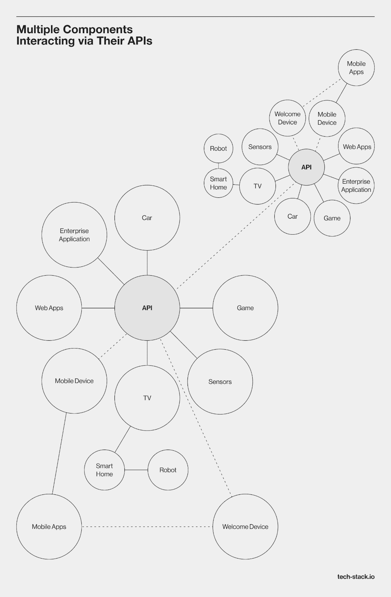
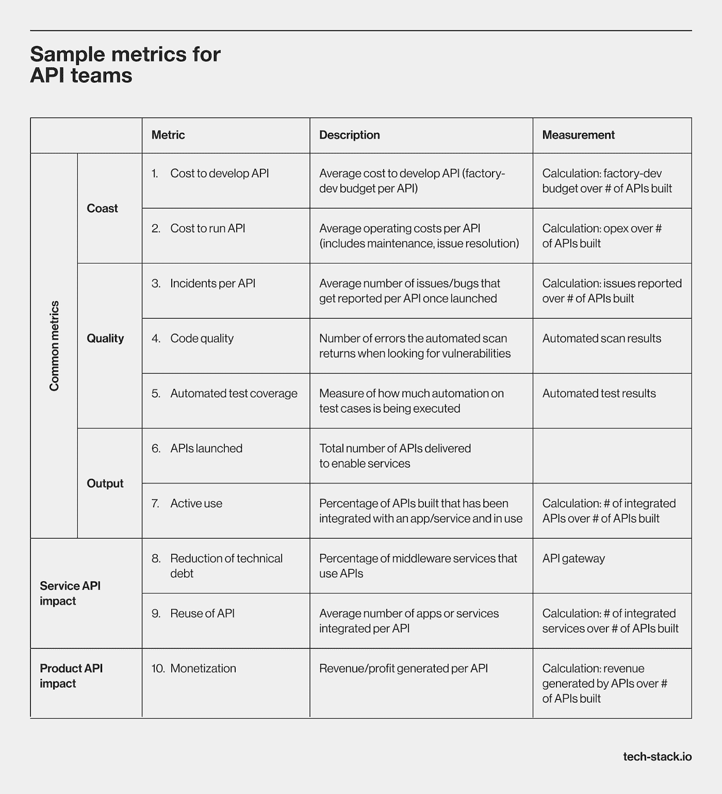

# 什么是 API？关于如何使用 API 的定义和常见问题

> 原文：<https://medium.com/codex/what-is-an-api-definition-and-faq-on-how-to-work-with-apis-f1d490c2bd11?source=collection_archive---------4----------------------->

应用程序编程接口(API)是连接数据流与客户端和合作伙伴系统的关键元素。全球原料药管理市场的规模预计将从 2021 年的 41 亿美元增长到 2024 年的 84 亿美元。

API 是用于创建和集成应用软件的定义和协议的集合。API 可以是私有的、合作伙伴的或公共的。在发布一个 API 之前，产生一个软件工程师信任并想要使用的完全功能性的最终结果是非常重要的。

在 Techstack，我们在[软件开发](https://tech-stack.io/services/custom-software-development)和产品开发方面拥有 8 年的市场/领域经验。我们将指导您了解 API、它的类型、规范和协议。我们还将列出 API 测试工具，并回答使用 API 的首席信息官和首席技术官的常见问题。

# 什么是 Web API？

web API 是 web 服务器或 web 浏览器的软件接口。浏览器 API 可以增加浏览器的功能，而服务器 API 可以扩展服务器的功能。API 使得软件工程师构建复杂的功能变得更加简单。它们允许工程师避免复杂的代码，使语法更简单。

# 服务器端

服务器端 web API 是一个编程接口，由一个或多个特定请求-响应消息系统的可访问端点组成。这些端点通常以 JSON 或 XML API 格式编写，可以通过 web 访问，最常见的是使用基于 HTTP 的 web 服务器。

# 客户端

当处理是客户端时，它发生在用户的计算机上。它要求浏览器在本地执行脚本，而不利用任何服务器端处理。客户端 API 是编程工具，用于更改站点使用的浏览器和操作系统中的各种设置。他们修改来自其他网站或服务的数据。

# 原料药的类型

API 可以根据发布策略和用例分为不同的类型。关于发布策略，API 可以是公共的、私有的和合作伙伴的。API 可以根据它们的用例以及为之创建的系统进行分类。

# 按发布策略的 API

## 私人的

私有 API 的目的是增强组织的解决方案和服务。软件工程师使用这些 API 来组合公司的技术系统或应用程序。他们还通过利用现有系统帮助创建面向客户的应用程序。

即使应用程序对公众开放，对界面的访问也仅限于那些直接与 API 发布者合作的人。公司可以通过私下使用来完全控制它的 API。

## 伙伴

业务合作伙伴可以访问公开发布的合作伙伴 API。两家公司之间的软件集成是合作伙伴 API 最典型的用例。让合作伙伴访问信息或资源会为公司带来额外的收入来源。Amazon API 是合作伙伴 API 的最好例子之一。许多在线企业可以通过他们的 API 直接连接到 Amazon.com，以检查库存并确定运输选择。

然而，如果您共享对您的 API 的访问，您应该留意暴露的数字资产是如何使用的。确保使用这些 API 的第三方应用程序提供良好的用户体验并保留企业身份非常重要，最重要的是，采取安全措施将风险降至最低。

## 公共

公共 API，也称为面向开发人员或外部 API，所有外部软件工程师都可以访问。当有效实施时，公共 API 可以提高品牌知名度，并提供新的收入来源。公共 API 有两种类型:开放的(免费的)和专有的。

公众可以访问开放的 API。它们不受限制，有助于开发和测试应用程序。商业 API 用户可以选择付费订阅或按需付费。向用户提供免费试用，让他们在付费订阅之前检查 API 是一种常见的策略。公共 API 的例子包括 Google 云 API，如 BigQuery API、云存储和云监控 API。

# 按用例划分的 API

API 可以按照它们的设计系统进行分类:

*   **数据库 API**。应用程序和数据库管理系统可以通过数据库 API 进行通信。当使用数据库时，开发人员编写查询来检索数据、修改表等。
*   **操作系统 API。**这类 API 描述了应用程序对操作系统提供的资源和服务的利用。每个操作系统都有一个独特的 API 集合，比如 Windows API 或 Linux API。
*   **远程 API。在几台机器上运行的程序的交互标准是通过远程 API 设置的。换句话说，顾名思义，一个软件产品访问不在发出请求的设备上的资源。**
*   Web APIs。得益于 web APIs，基于 web 的客户机-服务器系统可以交换机器可读的数据和功能信息。这些 API 传输来自 web 程序的 HTTP 请求和服务器响应(HTTP)。
*   **API 库**。这些是不同 API 的目录列表。从他们的许多 API 配置文件中，您可以找到使用这些 API 的相关 SDK、教程和示例源代码。一些图书馆是开放的，这样每个人都可以做出贡献。

# API 规范/协议

一组 API 规范有助于跨 web 服务标准化数据流。“标准化”是指使用各种技术制造的多个系统能够无误地相互作用。

# 远程过程调用

基于远程过程调用，web APIs 可以遵循资源交换原则。该协议定义了基于客户端-服务器的应用程序如何相互通信。一个程序(客户端)向运行在网络上不同机器上的另一个程序(服务器)请求数据或功能。服务器提供必要的响应。

# 服务对象访问协议

SOAP 是一种在分散的分布式环境中传输结构化信息的协议。这个 API 规范包含了 web 应用程序发送请求和响应消息的语法规则。与 SOAP 兼容的 API 支持通过 HTTP 或简单邮件传输协议(SMTP)在系统之间传输邮件的 XML 消息。

# REST(代表性状态转移)

通过利用 REST 架构风格，计算机系统可以有效地通信。这种无状态结构降低了复杂性，允许数据事务在两个访问点之间快速发生，为用户提供了便利，并最大限度地提高了交互双方的可靠性。

与 SOAP(一种协议)相反，REST 是一种软件架构风格，对于创建基于 HTTP 的应用程序(通常是 web 服务)有六个限制。这种架构类型最广泛的应用是在万维网上。SOAP 很难利用，因为它需要编写大量代码，而 REST 被认为是一个更容易的选择。

# gRPC

gRPC 是一个开源的通用 API 框架，也称为 RPC。它比肥皂“年轻”得多。谷歌于 2015 年向公众开放。使用 gRPC 的客户机程序可以调用运行在远程机器上的服务器应用程序，就像它是本地对象一样。因此，开发分布式服务和应用程序变得更加简单。gRPC 主要用于微服务之间的通信。

# GraphQL

GraphQL 是一种用于 API 的查询语言。开发人员可以使用一个 API 调用来请求所有需要的数据。它使客户端能够指定所需的数据，并使来自许多来源的数据聚合变得更加容易。GraphQL 使用类型系统来表示数据，这是该语言的另一个独特之处。基于 GraphQL 的应用程序可以选择从服务器检索哪些信息，这使它们能够快速运行。

# API 测试工具

为了确保您的 API 组件适当地响应各种预期和意外的查询，测试它们是至关重要的。除了它的功能性之外，这项技术还旨在确认 API 的可靠性、性能和安全性。下面列出了最流行的 API 功能测试工具。

# 邮递员

Postman 帮助测试 API 服务。它是一个用于 web 服务验证的强大的 HTTP 客户端。Postman 是测试 API 进行手动或探索性测试的一个不错的选择。团队可以聚集在[协作邮递员工作区](https://blog.postman.com/introducing-partner-workspaces/)解决问题。

## 关键特征

*   帮助提取几乎任何当前的 web API 数据。
*   构建一组 REST 调用，并保存每个调用供以后执行。
*   可靠地发送和接收 REST 数据。

# Ping API

Ping-API 是一个 API 测试工具，可以用 JavaScript 和 CoffeeScript 开发测试脚本来测试 API。它将允许全面检查 HTTP API 调用的请求和响应数据。

## 关键特征

*   使用 Ping-API 为特定时期安排测试
*   支持用脚本设置请求体、头和 URL 参数。它允许用户创建脚本来检查响应的内容和标题。
*   验证创建读取更新和删除(CRUD)流并登录到 Ping API

# vREST

vREST API tool 是一个在线解决方案，用于 REST/HTTP API/RESTful API 的自动化测试、建模、自动记录和设计。

## 关键特征

*   快速验证 REST APIs 的完整工具。
*   帮助 API 测试，更容易交付零缺陷的 web 应用程序。
*   web 应用程序的验证。
*   API 规范文档制作无需任何专业资源。

# API 的应用

在今天的经济中，API 使我们能够轻松地交换关键数据并提供适当的功能。即使我们可能没有注意到它们，API 几乎无处不在。以下是他们的一些应用:

*   批量分发和流量生成。
*   足迹越来越多。
*   功能开发
*   新鲜的商业模式调查。
*   内容获取高级商业模式。
*   内部内容分发和创新。

# 如何使用 API

API 已经成为许多公司技术现代化的重要组成部分，包括大多数银行和保险公司。API 对于提高软件系统的响应性和适应性是必不可少的，因为它们连接了系统和数据。

公司最终需要在几个方面取得重大进展，以实现 API 的全部潜力。技术领导者需要处理六个主要问题来避免这些错误，并最大化他们的 API 计划的好处。以下是技术领导者在使用 API 时常见问题的答案。

# 我从哪里开始？

由于 API 具有适应性，它们可以应用于几乎所有的技术领域。要选择创建哪些 API，您应该考虑它们支持面向客户的高级解决方案的潜力，以及它们提供坚实技术基础的潜力。

技术领导者可以根据他们的商业计划、现代化的影响和执行能力来决定如何优先考虑 API 开发。在选择要创建的 API 时，要考虑客户的旅程。考虑 API 可能提供的优化影响的三个额外好处:

*   数据访问和集成
*   云迁移
*   核心转换

# 我跟踪什么？

公司经常使用不合适的方法来评估 API 的性能。您应该使用一套标准的敏捷指标来访问团队的活动。这些指标包括面向客户的 API 的直接商业价值和后端 API 的重用/技术债务的减少。

其他可能的度量包括开发人员的采用、对架构简化或基础设施成本降低的贡献，以及特定于数据的 KPI。

# 我如何确保我的 API 真正为我的业务增加价值？

过去，API 被归类为中间件，在几个系统之间集成和交换数据。用来对它们进行分类的分类法常常是技术性的，不合逻辑的。它阻止了业务涉众参与设计和确定优先级。

今天的顶级公司定义他们的 API 分类法的方式为执行官和技术专家建立了一个共享的语言。这个想法是为了区分作为技术推动者的 API 和那些直接支持业务的 API，其中业务输入是至关重要的。

可靠的分类法使业务人员和技术人员能够讨论哪些 API 直接影响客户体验，以及需要哪些基础设施组件。

# 我们需要什么技术工具？

与产品利益相关者合作将有助于您识别 API 的正确用例。它们应该基于技术可行性(例如，后端准备)、业务规则和错误条件。然后，软件工程团队必须决定 API 的数据格式，并创建一个模块化的、适应性强的、可扩展的 API 参考架构。

这样你就避免了不必要的技术债务和层层技术。为了鼓励开发人员遵循最佳实践和 API 重用，工程领导者还应该设计 API 指导原则，告知产品所有者好的和坏的 API 的优点，并提供工具包和 API 目录。

# 谁拥有 API？

在一些公司中，业务部门为面向客户的 API 付费，而技术部门创建它们。然而，其他公司仍在开发他们的数字战略，需要准备提供大规模的客户体验 API。

API 的共同所有权是最好的方法，尤其是当跨职能的数字团队创建 API 来改善客户体验的时候。在这种情况下，技术团队拥有必要的过程和系统 API。同时，业务部门控制和支付 API。

# 哪里可以找到专家来构建 API？

开始 API 开发的公司通常需要雇佣经验丰富的专业人员。这些专业人员需要在将当前基础设施整合到支持 API 的系统中的经验。有必要招募能够利用开源工具访问微服务的单片内核的专家。

这些专业人员需要精通 API DevOps 程序。他们应该能够不断迭代 API 策略、开发和生命周期维护任务。它们是一个组织的 API 策略的基础，必须与技术和业务领导紧密合作。

根据我们的经验，任何 API 开发团队都应该掌握 API 设计、跨平台开发、前端开发、理解集成、API 编排技能等技能。团队应该直接与涉众互动，并意识到产品价值的创造。

# 通过 Techstack 利用 API 的强大功能

知道了“什么是 API？”这个问题的答案可能会带来可观的额外收入或财务节省。API 有多种形状和大小。您的业务情况决定了您应该使用的 API 类型。无论您选择哪个选项，您都需要有经验的专业人员来创建和实施这样的解决方案。

如果您正在寻找能够帮助您开发应用程序 API 的专家，Techstack 可以满足您的需求。作为一家拥有多年经验的全栈软件开发公司，Techstack 提供[定制软件开发服务](https://tech-stack.io/)，并为初创企业、中型企业和大型企业提供技术解决方案。我们特别关注公司内部的技术文化，并利用我们的技术专家社区，他们拥有多年调整开发流程和开发软件解决方案的经验。Techstack 提供自治的跨职能团队和个人技术专家，他们可以很容易地融入您的开发过程。

[立即联系我们](https://tech-stack.io/contact-us)了解更多关于 web APIs 的信息，以及它们如何帮助您的业务。

# 常见问题解答

# 简单来说什么是 API？

应用程序编程接口(API)是一种能够在两个应用程序之间进行通信的软件。API 使得连接内部系统变得相对容易，从而能够快速、频繁地访问数据。这可以简化活动，自动化过程，并加速软件开发。

# API 实际上是做什么的？

API 定义了两台机器如何相互连接。云应用程序与服务器对话，服务器之间相互 ping，应用程序与操作系统交互，这些都是基于 API 的交互的例子。

# API 的三种类型是什么？

根据可用性，API 可以分为私有、公共和合作伙伴 API。

# API 的一个好例子是什么？

大多数软件即服务(SaaS)提供商提供 API，允许软件工程师构建向提供商站点发送数据和从提供商站点接收数据的代码。Google Maps API 和 Twitter API 可能是最流行的 API 示例之一。

*原载于 2022 年 12 月 19 日*[*https://tech-stack . io*](https://tech-stack.io/blog/what-is-an-api/)*。*