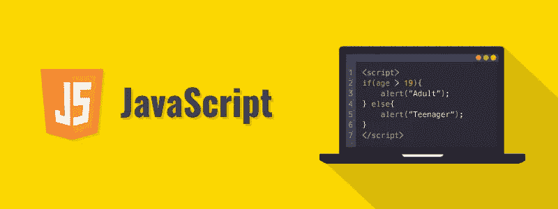
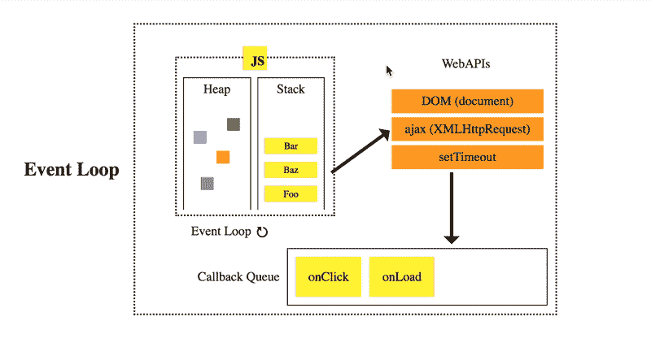

# JavaScript 中什么是事件循环？让我们来了解一下！

> 原文：<https://medium.com/codex/what-is-an-event-loop-in-javascript-lets-find-out-d244b6372456?source=collection_archive---------16----------------------->

你有没有想过 Javascript 在幕后是如何工作的？也许是，也许不是。我自己也不知道如何先执行一件事，然后再执行另一件事。一个语句如何先被执行，即使它是在代码的后面被声明的，而一个代码是在后面被声明的。在这个博客中，我们将看到 Javascript 是如何工作的。为什么它会这样？我们将在此过程中简要介绍一些概念。那么，我们开始吧。

# 堆和栈

当 Javascript 程序运行时，它在堆中分配内存，然后代码逐行执行，因此代码被发送到称为**调用堆栈**的堆栈，在那里创建**执行上下文**。在调用堆栈中的特定代码完成之前，不会运行其他代码。

# **阻塞**

当一段代码在调用堆栈中执行时，速度很慢会造成阻塞。这被称为阻塞，因为当代码运行缓慢时(例如当一个循环比较一个数组的数百万个项目时)在此之前，不能执行任何其他代码。

**有什么解决办法？嗯，我们使用一种叫做异步函数的东西(例如 setTimeout)。想象一个场景，一个程序中存在大量代码，而执行这些代码需要很长时间(例如获取媒体)然后我们使用发送给 WebAPIs 的异步函数，同时其他代码完成执行。异步函数继续它们的工作，比如获取媒体内容，当它完成时，这段代码移动到一个叫做**的任务队列中。****

# 事件循环

现在，你可能会问，进入任务队列的代码是如何回到主调用堆栈的？首先，当已经有一些代码正在执行时，不能在调用堆栈中注入任何代码。

有一种叫做**事件循环**的东西，只要调用栈空闲，它就会处理任务队列中正在执行的代码。它是怎么做到的？让我告诉你，事件循环一直在堆栈和任务队列中循环。当堆栈中有事情发生时，事件循环会阻止任何东西进入堆栈。这就是事件循环的工作方式。

为了更好地理解我在博客中的解释，你可以点击这个链接:[https://www.youtube.com/watch?v=8aGhZQkoFbQ](https://www.youtube.com/watch?v=8aGhZQkoFbQ)

如果你喜欢它，请喜欢并留下你的宝贵意见。我真的很感激。