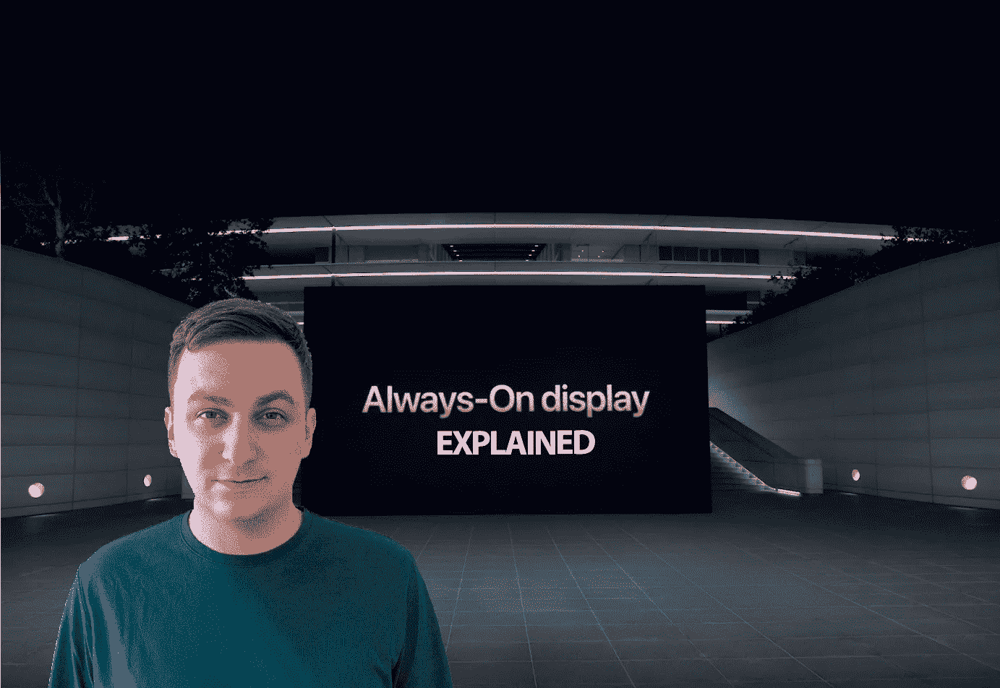

# 什么是 LTPO 展览，它比有机发光二极管展览更好吗？

> 原文：<https://medium.com/codex/what-is-an-ltpo-display-and-is-it-better-than-an-oled-e001cf773da9?source=collection_archive---------4----------------------->

## 深入研究技术

让智能手机更节能，每次充电能让它们发挥更大作用，这不是很好吗？这正是苹果和三星使用的 LTPO 显示技术背后的想法。以下是你对未来触摸屏的期待。

图片由作者提供(基于苹果主题演讲活动)

## 什么是 LTPO 屏幕？