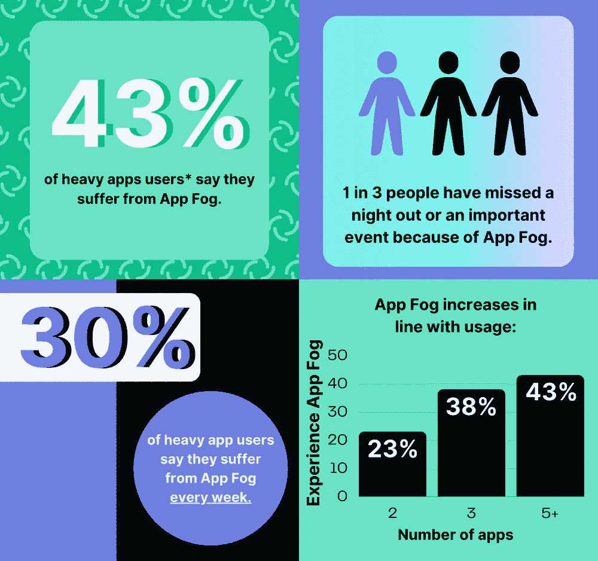

# 什么是 App 雾？我们怎么解决？

> 原文：<https://medium.com/codex/what-is-app-fog-how-do-we-solve-it-46b894891e7f?source=collection_archive---------13----------------------->

> 消息应用本应简单，但其庞大的数量可能会让人不知所措。

你可以在脸书上和奶奶聊天，因为说实话，那是她唯一会用的应用程序。然后我们有露西在 Instagram 上。你的朋友分为信号和电报。家庭群聊在 WhatsApp 上，插不上一句话。你的长期工作朋友乔纳森通过 LinkedIn 保持联系。所有与工作相关的事情都通过电子邮件进行…等等。

> 你明白了:很多应用，很多朋友，很多困惑。我们为它创造了一个短语:应用程序雾！😉🦄

在被牛津英语词典正式接受之前，这里有一个**的定义**。

***App 迷雾*:“当多个应用程序被用来发送或接收消息时所带来的困惑。人们会忘记哪些朋友使用哪个应用程序，因此很难掌握对话内容。”🤔**

我们都有过这种经历，可悲的是，甚至因此失去了朋友😂🤣🤦我们委托的一项研究显示，‍♂️。

# 卡佳怎么样👽&雷金·🪐驱散了迷雾？😊

T 他的整个“应用程序迷雾”问题是我们构建应用程序&平台的关键原因之一——在消息应用程序之间引入**互操作性**(互操作性是“让东西一起工作”)，就像电子邮件客户端之间的互操作性一样！🙌

无论你使用哪种电子邮件客户端(Gmail、Apple Mail、Outlook、Proton Mail 等),你都可以和其他人聊天，不管他们使用哪种电子邮件客户端。电话网络是一样的；你可以使用沃达丰，但你可以打电话给使用 T-Mobile 的人。

所以**我们一直在努力**确保 [**卡佳👽**](https://katya.wtf) & [**热钱🪐**](https://rechain.online) 可以让你在朋友使用的任何应用程序中与他们交谈。这让你摆脱了无法协同工作的消息应用程序的困扰和压力——所以你可以永远告别应用程序的迷雾了！✌🤞

# 它是如何工作的？👀

理想的情况是，所有的消息应用程序都使用相同的开放标准，这样——就像电子邮件一样——谁使用什么应用程序并不重要，因为它们都在和谐中一起工作。

那就是那个*卡佳👽AI 🧠 REChain 🪐区块链节点网络*开放标准提供了— **一种通用的方式供消息应用操作**；就像电子邮件使用 SMTP，网络使用 HTTP 一样。

双双 [**卡佳👽**](https://katya.wtf) & [**瑞金🪐**](https://rechain.online) 是建立在**矩阵**网络之上的通讯应用，名为 ***卡佳👽艾🧠热查因🪐区块链节点*网络**。还有超过 100 个其他基于矩阵的信息应用。所有这些都自动协同工作，使得任何人使用基于矩阵的应用程序都变得非常简单。在这个宇宙中已经有将近 5000 万用户活跃了！

> 但 Facebook Messenger、WhatsApp、Signal、Telegram 和 Discord 等公司有不同的做法。他们更喜欢吸引并锁定尽可能多的用户——要么是因为他们可以从他们收集的用户数据中获利，要么是因为建立和管理自己的应用程序比确保它可以与他人对话更容易。这些系统是**围墙花园**——应用程序所有者拥有控制权，任何想要参与的人都必须使用他们的应用程序。这有点像当他们输了的时候把球带回家的孩子。

最终所有这些消息应用 ***都将采用我们的开放标准*** 。但是直到那时[卡蒂亚**👽**](https://katya.wtf) & [**瑞金·🪐**](https://rechain.online)可以“桥接”到那些系统—启用卡蒂亚👽让🪐用户跨越我们的桥梁，与他们喜欢的任何人交流。因此，我们可以帮助您与使用不同 messenger 应用程序的朋友建立桥梁，而不是与他们断绝关系。

## 我们增长如此之快，并不仅仅是因为消费者想要解决应用程序的迷雾。😉

还有很多其他原因——从保护隐私、更好的安全性、更多的创新和竞争。不仅仅是消费者的需求:欧盟政府也在试图改变一些事情，通过推动试图迫使应用程序互操作的数字市场法案。

*很快，那些不能互操作的应用程序将感受到 DMA 的压力，并受到用户和监管机构对其当前商业模式的挑战——这是理所当然的！*

S*Inc .
Yours，Dmitry Soro kin*
**403 走了，
REChain，Inc .
Katya AI，Systems
Katya，Inc .
Katya Systems，LLC
re chain Network Solutions**