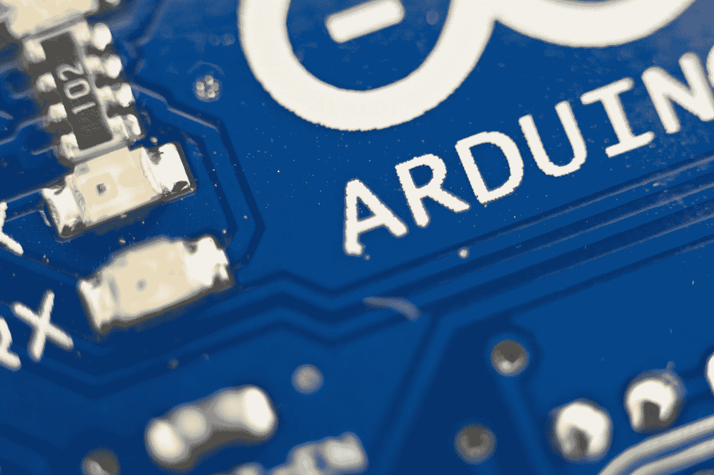

# Arduino 究竟是什么？

> 原文：<https://medium.com/codex/what-is-arduino-actually-49aadfee82ff?source=collection_archive---------25----------------------->

幕后的 Arduino

丹尼尔·安德拉德在 [Unsplash](https://unsplash.com?utm_source=medium&utm_medium=referral) 上的照片

## **简介**

我知道，你听说过 Arduino。你甚至使用了一些电路板，并对它们进行编程来制作一个小项目。

但是在这篇文章中，我想从不同的角度来看 Arduino。

不是作为业余爱好者。但是作为一个对嵌入式系统有一定了解的工程师。