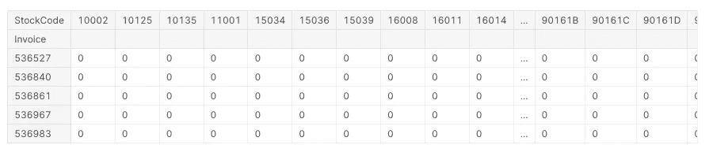

# 什么是关联规则学习？Python 中的一个应用实例:购物篮分析和产品提供

> 原文：<https://medium.com/codex/what-is-association-rule-learning-abd4a76144d8?source=collection_archive---------1----------------------->

在这个故事中，我们将尝试涵盖什么是关联规则学习，我将用 Python 演示一个应用示例。还有，我会在 Kaggle 里分享代码。您可以通过以下链接访问 Kaggle 笔记本:

[](https://www.kaggle.com/enesbaysan/association-rule-learning-in-python) [## Python 中的关联规则学习

### 使用 Kaggle 笔记本探索和运行机器学习代码|使用来自 UCI 在线零售 II 数据集的数据

www.kaggle.com](https://www.kaggle.com/enesbaysan/association-rule-learning-in-python) 

# 什么是关联规则学习？

关联规则学习是一种基于规则的机器学习技术，用于发现模式(关系、结构等)。)在数据集中。通过学习这些模式，我们将能够向顾客提供一些商品。对于产品，我们将使用 Apriori 算法。


由 [CardMapr](https://unsplash.com/@cardmapr?utm_source=unsplash&utm_medium=referral&utm_content=creditCopyText) 在 [Unsplash](https://unsplash.com/s/photos/shopping-cart-analysis?utm_source=unsplash&utm_medium=referral&utm_content=creditCopyText) 上拍摄的照片

## 什么是 Apriori 算法

在这种学习技术中，我们使用 Apriori 算法来提取与目标项目的关联。有时我们可以将这种技术视为购物车分析。

它有以下 3 个指标:

*   Support(X，Y) = Freq(X，Y) / N
*   置信度(X，Y) =频率(X，Y) /频率(X)
*   升力=支撑(X，Y) /(支撑(X) *支撑(Y))

支持度是指同时观察 X 和 Y 的概率

信心是指当 X 卖出时观察到 Y 的概率

升力是指当 X 被买入时，买入 Y 的概率增加升力倍。

> 在大型项目中，识别“什么是购物车”可能是一个挑战。

## Apriori 算法的一个例子


作者图片

我们可以看到上面 Apriori 算法的一个简单例子。

在这个例子中，对于 apriori 算法，我们假设面包是 X，牛奶是 Y。

*   Support(Bread)将给出包含 Bread 的事务计数与总事务计数的比率。
*   Support(Milk)将给出包含 Milk 的事务计数与总事务计数的比率。
*   Support(Bread，Milk)将给出包含面包和牛奶的事务计数与总事务计数的比率。
*   置信度(面包，牛奶)将给出包含面包和牛奶的事务计数与包含面包的事务计数的比率。
*   Lift(Bread，Milk)将得出包含面包和牛奶的事务数与包含面包的事务数之比乘以包含牛奶的事务数。
*   我们可以说，如果买了面包，按照上述过程，我们出售牛奶的概率增加了 1 倍以上。

# Python 中的一个应用实例

在我们的例子中，我们将使用[这个](https://www.kaggle.com/nathaniel/uci-online-retail-ii-data-set)数据集。还有，你可以从[这里](https://archive.ics.uci.edu/ml/datasets/Online+Retail+II)得到。如前所述，我会解释这个故事中代码的含义。你可以在 [Kaggle 笔记本](https://www.kaggle.com/enesbaysan/association-rule-learning-in-python)中找到没有解释的公正代码。

您可以在以下几行中找到数据集的列含义:

*   发票:发票编号。如果这个号码以“C”开头，就意味着这个交易取消了。
*   库存代码:产品代码
*   描述:产品名称
*   数量:产品数量
*   发票日期:交易日期
*   价格:单个产品价格
*   CustomerID:唯一的客户号
*   国家:客户的国家名称

## 安装库

我将使用`openpyxl`读取 excel 文件，使用`mlxtend`使用 apriori 算法并提取规则。

```
!pip install openpyxl!pip install mlxtend
```

## 获取数据集

我将导入从 excel 文件中读取数据所需的库。

```
import pandas as pd
from mlxtend.frequent_patterns import apriori, association_rulesraw_data = pd.read_excel('../online_retail_II.xlsx',sheet_name='Year 2010-2011')
```

## 准备数据集

我来准备数据集。我将筛选出发票列中包含“C”的条目等。这个过程我之前做过很多次。你可以从我之前的故事中看出这其中的意义。我为这个过程写了下面这个函数。我准备了数据帧，并将其赋给一个新变量`df`。

```
def prepare_retail(dataframe):
    *# preparing dataset*
    dataframe.dropna(inplace=True)
    dataframe = dataframe[~dataframe["Invoice"].str.contains("C", na=False)]
    dataframe = dataframe[dataframe["Quantity"] > 0]
    dataframe = dataframe[dataframe["Price"] > 0]
    return dataframedf = prepare_retail(raw_data)
```

## 创建先验数据结构

我需要下面的结构(数据透视表)来使用 apriori 算法。


行代表交易(发票、购物车等。)和列代表产品。我们代表哪个交易(发票，购物车等。)包含哪些产品为二进制。如果产品在发票中，交集单元格将为“1”。如果不是，则为“0”。

为此，我将创建一个带有`id`参数的函数。如果 id 参数为 True，它将使用 StockCode 列创建数据透视表。如果为 False，它将使用产品名称创建数据透视表。

```
def create_apriori_datastructure(dataframe, id=False):
    if id:
        grouped = germany_df.groupby(
            ['Invoice', 'StockCode'], as_index=False).agg({'Quantity': 'sum'})
        apriori_datastructure = pd.pivot(data=grouped, index='Invoice', columns='StockCode', values='Quantity').fillna(
            0).applymap(lambda x: 1 if x > 0 else 0)
        return apriori_datastructure
    else:
        grouped = germany_df.groupby(
            ['Invoice', 'Description'], as_index=False).agg({'Quantity': 'sum'})
        apriori_datastructure = pd.pivot(data=grouped, index='Invoice', columns='Description', values='Quantity').fillna(
            0).applymap(lambda x: 1 if x > 0 else 0)
        return apriori_datastructure
```

使用这个函数后，我会得到如下的结果数据帧。


## 选择基于德国的发票

在这个例子中，我想基于德国的数据工作。这样，我可以节省时间并获得更好的性能。

```
germany_df = df[df['Country'] == 'Germany'] 

germany_df.head()
```


## 获取先验数据结构

我将使用上面创建的函数来获得 apriori 算法数据结构。

```
germany_apriori_df = create_apriori_datastructure(germany_df,True)germany_apriori_df.head() *# Invoice-Product matrix (apriori data structure)*
```



## 学习规则(关联规则学习)

我将创建一个用于提取关联规则的函数。实际上，我们不需要为每个进程创建函数，但是我想如果我为每个进程创建函数，它们会更清晰。

这个函数有两个参数。`apriori_df`是数据帧，即先验数据结构。我们说通过使用`min_support`,可以以最小 0.01 的概率一起销售的产品应该出现。每种产品一起出售的概率。我们将通过使用`apriori`函数来应用 apriori 算法。然后我们将使用`association_rules`函数提取关联规则。

```
def get_rules(apriori_df, min_support=0.01):
    frequent_itemsets = apriori(apriori_df, min_support=min_support, use_colnames=True) rules = association_rules(frequent_itemsets, metric="support", min_threshold=min_support) return rulesgermany_rules = get_rules(germany_apriori_df)germany_rules.head()
```

正如我们在下面看到的，我们使用提取的规则创建的新数据帧有一些我们还不知道的列。


别担心，我在下面解释了它们:

*   前因->第一个产品(我们假设首先售出的产品)
*   结果->下一个产品(我们假设在第一个产品之后销售的产品)
*   先行支持->观察第一个产品的概率
*   后续支持->观察下一个产品的概率
*   支持->一起观察下一个产品(结果)和第一个产品(前提)的概率
*   置信度->在销售第一批产品时观察到下一批产品的概率
*   提升->当卖出第一件产品时，卖出下一件产品的可能性会增加一个提升系数。
*   杠杆->类似于提升，但杠杆倾向于优先于更高的支撑值。如果我们已经有了升力值，我们应该避免使用它。
*   信念->观察前因而不观察后果的概率

## 创建一些实用函数

我将创建一个使用产品 id 获取产品名称的函数。

```
def get_item_name(dataframe, stock_code):
    if type(stock_code) != list:
        product_name = dataframe[dataframe["StockCode"] == stock_code][["Description"]].values[0].tolist()
        return product_name
    else:
        product_names = [dataframe[dataframe["StockCode"] == product][["Description"]].values[0].tolist()[0] for product **in** stock_code]
        return product_names
```

我要去测试一下。

```
get_item_name(germany_df,10125)
```


我将创建另一个有用的函数。我们将看到购物车中的产品以及与之相关的推荐产品。

```
def get_golden_shot(target_id,dataframe,rules):
    target_product = get_item_name(dataframe,target_id)[0]
    recomended_product_ids = recommend_products(rules, target_id)
    recomended_product_names = get_item_name(dataframe,recommend_products(rules, target_id))
    print(f'Target Product ID (which is in the cart): **{**target_id**}\n**Product Name: **{**target_product**}**')
    print(f'Recommended Products: **{**recomended_product_ids**}\n**Product Names: **{**recomended_product_names**}**')
```

## 推荐产品

我将创建另一个函数来模拟推荐过程。其实我们会在这个功能里做一个推荐。

```
def recommend_products(rules_df, product_id, rec_count=5):
    sorted_rules = rules_df.sort_values('lift', ascending=False) 
*# we are sorting the rules dataframe by using "lift" metric*
    recommended_products = [] 

    for i, product **in** sorted_rules["antecedents"].items(): 
        for j **in** list(product):  
            if j == product_id:  
                recommended_products.append(
                    list(sorted_rules.iloc[i]["consequents"]))

    recommended_products = list({item for item_list **in** recommended_products for item **in** item_list}) 

    return recommended_products[:rec_count]
```

你可以在 Kaggle 笔记本中看到对上述功能的深入解释。这里我就不深解释了。只要知道这一点，我们上面编码的函数通过使用提升度量对保存关联规则的数据帧进行排序。然后它过滤出包含`product_id`参数的条目，并从结果列中收集相关产品，并将它们添加到`recommended_list`中，然后该函数最终返回为推荐产品创建的推荐产品。

## 让我们做一些推荐

我将创建一些产品 id 来模拟这种情况。

```
*# simulating some products like they are in cart*
TARGET_PRODUCT_ID_1 = 21987
TARGET_PRODUCT_ID_2 = 23235
TARGET_PRODUCT_ID_3 = 22747
```

我可以通过使用我们在上面创建的查看产品名称的函数来查看目标产品的名称。

```
get_item_name(germany_df, [TARGET_PRODUCT_ID_1,TARGET_PRODUCT_ID_2, TARGET_PRODUCT_ID_3])
```


我正在执行测试的推荐功能。


# 最后

希望你喜欢这个。我尽力了。如前所述，您可以在 Kaggle 笔记本中看到所有代码。

诚挚的问候