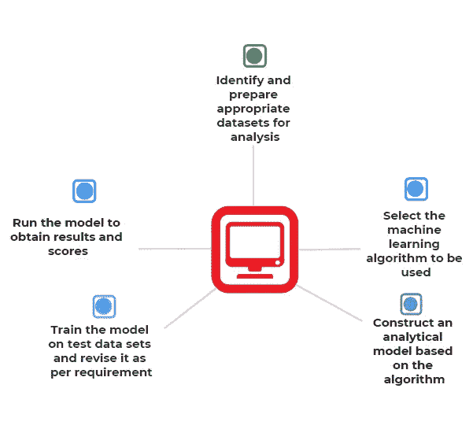

# 理解机器学习的自动驾驶仪— AutoML

> 原文：<https://medium.com/codex/what-is-automl-2e29b5364784?source=collection_archive---------18----------------------->

## 自动化机器学习和数据科学家的未来！

作者创作的插图

AutoML 是一个描述在现实世界场景中实现机器学习的自动化端到端过程的术语。这是一个人工智能系统。它专注于自动分析数据，并以最小的努力提供可操作的见解。换句话说，它使我们能够将机器学习应用到现实世界的应用中，即使你不是该领域的专家。主要目标是将数据科学家从重复和耗时的活动中解放出来。

ML 的目标是使用模型来构建模式的表示，然后使用这些模型来判断新的值。ML 算法在接受训练时会改进模型，就像一个蹒跚学步的孩子通过监督教育和接触的混合来学习基础语言一样。

这是一个将机器学习过程的每个步骤计算机化的平台，从管理原始数据集到安装有用的 ML 模型。

# AutoML 使用:

*   **为数据集寻找合适的模型**:每个数据集可以采用多种方法，如逻辑回归、决策树等等，为数据集确定最佳策略可能是一个耗时的过程，需要大量的调查和定制。
*   **超参数优化**:每种机器学习技术都包含代表每个变量权重的参数。大多数最大似然模型和参数一样，也有超参数，这些超参数通常包括辍学率和特定于模型的参数，如[随机森林](https://towardsdatascience.com/understanding-random-forest-58381e0602d2)中的树木数量。开发人员在培训阶段开始之前确定他们的值。因为超参数与模型参数不同，不是在训练期间从数据中学习的，所以它们在训练阶段通常是恒定的。超参数的最佳选择产生最精确的模型，但是确定理想的组合需要策略。
*   **特征选择** : [特征工程](https://towardsdatascience.com/feature-engineering-for-machine-learning-3a5e293a5114)是确定最佳变量集以及最佳编码的过程，用作训练过程的输入。特性对于模型构建是必要的，尽管最好的特性通常取决于所使用的模型。此外，所采用的特征的数量影响模型开发和评分持续时间，可能会减慢整个过程。通过一个机械化的审查程序，它确定哪种特征组合效果最好。

# AutoML 的重要性:

*   **无需人工干预:**每一步都可以电脑化，减少人工干预。
*   **易于使用:**它简化了 ML 方法的使用。使用它你不必是一个 ML 专家。
*   **资源的最佳利用:**它使任何商业或企业能够采用 ML 解决方案，而无需投入额外的时间和金钱来寻找所有专业人员，从而获得更高的投资回报。
*   **通用:**通过 AutoML，金融、营销、零售、运输和医疗保健等组织可以轻松受益于人工智能和机器学习。
*   **对数据科学家有益:**科学家将能够更专注于具有挑战性的问题，而不是训练模型或进行其他活动。

# 它是如何工作的？

作者创建:AutoML 学习过程

将一个 ML 模型付诸实施包括几个阶段。我们可以使用 AutoML 简化这些步骤。

*传统的机器学习需要以下步骤:*

*   首先，从多个来源收集数据，并将其合并到一个媒体中。
*   然而，为了将数据直接用于测试，必须执行一些处理。这包括清除重复、处理缺失值和检测泄漏。
*   机器学习过程的下一个阶段是特征工程，它试图将分类值和序数值转换为数字特征。
*   需要进行额外的研究来选择合适的模型，并确定哪种模型最适合数据集。在此阶段，将对进行培训、分析和评估，以获得最佳性能。
*   超参数调整也用于通过微调参数来提高性能。
*   最后，我们基于以前未知的值生成预测。机器学习为 ML 模型已经被教会回答的查询提供答案。

AutoML 主要关注数据采集的第一阶段和预测的最后一步。顾名思义，所有其他中间阶段都是计算机化的。它使用组合值作为输入，并生成预测作为输出。它生成可用于预测的优化模型。

# AutoML 在现实生活中的应用

*   **金融欺诈检测:**它有可能提高欺诈检测算法的准确度和精确度。
*   **图像识别:**可以用来识别人脸。
*   **网络安全:**可用于网络安全的风险评估、监控和测试。
*   **恶意软件:**恶意软件和垃圾邮件就是可以用来制造适应性网络威胁的例子。
*   娱乐:它可以用作内容选择引擎。
*   **客户协助:**可以用来分析聊天机器人的情绪，提高客服人员的效率。
*   **营销:**它可以通过预测分析来提高参与度。它还可以用来提高社交媒体行为营销计划的有效性。
*   **医疗保健研发:**它可以评估大数据量并得出结论。

# 流行的 AutoML 平台

*   Google Cloud AutoML :它是一个在云上实现自动化 ML 的平台。它使你能够快速创建你自己独特的 ML 模型。
*   **SMAC:** [SMAC](https://www.cs.ubc.ca/labs/beta/Projects/SMAC/) 是改进算法参数的有力工具。这对 ML 算法的超参数调整非常有用。
*   **Auto-Keras:** 它是一个开源的免费使用的库[由德克萨斯 A & M 大学的数据实验室与其他社区成员合作创建。这个库以提供自动搜索深度学习的超参数和架构的方法而闻名。](http://autokeras.com/)
*   **Auto-sklearn:** 基于 [scikit-learn](https://automl.github.io/auto-sklearn/) ML。它可以为每个数据收集找到最佳方法，然后调整超参数。

# 了解谷歌的 AutoML

[Google Cloud AutoML](https://cloud.google.com/automl) 为语言对翻译、自然语言分类和图片分类提供自动深度迁移学习和神经架构搜索，而不是从你的价值观训练模型时从头开始。

*迁移学习对于从零开始训练神经网络有两个显著的好处:*

1.  因为网络的大部分层已经被完全训练，所以训练所需的值要少得多。
2.  因为它只是优化了最后几层，所以运行起来很流畅。

*谷歌云 AutoML 提供多种服务，包括:*

*   AutoML Vision:它允许我们训练 ML 模型根据你自己的标签对图片进行分类。
*   视频智能 API:开发者可以使用视频智能 API 将谷歌的视频分析功能集成到他们的应用中。
*   **AutoML Tables** :这是一个监督学习工具，允许你根据现实世界的值训练一个 ML 模型。它使用表格(结构化格式)值进行训练，以生成对新值的预测。
*   **AutoML 自然语言和翻译**:您可以使用 AutoML 自然语言创建和部署独特的 ML 模型，对文档进行评估、分类并识别其中的实体。另一方面，AutoML Translate 允许你进行监督学习，这需要教会计算机识别翻译短语对中的模式。

# 数据科学家工作的未来

在我们进入自动化是否会扼杀就业机会之前，理解数据科学与机器学习的不同是至关重要的。

数据科学家应用工程、统计和人类专业知识从业务角度理解数据，并给出可靠的见解和预测。同时，ML 算法有助于识别组织模式。然而，它们在数据驱动过程中的功能仅限于生成对未来事件的预测。他们还不能完全理解具体数据对公司及其关系意味着什么。

低级任务的某些方面确实可以计算机化，导致某些工作岗位的丧失和总体收入的减少。然而，重要的是要注意到 **AutoML 的主要目的是将科学家从繁琐耗时的工作中解脱出来**。

AutoML 只会让科学家更容易专注于复杂的主题。这也创造了巨大的需求。然而，如前所述，ML 技术缺乏建立和验证研究所需的人类好奇心和动力。数据科学家是目前唯一能做到这一点的人。

计算机将无法取代人类的决策和认知。从长远来看，技术进步可能会增加它发生的可能性，但我们永远不知道未来会发生什么。

如果你觉得这篇文章有帮助，那么请把它发给其他人。

https://youtu.be/OSwuhYfMwWY ✅learn 过着社交焦虑的生活⇾