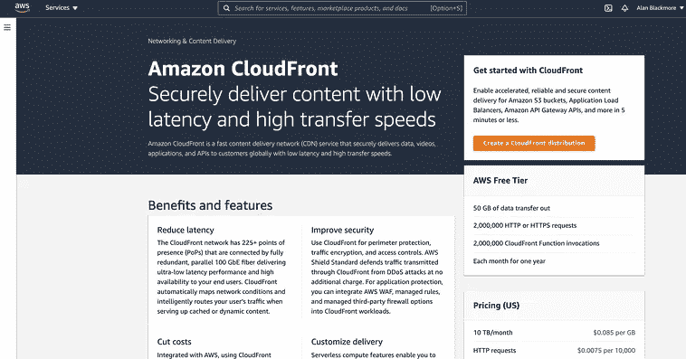
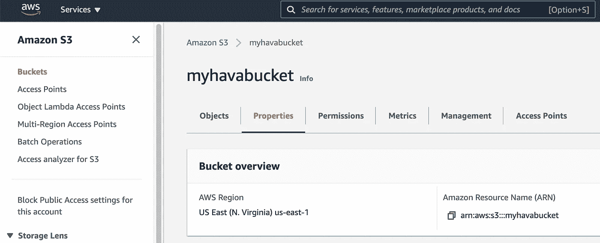
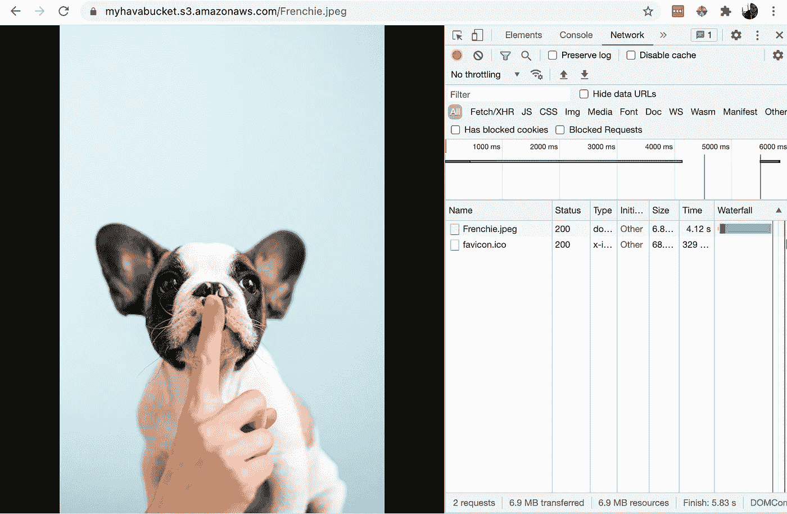
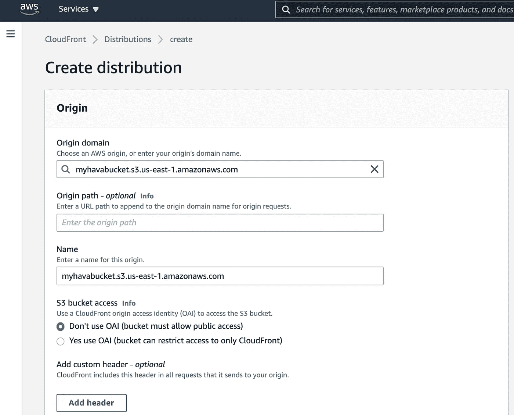
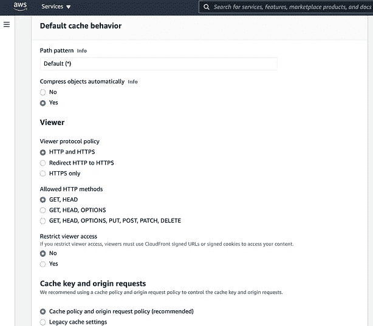
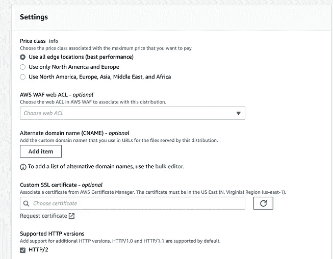
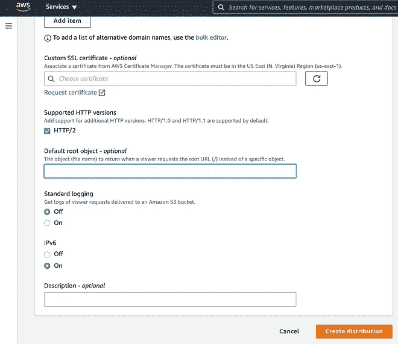
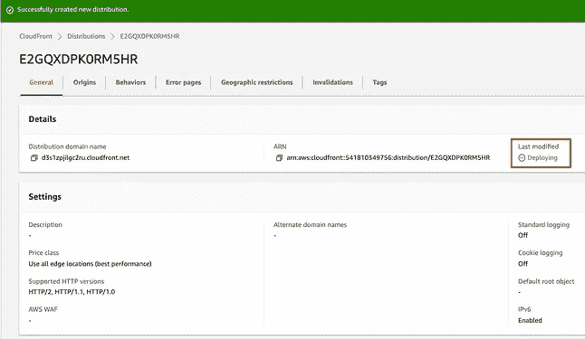
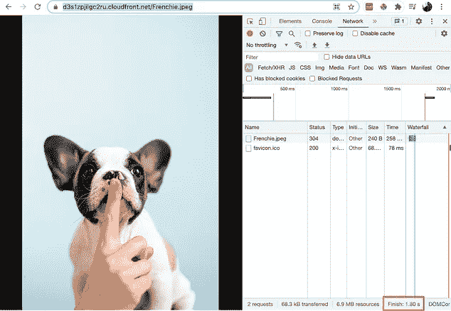

# 什么是 AWS CloudFront，它有什么作用吗？

> 原文：<https://medium.com/codex/what-is-aws-cloudfront-and-does-it-make-a-difference-a822135fa5d6?source=collection_archive---------12----------------------->

AWS 为应用程序和数据存储提供安全的基于云的服务。这些可以是您希望您的用户访问的计算资源、数据库、静态资产，如图像、视频或音频文件。

web 应用程序或网站检索数据和内容所需的时间对于提供良好的用户体验非常重要。

CloudFront 是一种内容交付服务，它将存储在 AWS 中的数据复制到世界各地的其他边缘位置，以便当更接近该位置的用户请求时，可以更快地提供服务。

当您创建 AWS 帐户时，您可以选择一个特定的区域来托管您使用 AWS 服务创建的任何基础架构和数据。该区域实际上是特定于地理位置的数据中心，其中包含您从 AWS 租赁的物理计算机硬件，作为其基础架构即服务(IaaS)或平台即服务(PaaS)的一部分

每个区域都有名称，并与该地理区域的主要 AWS 数据中心相关联:

例如:

美国东部-1 =美国东部(北弗吉尼亚)

美国西部-1 =美国西部(北加利福尼亚)

Af-south-1 =非洲(开普敦)

Ap-east-1 =亚太地区(香港)

Ap-southeast-1 =亚太地区(悉尼)

提供更快的数据访问或更低延迟的最佳方式是将您的数据和应用程序存储在尽可能靠近您的用户的地方。因此，如果您有一个应用程序为位于加利福尼亚州的用户提供服务，那么当用户访问的应用程序或 web 服务需要获取内容或数据时，在 us-west-1 中托管应用程序和数据将提供最快的响应时间。

AWS CloudFront 发挥作用的地方是当您的用户位于比您设置基础设施的位置更靠近其他 AWS 区域和边缘位置的时候。

如果您的主要 AWS 帐户基础架构设置在 us-west-1(北加州)，但大部分用户在澳大利亚，那么从 Ap-southeast-1(悉尼)服务数据请求将更有意义，这就是 CloudFront CDN 变得非常有价值的地方。

当您设置 CloudFront 发行版时，只要用户靠近另一个 AWS 区域并发出数据请求，数据就会被复制到离他们最近的 AWS 区域缓存中，这样就可以更快地提供服务。这也意味着，当同一地区的其他用户请求相同的数据或内容时，它已经位于离他们最近的数据中心，并且可以比从创建源应用程序和数据的原始地区请求更快地得到服务。

无论是静态内容还是动态内容，如 html、css、javascript 或图像，CloudFront 都会在本地缓存内容，以便更快地访问。这加快了静态网站内容的交付，并改善了点播或直播视频的交付。

# 面向 CloudFront 的 AWS 全球基础设施

CloudFront 在全球拥有超过 80 个边缘位置和 10 个或更多用于内容交付的径向边缘缓存。这个不断发展的网络提供了一个机会，通过一个易于使用的安全服务以低成本扩展您的内容交付，该服务与许多 AWS 数据存储和计算服务(如 AWS Web 应用程序防火墙、证书管理器、route53 和亚马逊 S3)深度集成。

AWS CloudFront 的典型用例包括静态资产缓存、实时视频流、安全和 DDoS 保护、API 加速和软件分发。

# 如何设置 AWS CloudFront？

在这个例子中，我们将为一个 S3 桶的内容设置一个 CloudFront 发行版。bucket 位于 us-east-1，访问请求将从澳大利亚发出，我们将看到在引入 CloudFront 后，样本图像的加载速度是否有任何不同。

我们的铲斗位于北弗吉尼亚

在不使用 CloudFront 的情况下访问一个 6.5mb 的映像始终会返回 5.8-6.2 秒的响应

从 AWS 中的 Cloudfront 控制台，您可以创建一个新的发行版。

在这个屏幕上，您需要选择希望通过 CloudFront 分发的实体的来源，这可以是域、web 服务器、应用程序 IP 地址(甚至是 AWS 外部的)或 AWS 服务来源，如 S3 桶或负载平衡器端点。

一旦选择了原点，AWS 将为原点建议一个名称，如果需要，您可以更改该名称。

我们可以在这一点上设置查看器行为，但将保留默认值。

在设置选项中，您可以选择价格类别。这将决定 CloudFront 将在全球的哪些区域缓存您的内容。

您还可以选择指定已经在 AWS 证书管理器中设置 AWS WAF web ACL、自定义 CNAME 和 SSL 证书。

现在你需要做的就是选择“创建发行版”。然后，AWS 会将发行版部署到您选择的边缘位置。

部署时间通常需要 10–15 分钟，分发状态才会变为启用状态并开始运行。

但这有什么不同吗？

如果我们使用 AWS 在设置 CloudFront 发行版时提供的域名来检查相同的映像加载速度。这将确保我们访问最近的边缘位置。

随着 CloudFront 的活跃，我们托管在 us-east-1 并从澳大利亚请求的 6.5mb 图像的加载时间现在从 5.8 秒下降到 **1.8 秒**，减少了 4 秒(68.98%)，这在核心网站生命周期和页面加载速度在许多层面上都是一个关键指标的今天是一个生命周期。

如果您有全球分布的客户端或用户，CloudFront 作为一种提高内容交付性能的方法绝对值得一看。

如果您正在 AWS 上构建或托管应用程序和数据，Hava 自动生成的网络拓扑图也绝对值得一看。无需手动，无需拖放，当你连接到你的 AWS、Azure 或 GCP 帐户时，hava.io 将生成一组网络拓扑、安全和 3d 图表。

创建后，Hava 会持续轮询您连接的云配置，当检测到更改时，会生成一组新的图表，被取代的图表会被放入版本历史中，如果您需要快速识别更改，可以检查这些图表并将其与当前图表集进行比较。

你可以在这里免费试用 Hava:https://www . Hava . io

*原发表于*[*https://www . hava . io*](https://www.hava.io/blog/what-is-aws-cloudfront-and-does-it-make-a-difference)*。*