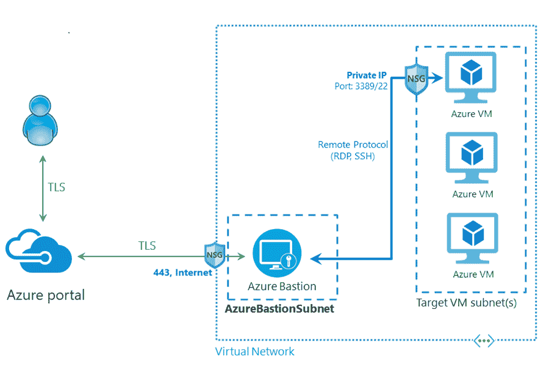

# 什么是 Azure Bastion 服务

> 原文：<https://medium.com/codex/what-is-azure-bastion-service-6adb7e069137?source=collection_archive---------13----------------------->

如果您管理远程服务器或虚拟机，大多数人可能都熟悉 RDP 和 SSH。使用 RDP 和 SSH 远程访问虚拟机和服务器。

我们还可以使用 RDP 和 SSH 来访问云中的虚拟机，比如 Azure。您可以在设置中选择连接选项，查看连接到虚拟机的三种方式——SSH、BASTION 和 RDP。

在这篇文章中，你将了解 Azure Bastion 以及使用它来连接你的 Azure 虚拟机的目的。请继续阅读。

**目录**

*   什么是 Azure Bastion 服务？
*   为什么要用 Azure Bastion 服务？
*   Azure Bastion 服务的架构
*   Azure Bastion 服务的主要特性
*   启用 Azure Bastion 服务
*   结论

# 什么是 Azure Bastion 服务？

为了在远程虚拟机或远程服务器和客户端机器之间提供安全的连接，使用虚拟专用网络(VPN)。但是您需要在大多数 VPN 中的机器上安装 VPN 客户端应用程序。为了连接到机器，VPN 使用远程机器上的公共 IP。

Azure Bastion 允许您使用浏览器连接到 Azure 虚拟机。它通过传输层安全性(TLS)直接从 Azure 门户提供无缝、安全的 SSH 或 RDP 连接。这是因为它是 Azure 的平台即服务(PaaS)。在 RDP 连接中，客户端计算机通常使用 IP 和登录凭据来连接和登录虚拟机。这些是由虚拟机配置的，并且是公开的公共 IP。当您通过 Azure Bastion 连接时，您的虚拟机不需要公共 IP 地址、特殊的客户端软件或代理。

SSH 和 RDP 连接提供给虚拟网络中的所有虚拟机，在虚拟网络中提供了 Bastion(当您通过 Azure Bastion 连接时)。因此，尽管使用 SSH 或 RDP 提供访问，您的虚拟机也不会向外界暴露 SSH 或 RDP 端口。

# 为什么要用 Azure Bastion 服务？

使用 Azure Bastion 的主要原因是它使远程连接更加安全。它创建了一个更安全的私有虚拟网络，并限制对远程机器的任何访问。这限制了针对虚拟机的威胁，如端口扫描和其他类型的恶意软件。

# Azure Bastion 服务的架构

Azure Bastion 的部署是基于虚拟网络的，而不是基于帐户、订阅或虚拟机的。一旦您在虚拟网络中提供 Azure Bastion 服务，SSH 或 RDP 体验就可用于同一虚拟网络中的所有虚拟机。

通过使用 SSH 或 RDP 等基本手段，您可以连接到运行在 Azure 中的工作负载。在互联网上暴露 SSH 或 RDP 被视为一个重大的威胁，这是完全不可取的。由于协议漏洞，这种情况经常发生。您可以部署堡垒主机。这些也称为跳转服务器，位于您的外围网络的公共端，用于遏制这种威胁。Bastion 主机服务器可以抵御攻击，因为它们是这样设计和配置的。到位于堡垒后面以及网络内部的工作负载的 RDP 和 SSH 连接也由堡垒服务器提供。

**图片来源:**[https://docs . Microsoft . com/en-us/azure/bastion/bastion-概述](https://docs.microsoft.com/en-us/azure/bastion/bastion-overview)

上图显示了 Azure Bastion 部署的架构。在此图中，您可以看到:

*   在虚拟网络中，部署了堡垒主机。
*   用户可以使用任何 HTML5 浏览器连接到 Azure 门户。
*   要连接的虚拟机由用户选择。
*   只需单击一下，SSH 或 RDP 会话就会在浏览器中打开。
*   在 Azure 虚拟机上，不需要公共 IP。

# Azure bastion 服务的主要特性

以下是 Azure Bastion 服务的主要功能:

*   在 Azure 门户中，您可以通过单击直接进入 SSH 和 RDP 会话。
*   Azure Bastion 使用一个基于 HTML5 的 web 客户端，它会自动传输到您的本地设备，这样您就可以在端口 443 上通过 TLS 获得 SSH 或 RDP 会话。这使您能够安全地穿越公司的防火墙。
*   使用虚拟机上的私有 IP，Azure Bastion 打开到 Azure 虚拟机的 SSH 或 RDP 连接。不需要公共 IP。
*   由于您不必向公共互联网公开您的虚拟机，因此您可以保护您的虚拟机免受虚拟网络外部恶意和流氓用户的端口扫描。
*   Azure Bastion 位于虚拟网络的外围，因此您不必考虑加固虚拟网络中的每个虚拟机。通过保持 Azure Bastion 的坚固性并始终保持最新，Azure 平台可以保护您免受零日攻击。

# 如何启用 Azure Bastion 服务

以下是从 Azure 门户在虚拟机上启用 Azure Bastion 的步骤:

第一步是创建一个堡垒主机。这是在 VNet 上创建到虚拟机的安全连接所必需的。以下是创建堡垒主机的子步骤:

*   在主页上选择要启用堡垒的虚拟机。
*   单击连接并选择堡垒
*   点击创建
*   在“创建堡垒”页面上配置新的堡垒资源。

要配置堡垒资源，您需要填写以下详细信息:

*   **订阅** —输入将用于创建新堡垒资源的 Azure 订阅。
*   **资源组** —堡垒资源将在选中的 Azure 资源组中创建。如果没有现有的资源组，请创建一个新的。
*   **名称** —为新的堡垒资源提供一个名称。
*   **Region** —选择将在其中创建资源的 Azure 公共区域。
*   **虚拟网络** —选择将创建堡垒资源的虚拟网络。可以在运行中创建新的虚拟网络，也可以使用现有的虚拟网络。使用现有的虚拟网络检查虚拟网络中的可用空间，以及它是否能满足 Bastion 子网的要求。如果现有网络未显示在下拉列表中，请检查是否选择了正确的资源组。
*   **子网** —一旦选择或创建了虚拟网络，就会出现一个子网字段。堡垒主机将部署在所选虚拟网络的该子网中。子网将专用于堡垒主机。通过选择管理子网配置来创建 Azure Bastion 子网。单击+Subnet 并遵循以下指导原则创建子网:
*   该子网必须命名为 **AzureBastionSubnet** 。
*   子网必须至少为/27 或更大。

不需要更多字段。单击确定并选择创建堡垒以返回到堡垒配置页面。

*   **公共 IP 地址** —必须在同一个区域，这是堡垒主机的公共 IP。
*   **公共 IP 地址和名称** —保留默认值
*   **公共 IP 地址 SKU** —保留默认值
*   分配 —保留为默认

填写完所有信息后，单击创建。

# 结论

Azure Bastion 服务有很多特性，比如 SSH 和 RDP 连接的可用性，不需要公共 IP，等等。这些特性使得 Bastion 成为使用浏览器连接 Azure 虚拟机的良好服务。因此，继续前进，并开始使用它为您的虚拟机。

*原载于*[*https://www . partech . nl*](https://www.partech.nl/nl/publicaties/2021/06/what-is-azure-bastion-service)*。*