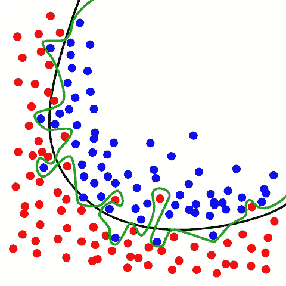
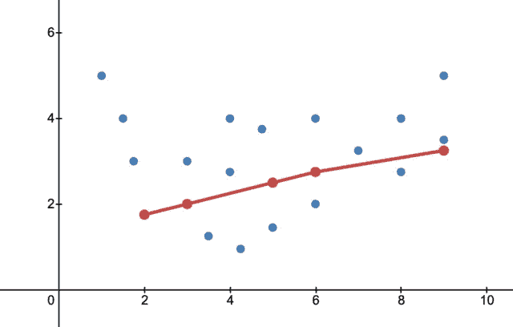
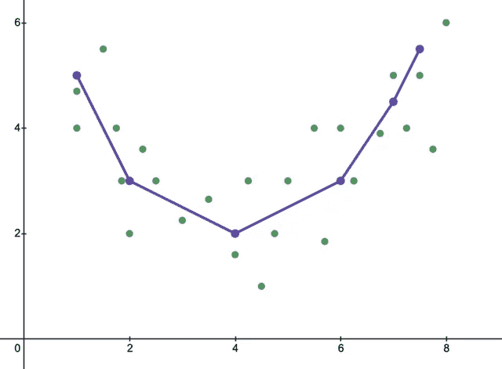

# 什么是机器学习中的偏差和方差？

> 原文：<https://medium.com/codex/what-is-bias-and-variance-in-machine-learning-1756c36f49f7?source=collection_archive---------10----------------------->

让我们深入了解偏差和方差以及欠拟合和过拟合

机器学习是人工智能的一个子集，在不同领域发展迅速。机器学习从输入其模型的数据中学习，这有助于它随着时间的推移做出更好的预测。ML 模型需要各种各样的大量数据来做出有意义的预测。

由于巨大的规模和现实世界的限制，总是会有误差，这导致预测和实际结果之间的偏差。数据科学家的主要目标是最小化误差，以做出更准确的预测。

**机器学习错误:**

ML 中有两种类型的错误:

**#1 可还原错误**:

数据集中存在的偏差和方差被称为可约误差，因为它们可以被调整和微调，并调整到一定程度以提高模型的准确性

**# 2 不可约误差:**

无论您做什么，数据集中总会存在一些错误。例如，可能有未知变量，其值不能改变或减少。

不可约误差是不可改变的，数据科学家需要解决这个限制。

# **偏置:**

偏差是指平均预测值与期望值之间的差异。高偏差是指当模型过于简化，ML 模型无法识别数据集中的真实关系或主导模式时的现象。

每个模型都有一个内在的偏好，因为它帮助模型以更快更容易的方式学习。高偏差导致模型拟合不足。

一般来说，线性算法具有较高的偏向性，这使得它们能够快速学习。而非线性算法具有较低的偏差，因为它们比线性模型更复杂。简单来说，算法越简单，模型中的偏差越大。

**以下是高偏差数据模型的特征**

#1 无法捕捉趋势

#2 高错误率

#3 装配不足

#4 过于简化/过于一般化的模型

# **差异:**

如果使用新的不同训练数据集，方差测量值/输出的变化。在理想情况下，对于不同的训练数据集，模型不应该不同。当数据科学家使用具有多种特征的复杂模型时，差异就会显现出来。

高方差会导致过度拟合，这会捕获比所需更多的数据点以及噪声。然而，具有低方差的模型在样本模型和预测模型之间具有最小的差异。

具有高方差的模型在训练数据集上表现良好，但是当提供看不见的数据时，其表现不如预期。

线性回归和逻辑回归模型具有较低的方差，而决策树、支持向量机和 k 近邻模型具有较高的方差。

**高方差模型的特征**

排名第一的高复杂性

#2 将所有数据点相互靠近

#3 过度拟合

数据集中的#4 噪音

**欠拟合和过拟合:**

现在我们已经理解了偏差和方差，让我们来理解过度拟合和欠拟合是怎么回事

过拟合和欠拟合是困扰每一个机器学习模型的两个问题。最优的机器学习模型应该能够适应所有未知的输入，并且每次都提供可靠的输出。

# **过拟合**

过拟合是指数据科学家用大量数据训练 ML 模型的情况。打个比方，想象一个苗条的人穿着宽松的超大号衣服！

当模型被大量数据训练时，它开始覆盖比需要的更多的数据点，在这个过程中，它也开始整合噪声和不准确的值

过度拟合模型具有高方差和低偏差。监督学习算法总是遭受过拟合。

.

作者 chaba cano——自己的作品，CC BY-SA 4.0，[https://commons.wikimedia.org/w/index.php?curid=3610704](https://commons.wikimedia.org/w/index.php?curid=3610704)

**什么导致过度拟合:**

以下是提到的导致过度拟合的一些原因

ML 模型中的第一大差异

#2 模型的高度复杂性

#3 使用不干净和非结构化的数据

#4 不充分的训练数据集

**如何纠正过拟合**

#1 用足够的数据训练模型

#2 实施正规化技术

#3 应用 K 倍交叉验证

#4 移除功能

#5 组装技术

# **欠拟合:**

欠拟合是当 ML 模型不能识别数据趋势时发生的现象

打个比方，想象一个健康的人试图穿上一件小号的衣服。

该模型无法从训练数据中学习以做出可靠和准确的预测。这是由于高偏差和低方差造成的

作者:AAStein —自己的作品，CC BY-SA 4.0，[https://commons.wikimedia.org/w/index.php?curid=112896907](https://commons.wikimedia.org/w/index.php?curid=112896907)

**什么原因导致拟合不足:**

#数据集中的高偏差和低方差

# 2 用于预测的简化模型

#3 用于预测的不干净数据

#4 训练数据集的规模不足

**如何纠正欠拟合**

#1 使模型更复杂

#2 增加训练数据集的功能和持续时间

#3 消除数据集中的噪音

# **很适合:**

理想情况是预测值与数据集中的实际值相匹配，并且没有记录错误。然而，在现实生活中，这是不可能实现的。最佳解决方案是找到一条有助于获得所需输出的中间路径。

通过不断训练模型，训练数据集中的错误会随着时间的推移而减少。测试数据集也会发生同样的事情。如果您继续测试训练数据集，它最终也会开始捕获噪声，并导致过度拟合。

由 AAStein —自己的作品，CC BY-SA 4.0，[https://commons.wikimedia.org/w/index.php?curid=113123580](https://commons.wikimedia.org/w/index.php?curid=113123580)

我们需要保持警惕，观察错误开始增加的关键点。此刻我们需要停止训练。这种经过训练的模型被认为是合适的，并且可以做出有效的预测。