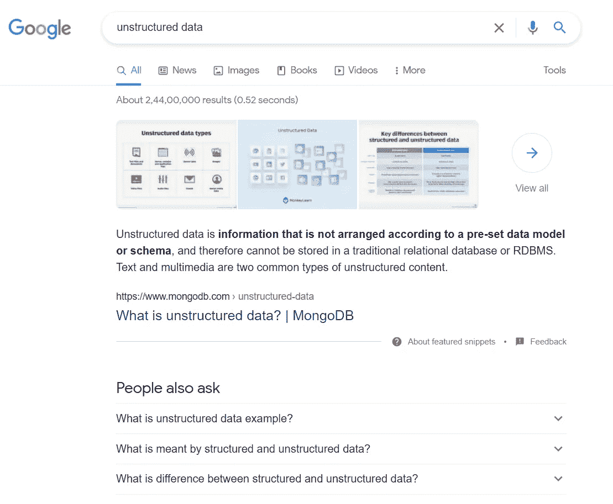

# 什么是大数据技术？

> 原文：<https://medium.com/codex/what-is-big-data-technology-6ff52c51187d?source=collection_archive---------8----------------------->

虽然“大数据”这个词相当新，但人类从 20 世纪 60 年代和 70 年代就开始使用数据集了。自创建第一个数据中心以来，组织一直在使用电子表格和基础分析来对未来做出准确的决策。

每天都会产生 2.5 万亿字节的统计数据。随着互联网接入的增加，这一数字可能会增加。我们现在可以从任何可以数字化监控的领域获取大量信息。信息量是无与伦比的。

我们才能理解大数据技术在我们日常生活中的应用。我们首先要了解什么是大数据，大数据是如何收集的。

大数据是一个庞大的数据集合，随着时间的推移呈指数级增长。这是一个庞大而复杂的数据集。即使是标准的数据管理技术也无法有效地存储或处理它。

以下是一些例子:

*   纽约证券交易所:纽约证券交易所每天创造大约 1tb 的新交易信息。
*   脸书:据 [TechCrunch](https://techcrunch.com/2012/08/22/how-big-is-facebooks-data-2-5-billion-pieces-of-content-and-500-terabytes-ingested-every-day/) 报道，脸书的技术每天处理 25 亿条内容和 500 多 TB 的统计数据。它接收 27 亿。比如动作和每天 3 亿张图片，每半小时分析约 105 的信息。

# 大数据的类型

*以下是不同的类型:*

*   结构化的
*   无社会组织的
*   半结构化的

# 结构化的

结构化数据是指任何可以以设定的方式进行分析、检索和存储的信息。随着时间的推移，软件工程的专业知识在开发与这种数据交互的方式以及从中获得激励方面取得了更显著的进步。

大数据中的结构化数据是最容易处理的。它与参数指定的测量值密切相关。它基本上是定量信息，如地址、年龄、费用、借记卡号等。

下面显示的数据库是结构化数据的一个例子。

# 无社会组织的

这是大数据的一种形式，包括大量非结构化文件的统计格式，如图片文件、视频文件和音频文件。非结构化数据是任何具有未知结构或模型的信息。除了数据量大之外，非结构化数据在处理和从中提取价值方面还存在许多新问题。由基本文本文件、图片、电影等混合组成的异构信息源是非结构化数据的一个例子。

“谷歌搜索”提供的结果是非结构化数据的一个很好的例子。

# 半结构化的

半结构化数据是一种包括结构化数据和非结构化数据的形式。这表明即使统计数据没有被组织到特定的数据库中。它仍然包含重要的标记或信息，可以隔离数据中的某些组件。

XML 文件中包含的个人信息就是半结构化数据的一个例子。

# 大数据的重要性

*组织需要收集和评估大量信息，原因如下:*

*   **提高效率**:大数据有助于分析企业的许多要素。例如，它可以帮助您确定产品从生产地到达市场需要多长时间。此信息可用于确定花费时间最多的生产领域。这有助于您识别障碍并开发解决方案，从而提高生产率并缩短时间。产品到达市场需要时间。
*   **节约成本**:利用大数据提高效率可以在制造过程中节省大量成本。当组织需要存储大量数据时，Spark、Apache Hadoop 等工具可以帮助他们节省资金。这些工具帮助企业发现更成功的商业实践。
*   **节省时间**:Hadoop 等大数据工具使公司能够实时评估数据，从而根据调查结果快速做出选择。在这种技术的帮助下，企业能够在更短的时间内分析数据。
*   **更好地了解市场状况**:数据分析有助于组织更好地了解市场状况。例如，监控客户购买行为使企业能够确定最受欢迎的商品。一旦他们知道他们最受欢迎的产品是什么，由于高需求，他们将开始创造更多的这些产品。这使得企业能够在竞争中保持领先。
*   **提高在线形象**:大数据工具可以帮助企业提高在线形象。企业可以使用这些工具进行情感分析。这些工具将允许他们收集关于他们公司的反馈，比如谁在说什么。
*   **提高客户参与度**:盈利能力对于任何组织的长期发展都至关重要。顾客满意了才能盈利。他们是每个公司赖以生存的重要资产。因此，本质上，没有一家公司能够成功，除非它有一个坚实的客户基础。然而，即使拥有坚实的客户基础，企业也无法避免市场竞争。如果公司没有意识到客户的需求和偏好，他们就不会在行业中取得成功。不了解客户的需求和偏好会导致客户的流失，从而对业务的增长产生不利影响。企业可以使用大数据分析来发现与客户相关的趋势和模式。对顾客行为的分析导致生意兴隆。

# 大数据如何提高我们的生活质量？

让我们看看更多可能对我们有帮助的领域。

# 教育和就业

大数据还影响着决定一个人未来的两个最关键的领域:教育和工作程序。大学招生和招聘程序都受到大数据的收集和使用的影响。许多大学越来越依赖统计工具来发现和招募能够帮助他们实现内部目标的学生。雇主们也在努力利用数据来改进招聘程序。他们经常依靠汇集大量信息的服务来寻找最有可能适合某些职业并取得成功的申请人。教育、工作经历、语言和公共工程样本是为大学招生和招聘程序收集的大量数据的几个例子。

# 驾照更新

驾驶执照的更新过去对每个人来说都是一件困难的事情。以前是很费时间的。目前，印度和美国的每个州都允许你在自己舒适的家中更新驾照。在大数据广泛可用之前，这是不可能的。所以，如果你有电脑或手机，你可以快速输入几行识别信息就完事了。

美国大多数机动车辆部门也允许车主在线更新他们的标签，支付所需的费用，并通过邮件获得每年粘贴的补丁。这两项活动过去需要一整天才能完成，但现在只需要 10 分钟左右！

# 选民登记

幸运的是，大数据让登记投票变得前所未有的容易。各州维护着庞大的选民登记数据库。这些数据库还有助于选民在登记时节省时间。

过去需要穿过城镇、取号码和排队的巨大不便，现在只需两分钟，你就可以在自己舒适的家中完成。

# 医疗保健服务

另一个在生活中很容易看到大数据影响的领域是医疗保健。大量数据的收集和应用改变了医疗保健行业的几个方面。医疗信息的日益数字化和实时监控患者的能力，使得医生更容易确定一种药物对大量人群的益处。在考虑了统计数据后选择的行动方案有可能拯救生命。

# 赌博

游戏将继续改善。在游戏过程中，每个玩家都会产生大量的信息，并用来获得对他们偏好的有价值的见解。从玩家那里收集的所有信息都由视频游戏开发商进行评估。然后利用他们的发现为他们创造独特而有趣的游戏体验。

# 人工智能

现代操作越来越自动化，为人工智能和机器学习铺平了道路。两者的发展和成功都依赖于大数据。因此，大数据不仅影响着我们的日常生活，也影响着不远的将来。

如果你觉得这篇文章有帮助，那么请把它发给其他人。

https://youtu.be/OSwuhYfMwWY ✅learn 要过社交焦虑的生活⇾