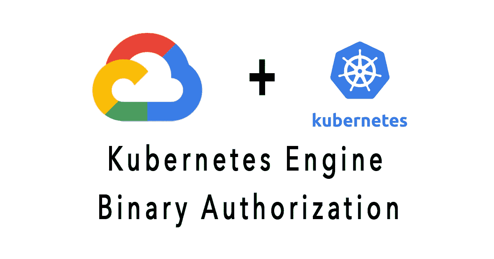

# 什么是二进制授权，如何提高 GCP 的安全性

> 原文：<https://medium.com/codex/what-is-binary-authorization-and-how-to-improve-security-in-gcp-d7e46a26177a?source=collection_archive---------0----------------------->

## [法典](http://medium.com/codex)

运行 Kubernetes 集群的一个关键安全问题是了解每个 pod 中运行的容器映像，并能够说明它们的来源。建立“容器来源”意味着有能力追踪容器的来源到一个可信的起点，并确保您的组织遵循期望的…