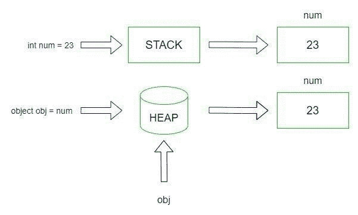
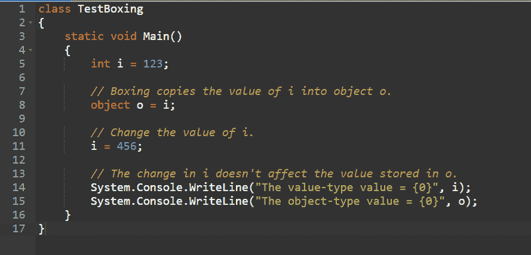
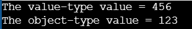
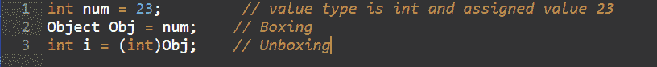
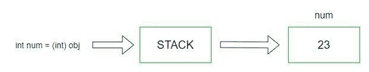
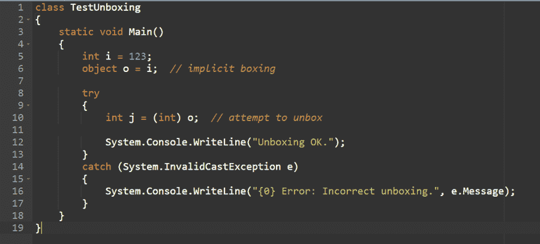
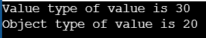

# 什么是 C#中的装箱和拆箱

> 原文：<https://medium.com/codex/what-is-boxing-and-unboxing-in-c-1512f13ed907?source=collection_archive---------11----------------------->


C#中的数据类型通常可以分为两种类型，即。值类型和引用类型。引用类型保存存储值的地址，但值类型保留项本身。

值类型包括 int、float、double、decimal、bool、char 等，引用类型包括 object、string、array 等。在处理这些数据类型时，您经常需要将值类型转换为引用类型，反之亦然。

因为它们具有不同的特性，并且以不同的方式存储在内存中。NET 必须执行一些内部工作来将它们从一种类型转换成另一种类型。装箱和取消装箱是这些转换过程的工具。所以让我们快速了解一下什么是 C#中的装箱和拆箱。

**目录**

1.  C#中的装箱是什么？
2.  C#中的装箱示例
3.  为什么这个概念被命名为拳击？
4.  C#中什么是拆箱？
5.  C#中取消装箱的示例
6.  C#中装箱和取消装箱的主要区别
7.  结论

# C#中的装箱是什么？

装箱是将值类型转换为引用类型的隐式转换类型。它涉及将值类型转换为类型对象或由该值类型实现的任何接口类型。CLR 将值类型包含在对象实例中，并在装箱时将其保存在托管堆中。

在垃圾收集堆中，使用装箱来存储值类型。当对值类型进行装箱时，它会在堆上创建一个新的对象实例，并将值复制到其中。

这里有一个简单的例子:


声明一个整数类型的值类型变量(num ),并为其赋值。创建对象引用类型(obj)并应用显式操作，这将导致 num 值类型被复制并保存在对象引用类型 obj 中，如下所示:



# C#中的装箱示例

下面是用 C#描述装箱的程序:



**输出:**



# 为什么这个概念被命名为拳击？

您可能很清楚，所有保存在堆上的引用类型都包含值的地址。值类型只是放在堆栈上的一个实际值。Int I 现在被分配给对象 o(如第一个例子所示)。对象 o 必须是地址而不是值。因此，CLR 创建了一个新的系统来装箱值类型。整个过程被称为“装箱”,因为 CLR 在存储该项的堆上构造了一个盒子。

# C#中什么是拆箱？

顾名思义，unboxing 与 boxing 正好相反。它是引用类型到值类型的转换。从引用类型中提取值，并通过取消装箱将其赋给值类型。拆箱行为是显而易见的。这就需要进行特殊的铸造。

换句话说，从类型对象到值类型的显式转换，或者从接口类型到实现该接口的值类型的显式转换，称为取消装箱。拆包操作需要以下步骤:

*   确保对象实例是否是指定值类型的装箱值。
*   实例的值被复制到值类型变量中。

这里有一个简单的例子:



声明一个整型的值类型变量(num ),存储一个值。现在创建一个引用对象类型(obj)。显式装箱过程创建一个 I 类型的整数值，并使用强制转换方法。然后，堆上引用的类型被复制到堆栈，如下图所示:



# C#中取消装箱的示例

以下是 C#中取消装箱的示例:



**输出:**


# C#中装箱和取消装箱的主要区别

## 拳击

*   它用于将值类型转换为对象类型
*   拳击是一种隐式转换的形式
*   堆栈上的值被复制到堆内存上的对象中

拳击的例子-

```
// C# program to illustrate Boxing using System; public class example { static public void Main() { ​ int value = 20; ​ // Boxing ​ object obj = value; ​ // Change the value of val ​ value = 30; ​ Console.WriteLine("Value type of value is {0}", value); ​ Console.WriteLine("Object type of value is {0}", obj); } }
```

**输出**



## 拆箱

*   它将对象类型转换为值类型
*   取消装箱是显式转换的一种形式
*   堆内存中的项被复制到堆栈内存中的值

C#中取消装箱的示例

```
// C# program to illustrate Unboxing using System; public class example { static public void Main() { ​ int value = 20; ​ // Boxing ​ object obj = value; ​ // Unboxing ​ int a = (int)obj; ​ Console.WriteLine("Value of object is {0}", obj); ​ Console.WriteLine("Value of a is {0}", a); }
```

}

**输出**


# 结论

可以这样想——对于不需要 int 值作为对象来操作的应用程序，Int 值只是 32 位数字。将值类型视为对象的能力弥补了大多数语言中值类型和引用类型之间的差距。对于需要 int 值表现得像对象一样的程序，可以按需访问该功能。

*原发布于*[*https://www . partech . nl*](https://www.partech.nl/nl/publicaties/2021/07/what-is-boxing-and-unboxing-in-c-sharp)*。*