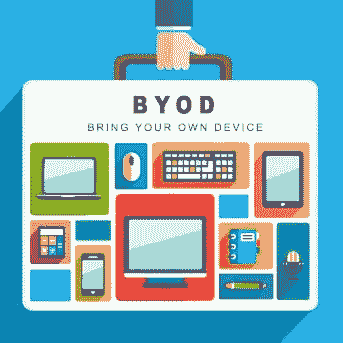

# 什么是 BYOD(自带设备)政策

> 原文：<https://medium.com/codex/what-is-byod-bring-your-own-device-policy-5b265cc4fb09?source=collection_archive---------11----------------------->

自带设备(BYOD)是一种日益增长的趋势，员工在工作中使用个人设备。实施自带设备政策的公司允许员工出于工作相关原因使用自己的电脑、智能手机和平板电脑，而不是要求他们使用公司拥有和管理的设备。

随着设备和平台变得越来越能够在专业环境中使用，这一概念从其早期开始就有所发展，现在旨在:

*   通过允许最终用户以他们满意的方式使用设备，减少组织在企业设备采购和配置方面的开销。
*   允许灵活(可能远程)工作。
*   增加你的产量。
*   当员工无法到达其主要工作地点时，为企业和组织提供冗余。

虽然 BYOD 具有与其他灵活工作解决方案相同的一些风险和缓解措施，但它也有自己的一系列问题。

## BYOD 数据保护的效率由以下因素决定:

*   这个小玩意能管理得多好？(这是业主允许的多少)。
*   可用性和安全性之间的平衡如何？

影子 IT 是指任何未经雇主批准并给公司带来安全风险的员工所有的设备。在利益相关方无法访问的设备上，无法检测或保护恶意软件和其他安全隐患。因此，良好的设备政策会规定员工何时可以使用个人设备工作，以及何时应该依赖公司拥有的资产。

自带设备的另一个危险是，员工会随身携带他们的设备。虽然人们不太可能在晚上外出时带上工作用的笔记本电脑，但他们几乎肯定会带上个人智能手机。这增加了带有固定数据的设备丢失或被盗的可能性。

所有这些问题都是可以避免和计划的，但是雇主必须提前采取预防措施。应在公司政策中概述限制风险和应对数据泄露的应急策略。如果明确规定了员工的义务，他们将能够更好地掌握如何将个人设备用于公司目的。

当公司利益相关者了解他们正在解决的痛点时，BYOD 策略效果最佳。利益相关者应制定安全策略来解决问题，然后与员工合作，以互利的方式实施解决方案。

# 结论

小型企业可能会受益于自带设备政策。然而，仅仅基于便利性和成本做出决定并不是一个好主意。考虑 BYOD 政策在隐私、企业数据安全和 IT 支持方面将对您的业务产生的影响。你还应该考虑你的员工更喜欢在工作中使用哪种设备。在决定员工离开公司后如何管理设备时，要考虑未来。

来源:[https://socradar . io/what-is-byod-policy-practices-to-help-keep-your-network-secure-in-2022/](https://socradar.io/what-is-byod-policy-practices-to-help-keep-your-network-secure-in-2022/)