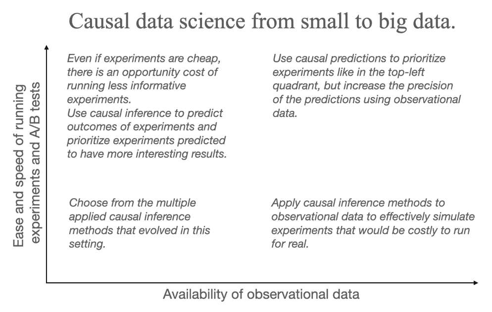
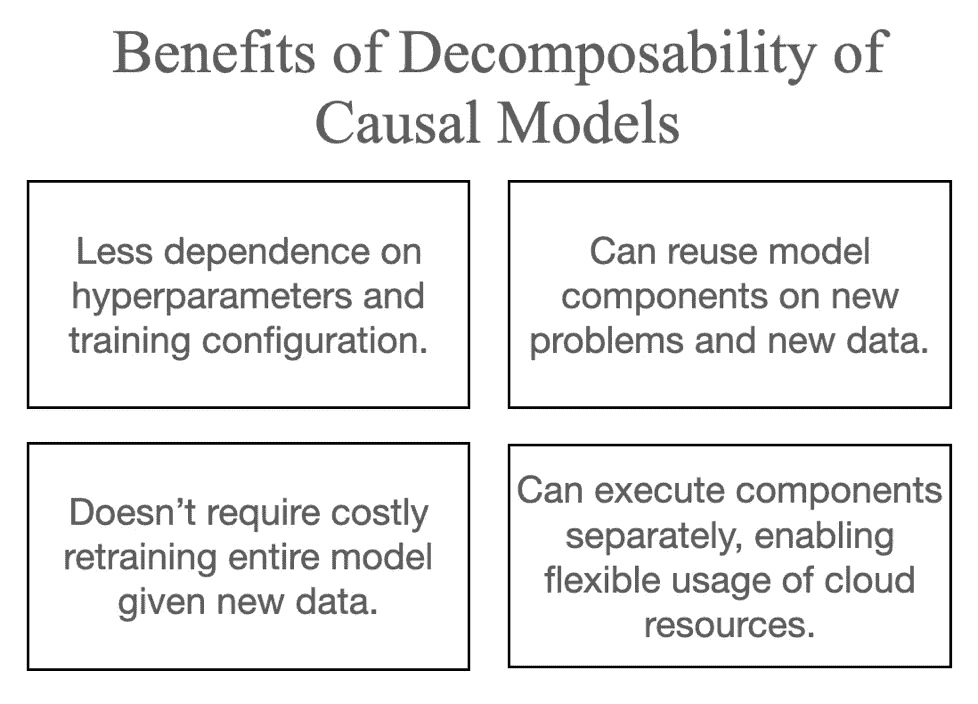

# 什么是因果机器学习，为什么要关心？

> 原文：<https://medium.com/codex/what-is-causal-machine-learning-and-why-should-you-care-9d42c35c8292?source=collection_archive---------5----------------------->

## 新 MEAP

## *出自* [*因果机器学习*](https://www.manning.com/books/causal-machine-learning?utm_source=medium&utm_medium=referral&utm_campaign=book_ness_causal_7_26_22) *作者罗伯特·奈斯*

*用因果推理增强机器学习，以获得更稳健、更可解释的结果。利用机器学习进行因果推理，创造下一代人工智能..现在是构建因果人工智能的最佳时机。*

*请继续阅读。*

通过在[manning.com](https://www.manning.com/books/causal-machine-learning?utm_source=medium&utm_medium=referral&utm_campaign=book_ness_causal_7_26_22)的结账处将 **fccness** 输入折扣代码框，享受 25%的折扣 [*因果机器学习*](https://www.manning.com/books/causal-machine-learning?utm_source=medium&utm_medium=referral&utm_campaign=book_ness_causal_7_26_22) 。

## **什么是因果 AI？**

因果推理是人类如何理解、解释和决定世界的关键因素。因果 AI 既意味着用因果推理改进机器学习，也意味着用机器学习自动化因果推理。今天的学习机器拥有超人的预测能力，但并不特别擅长因果推理，即使我们用令人厌恶的大量数据训练它们。在本书中，你将学习如何在机器学习和自动化数据科学的背景下编写捕捉因果推理的算法。

尽管人类非常依赖因果推理来导航世界，但我们的认知偏差使我们的因果推理非常容易出错。我们发展了经验主义、科学方法和实验统计，以解决我们在因果推理任务中出错的倾向，如寻找和验证因果关系、区分因果关系和单纯的相关性，以及预测行动、决策和政策的后果。然而，即使是经验主义也仍然需要人类来解释和说明*观察*数据*数据*(我们顺便观察的数据)。我们从实验中解释因果关系的方式也容易出错。因果人工智能试图使用统计，概率和计算机科学来帮助我们超越我们推理中的这些错误。

回答因果问题的困难激发了几千年的哲学家、几个世纪的科学家和几十年的统计学家的工作。但现在，统计和计算进步的融合已经将焦点从话语转移到我们可以在数据上训练并部署到软件的算法上。现在是学习如何构建因果人工智能的迷人时刻。

## **为什么我或我的团队要关心因果数据科学和人工智能？**

我想提出一些激励因果建模研究的高层次原因。这些原因适用于从事数据科学、机器学习和其他数据驱动的自动化决策领域的研究人员、独立贡献者和经理。

## **更好的数据科学**

大型科技公司和以科技为动力的零售企业已经意识到因果推理的重要性，并向拥有因果推理技能的人支付高薪。主要原因是数据科学的目标——从数据中提取可操作的见解——是一项因果任务。因果建模有助于数据科学家以多种方式实现这一目标。

## **模拟实验和因果推断**

因果推断-量化一个原因(如促销)对一个结果(如销售)的影响程度是应用数据科学最常见的目标。因果关系推断的黄金标准是随机实验，如 A/B 测试。因果推理的概念解释了为什么随机实验如此有效；随机化消除了统计相关性的非因果来源。

图一。因果数据科学是一个有价值的工具，无论你的数据有多小或多大，或者运行实验有多容易。

## **反事实数据科学**

反事实问题的形式是，“给定已经发生的事情，如果事情不是这样，会发生什么？”因果建模提供了一种预测反事实结果的逻辑方法。可以推断反事实的数据科学可以更直接地回答关键的业务问题。

## **更好的归因、信用分配和根本原因分析**

企业家和广告先驱约翰·沃纳梅克的一句名言或许最能说明营销中的“归因问题”:

"*我花在广告上的钱一半都浪费了；问题是我不知道是哪一半。*

换句话说，很难知道什么广告、促销或其他行为导致了特定的客户行为、销售数字或其他关键业务成果。即使在网络营销中，数据已经变得比沃纳梅克时代更加丰富和细化，归因仍然是一个挑战。例如，用户可能在看到一个广告后点击了，但这是导致点击的单个广告视图，还是他们在多个渠道收到的所有点击的累积效应？因果建模通过使用正式的因果逻辑来回答“为什么”的问题，例如“为什么这个用户点击了？”

归因在其他领域有其他的名称，例如“信用分配”和“根本原因分析”核心意思是一样的；我们想了解为什么一个特定的事件结果会发生。

## **更多可解释的机器学习**

现代机器学习的行为很难解释。在商业和工程的背景下，可解释性尤其重要。如果你的团队部署了一种预测算法，而它的行为方式损害了你的业务，那么当你的老板问你发生了什么时，你不会想一直滔滔不绝地谈论机器学习技术术语和挥手致意。你需要一个简明的解释，希望能建议将来避免这个问题的方法。作为一名工程师，您希望将该解释浓缩成一份简明的错误报告，用简单的术语显示错误的性质、正确的输出应该是什么、哪些输入会再现错误，以及在给定这些输入的情况下代码逻辑在哪里开始出错。有了对问题的解释，您就可以有效地解决问题。

可解释性对于基于机器学习的服务的第三方用户也很重要。例如，假设一个产品特性为用户提供了一个推荐。用户可能需要知道为什么这个特性会让他们成为特别的推荐。解释是提供资源的基本要素，这样用户将来可以获得更好的结果。例如，视频流媒体服务经常用“因为您观看了 X”来解释推荐的内容，其中 X 是与推荐内容相似的观看内容。相反，想象一下基于喜欢的类型、演员和主题的更丰富的内容。这种解释可能会建议你如何探索不熟悉的内容，以拓展你的口味，并在未来产生更有价值的推荐，而不是推广类似内容的兔子洞。

有多种解释方法，例如分析神经网络中的节点激活。但是因果模型非常容易解释，因为它们直接编码了建模领域中易于理解的因果关系。的确，因果关系是解释的核心；解释一个事件意味着提供事件的原因。因果模型用您正在建模的领域的语言提供解释(语义解释)，而不是按照模型的架构(“节点”和“激活”——句法解释)。

## **更有价值的机器学习**

当机器学习工程师训练和验证机器学习算法时，她会将其部署到生产环境中，就像任何其他代码集一样。一旦她这么做了，它就成了对组织有价值的艺术品。

在其他条件都相同的情况下，一个模型工件如果有因果要素，比没有因果要素更有价值。健壮性和可解释性通过降低维护成本来增加价值。如果它是健壮的，那么它就不太容易坏，如果它是可以解释的，那么当它坏了的时候，你可以想出如何修复它。

此外，因果不变性允许建模者将一些因果模型分解成更小的可组合模块。这些模块可以单独和独立地测试和验证，符合软件工程的最佳实践。这些工件上的计算机操作可以单独执行，从而更有效地利用现代云计算基础设施。对于大型机器学习模型工件，如果我们获得额外的训练数据或发现初始训练数据有问题，通常必须从头开始重新训练模型，这通常是昂贵的。相比之下，我们只需要重新训练与新数据相关的因果模型的模块。最后，如果这些问题重叠，您的团队可以在解决新问题的模型中重用旧问题的组件。

图一。因果模型可以分解成组件。与大型机器学习工件相比，这种能力具有优势。

## **我为什么写这本书**

我写这本书是因为我想要一种代码优先的因果推理方法。我的意思不是简单地将因果推理库和数据集导入某个“do_causal_inference”方法。我想要一本代码优先的书，将因果建模从统计估计和推断中分离出来。建模就是将你对某个问题的深刻认识转化为代码，使数据驱动的决策自动化。相比之下，现代统计和机器学习框架，一旦给定一个模型，就自动进行统计学习和推理。所以我认为应该有一本书关注如何建立因果模型，并把因果推理的统计机制留给这些框架。这本书不存在，所以我写了它。

## **这本书和其他因果推理书有什么不同？**

因果推理研究主要依赖于三种不同的技能；将你的领域知识转化为代码的能力，概率论的深度技能，统计理论的深度技能，即估计理论和实验的设计。

在本书中，我采取了以下方法:

*   对于常见的因果推理问题，我们可以使用处理概率论和统计理论的软件工具。我们可以专注于学习使用这些工具。
*   当我们需要做更多定制的因果建模时，我们可以依赖生成式机器学习工具。这些工具将帮助我们使用黑盒推理技术来处理概率和统计理论，包括基于尖端深度学习的方法，如变分推理。

因果推理作为一个领域是令人生畏的，因为它要求从业者获得许多技能。不同的书对技能习得的平衡有不同的处理。这本书的重点是:

1.  向您展示如何将领域知识转化为代表可测试的因果假设的代码。
2.  从高层次向您展示这些因果假设如何指导算法因果推理。
3.  使用实现这些推理算法的机器学习软件库。

## 谁应该读这本书？

这本书是为:

*   数据科学家、机器学习工程师和精通代码的产品经理希望用生产质量的代码解决行业中的因果推理问题。
*   希望将因果推理应用于其专业领域而无需深入研究统计估计理论和实验设计的研究人员。
*   统计学家和经济学家，他们知道一些因果推理方法，并希望有一个将所有这些联系在一起的鸟瞰图。
*   想进入因果人工智能底层的人。

## **需要什么数学和编程背景？**

这本书假设一个数据科学家对概率和统计的熟悉程度。具体来说，它假设您具备以下基本知识:

*   概率分布。
*   联合概率和条件概率以及它们是如何联系在一起的(链式法则，贝叶斯法则)。
*   从分布中抽取样本意味着什么。
*   期望、独立和条件独立。
*   统计概念，如随机样本、相同和独立采样数据以及统计偏差。

在 altdeep.ai/p/causalaibook.，我已经包括了一套关于这些主题的入门读物，随着课程的进展，我会给你指出相关的具体入门读物。

放心，这本书不需要很深的概率统计理论背景。因果关系和统计学之间的关系就像工程学和数学之间的关系。工程涉及大量的数学，但是你只需要一点点就可以学习核心的工程概念。在学习了这些概念并深入研究了一个应用问题后，你可以专注于学习深入研究该问题所需的额外数学知识。

## 您使用什么编程工具，预期使用水平如何？

本书假设您熟悉 Python 中的数据科学脚本。本书中我们所依赖的三个开源 Python 库分别是 *DoWhy* 、 *pgmpy* 和 *Pyro* 。 *DoWhy* 是微软研究院开发的一个用于因果推理和其他因果建模任务的库。 *pgmpy* 是基于 *SciPy* 和 *NetworkX* 构建的概率图形建模库。

同样，我们的代码优先目标是不同的，因为我们不是深入研究进行因果推理所需的统计理论，而是依靠这些支持库来为我们进行统计。在将领域知识输入映射到因果推理输出方面，DoWhy 尽量做到端到端。当我们想做更多的定制建模时，我们将使用 *pgmpy* 或 *Pyro* 。这些库提供了概率推理算法来处理估计理论。pgmpy 有基于图形的推理算法，非常可靠。Pyro 作为 Pytorch 的扩展，将因果建模扩展到高维数据上的深度生成模型和*变分推理——*一种前沿的基于深度学习的推理技术。

如果你的背景是 R 或者 Julia，你应该还是觉得这本书有用的。有许多 R 包在功能上与 R 和 Julia 中的 DoWhy 重叠。这些语言的图形化建模软件，比如 bnlearn，可以替代 pgmpy。类似地，我们用 Pyro 开发的思想也适用于类似的概率编程语言，比如 *Stan* 、 *PyMC* 和 *Turing.jl* 。我在[https://tutorials . alt deep . ai](https://tutorials.altdeep.ai/)中包含了其他语言和库的教程。

如果你想了解更多，可以在这里查阅[这本书。](https://www.manning.com/books/causal-machine-learning?utm_source=medium&utm_medium=referral&utm_campaign=book_ness_causal_7_26_22)