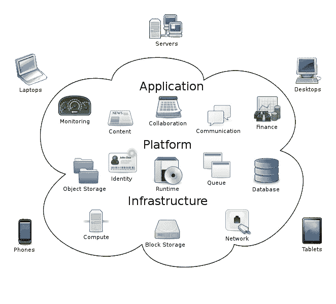

# 什么是云计算？

> 原文：<https://medium.com/codex/what-is-cloud-computing-67627d7ba9fe?source=collection_archive---------26----------------------->

许多人对云计算之类的东西非常感兴趣，但很少有人知道它是什么或它是如何工作的。亚马逊公司负责创建一个在线市场，也负责形成一个使用云架构的系统，该公司将云计算定义为“通过互联网按需交付 IT 资源，按量付费。无需购买、拥有和维护物理数据中心和服务器，您可以…