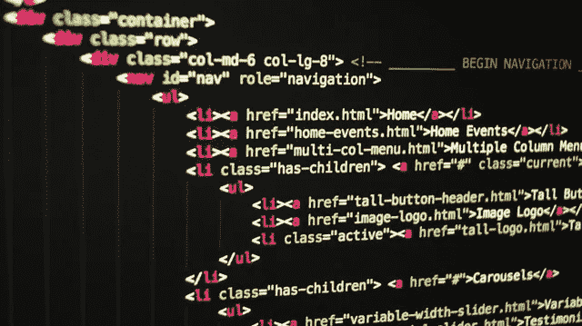
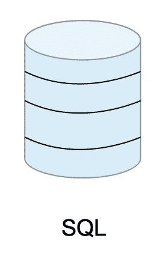
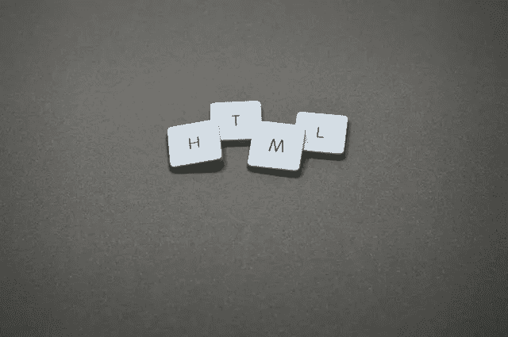
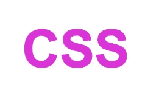
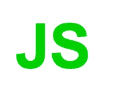

# 什么是编码？

> 原文：<https://medium.com/codex/what-is-coding-a8f4200e502?source=collection_archive---------11----------------------->

## 破解代码，揭开编码之谜

照片由[像素](https://www.pexels.com/photo/black-background-with-text-overlay-screengrab-270404/?utm_content=attributionCopyText&utm_medium=referral&utm_source=pexels)的[皮克斯拜](https://www.pexels.com/@pixabay?utm_content=attributionCopyText&utm_medium=referral&utm_source=pexels)拍摄

什么是编码？编码是计算机用来给出特定结果或动作的一组指令的创造。结果可能是在你的浏览器中显示可爱的小猫照片。这些操作可以是在银行账户上进行交易(取款/存款)。程序员，也称为程序员，编写代码(指令)告诉计算机如何做这些事情。

代码用于各种编程语言。编程语言是一套定义如何编写代码的语法规则。语言是完美的描述性词汇，因为编程语言真的就像在用外语交谈。在学习了一门编程语言之后，我发现自己参加了一些会议，参与了一些曾经对我来说完全陌生的对话。这些不同的编程语言最适合于传递不同种类的指令。

例如，SQL(结构化查询语言)是一种用于操作存储在数据库中的数据的数据库编码语言。这种语言将被用来保存和组织网站访问的可爱的小猫照片。程序员会编写 SQL 代码，一步一步地指导计算机如何实现这一点。

由[米盖尔·Á拍摄。来自](https://www.pexels.com/@padrinan?utm_content=attributionCopyText&utm_medium=referral&utm_source=pexels)[像素](https://www.pexels.com/photo/four-letter-tiles-1591061/?utm_content=attributionCopyText&utm_medium=referral&utm_source=pexels)的帕德里纳

HTML(超文本标记语言)是一种用于创建网页的编码语言。HTML 基本上是将在网页上显示的内容和指示计算机如何在网页上显示内容的格式化标签。HTML 负责创建标题、段落、表格、图像等。在网页上。HTML 可以用来告诉计算机在表格中显示银行数据。HTML 通常被称为 web 的基本构件，因为它是定义 Web 内容结构的编码指令。

CSS(层叠样式表)是一种设计网页内容的编码语言。CSS 指示计算机在网页上显示文本时使用的文本或背景颜色以及字体。CSS 可以用来为银行表格提供不同颜色的行，以便更容易阅读表格中的金融数据。它还可以在网页上加粗不同的单词，使它们突出。

JavaScript 是一种被称为脚本语言的编码语言，因为它就像一个指令脚本，告诉计算机如何使内容执行。性能可以是显示或隐藏页面上显示的内容，验证用户对网页表单的输入，使图像在页面上淡入或淡出，等等。

有成千上万种其他的编码语言，但是程序员不需要知道所有的语言。他们需要精通编码语言，这将使他们能够编写必要的指令，使计算机执行他们预期的过程。

如果你有兴趣涉足编码，看看对自己来说是什么样的，可以点击[这里](https://flatironschool.com/free-courses/coding-bootcamp-prep)免费试用。您将获得 Flatiron 的免费编码课程，包括 HTML、CSS、Javascript 和 Ruby。

编码快乐！