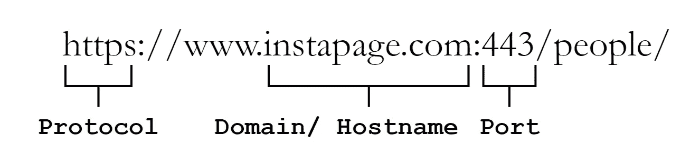

# CORS(跨产地资源共享)让一切变得简单！

> 原文：<https://medium.com/codex/what-is-cors-why-is-it-important-be4f0a9a0c38?source=collection_archive---------10----------------------->

CORS(跨来源资源共享)简单易行的指南

在进入 CORS 之前，让我们了解一下什么是起源。

# 什么是起源？

web 对象的原点由其定义:

*   草案
*   域/主机名
*   港口

网站起源的例子