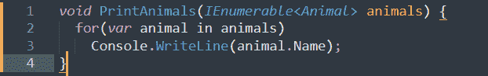
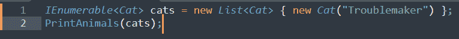
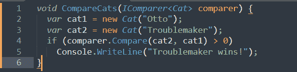
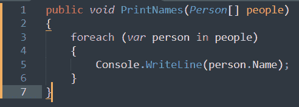
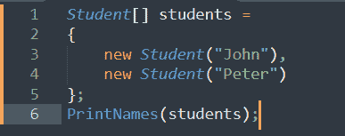
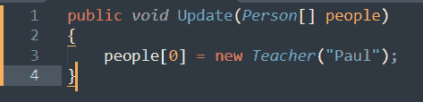
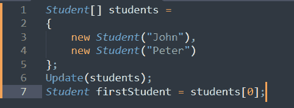
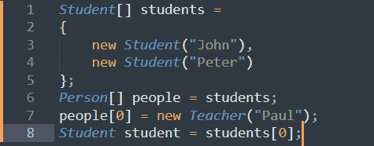
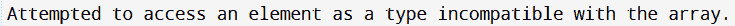

# 什么是 C#中的协变和逆变

> 原文：<https://medium.com/codex/what-is-covariance-and-contravariance-in-c-e3e5995fc599?source=collection_archive---------2----------------------->

当 C # 4.0 版发布时，在该语言已经广泛的工具中引入了两个新的功能来解决各种问题。是的，我们正在谈论流行的协变和逆变特性。

这篇文章将定义并演示这两个方便的特性如何让开发者解决以前需要变通的挑战。

简而言之，共变和反变指的是如何处理对象。术语“方差”指的是作用于指定类型的运算符的属性，以及运算符的排序。与它的操作数相比，co 前缀意味着“连同”，并表示运算符保留了类型的顺序。当与它的操作数比较时，contra 前缀意味着“反对”某事，并指示运算符颠倒类型的顺序。

关于这一点，让我们详细了解一下什么是 C#中的协方差和逆变。

**目录**

1.  C#中的协方差是什么？
2.  C#中的逆变是什么？
3.  数组协方差
4.  结论

# C#中的协方差是什么？

让我们从协方差的简单定义开始。假设每种动物都有名字，我们可以构造一个函数，输出集合中所有动物的名字:

值得注意的是，IEnumerable 只能用于从集合中读取动物值(通过 IEnumerator 的当前属性)。我们无法将动物添加到收藏中，因为它是只读的。

现在试着回答一个重要的问题——有没有可能用 PrintAnimals 来打印一批猫的名字？

如果您编译并运行这个示例，您会注意到 C#编译器能够识别它，并且应用程序运行良好。编译器在调用 PrintAnimals 时通过使用协方差将 IEnumerable 转换为 IEnumerable。这是因为 out 注释指定 IEnumerable 接口是协变的。

运行应用程序时，PrintAnimals 方法不会出错，因为它只能做一件事:打印。由于 PrintAnimals 方法只能从集合中读取动物，因此在运行程序时不会产生任何问题。所以用猫的集合来说明一个观点是没问题的，因为所有的猫都是动物。

# C#中的逆变是什么？

逆变正好是协方差的反义词。假设我们有一个创建一些猫的方法，并将它们与我们提供的 IComparer 对象进行比较。在一个更实际的场景中，该方法可以对猫进行如下分类:

猫作为参数传递给比较器对象，但它从不返回猫作为结果。这主要是因为它使用泛型类型参数的方式——你可以说它是只写的。现在，由于 contravariance，我们可以制作一个比较动物的比较器，并将其作为参数传递给 CompareCats:

因为 IComparer 接口是逆变接口，并且泛型类型参数是用 in 注释指示的，所以编译器接受此代码。我们构造了一个可以比较动物的 compareAnimals 对象。这意味着它绝对可以比较两只猫。

# 阵列协方差

看看下面的方法:

它将 Person 对象的数组作为输入，并将所有对象的名称输出到控制台。但是如果我们传递一个老师或学生的数组而不是一个人的数组，如下所示-

这段代码可以编译、运行，并且完全符合逻辑。因为学生和老师都有名字。提供学生[]或教师[]而不是人员[]使我们的方法比提供人员[]的精确类型匹配更有用。

记住这个例子，你可能会得出这样的结论:我们应该能够把一个带有通用参数老师或学生的对象发送到任何我们认为是通用类型的人的地方。这不是真的。考虑以下场景:

如果我们这样称呼这个方法-

这段代码可以编译；然而，在运行时会抛出一个异常。我们可以简化这个例子来不同地解释这个问题:

密切注意作业。Student[]是原始数组的类型。但是，因为我们可以用 Student[]替换 Person[]，所以我们在第 6 行收到了对 Person 对象数组的引用。

编译器允许执行第 7 行，因为每个老师都是一个人。然而，这就是运行时出现问题的地方:

当然，这是我们所期望的。如果这段代码有效，第 8 行的赋值语句会做什么？我们会尝试让学生和老师配对。这至少是荒谬的，因为这两个类别是不相容的。

如果在预期的是一个人的数组时，您可以传递一个学生或教师的数组，则数组是协变的。当语言不支持泛型类型时，这从一开始就是一个深思熟虑的决定。尽管可能会有一些潜在的灾难性后果，正如我们所看到的，这种行为在实现通用算法(如 PrintNames 方法)时提供了很大的灵活性。

# 结论

协变和逆变被添加到 C#语言中，以便多态特性可以被添加到数组、委托类型和泛型类型中。您可以使用比最初用 contravariance 指定的派生程度更低的类型，也可以使用派生程度更高的协方差类型。根据您正在处理的数据类型，您可以使用协方差或逆变。

*原载于*[*https://www . partech . nl*](https://www.partech.nl/nl/publicaties/2021/07/what-is-covariance-and-contravariance-in-c-sharp)*。*