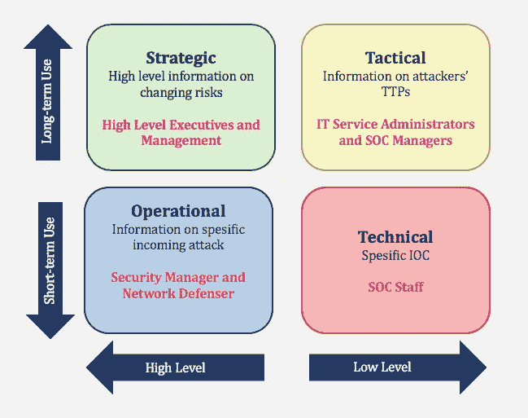

# 什么是网络威胁情报

> 原文：<https://medium.com/codex/what-is-cyber-threat-intelligence-f8c3208752f?source=collection_archive---------5----------------------->

组织用来了解已经、将要或正在攻击它的风险的信息被称为网络威胁情报。这些信息用于预测、预防和识别试图利用宝贵资源的网络威胁。

为了防止威胁，威胁情报使组织能够做出更快、更明智的安全决策，并将其行为从被动转变为主动。

# 为什么威胁情报很重要？

威胁情报系统从各种来源收集关于新出现或现有威胁参与者和威胁的原始数据。然后对这些信息进行评估和过滤，以提供威胁情报源和管理报告，自动化安全控制解决方案可以使用这些信息。这种类型安全的主要目标是让企业了解高级持续威胁、零日威胁和漏洞利用的危险，以及如何保护自己。

威胁情报通过提供预测技能，使公司在面对潜在的网络攻击时变得主动而非被动。如果不首先了解安全弱点、威胁指标以及威胁是如何实施的，就很难有效地抗击网络攻击。使用网络情报的安全专家可以更快地防止和遏制入侵，从而在发生网络攻击时节省资金。威胁情报可以全面提高安全性，包括网络和云安全性。

[https://socradar . io/what-is-technical-cyber-threat-intelligence-and-how-to-use-it/](https://socradar.io/what-is-technical-cyber-threat-intelligence-and-how-to-use-it/)

# 谁受益于威胁情报？

精英分析师的领域通常被认为是网络威胁情报。实际上，它为各种规模的企业提供了全面的安全功能价值。

安全运营团队通常无法处理他们收到的警报，威胁情报会与您现有的安全解决方案进行交互，自动对警报和其他风险进行优先排序和过滤。通过访问威胁情报的外部洞察力和上下文，漏洞管理团队可以更精确地确定最关键漏洞的优先级。

威胁情报提供关于威胁行为者、其战术、技术和程序以及其他高级安全流程的关键见解，如欺诈预防、风险分析和其他高级安全流程，包括关于威胁行为者、其战术、技术和程序的关键见解，以及来自网络数据源的更多信息。

# 威胁情报使用案例

## **漏洞优先级**

威胁情报最有效的用途之一是收集数据并进行研究，这将有助于您的组织开发一种评估风险的简单指标。考虑到可用的时间和资源，这个统计数据应该是您可以修复的问题和将产生最大差异的解决方案之间的重叠的度量。

划分漏洞优先级的传统方法使人们相信“随时随地修补所有东西”是最大的安全策略。理论上，实现这一目标将导致一个完全不可渗透的系统，但它设置了一个不切实际的高标准。因此，采取这种策略的公司将不可避免地做出让步，优先考虑“最大”的问题。

然而，与普遍看法相反,“最大”的问题(就实际损害而言)不是零日威胁或巧妙的新利用，而是继续被利用的旧漏洞，这正是因为如此多的组织将新威胁置于改善其基础之上。

## **公开、深度和黑暗网络监控**

任何可以访问互联网的人都可以使用开源软件。这是指所有被搜索引擎索引的数据，通常被称为表面网络。

deep web 是指受安全登录或付费墙保护的互联网区域，防止搜索引擎爬虫访问它们。科学、学术或政府报告、财务记录或病历等个人信息以及私人商业数据库构成了这些数据的大部分。

暗网由只能用提供加密和匿名的浏览器访问的网站组成，比如 Tor。尽管情况并非总是如此，但许多黑网站充当了非法商品和服务的黑市。

在深层和黑暗的网络空间中，对保持安全感兴趣的双方和威胁参与者经常讨论和交易漏洞和相关利用。因此，从这些来源收集数据至关重要，以便对存在的危险保持更全面和最新的了解。

## **品牌监控**

公开来源，尤其是社交媒体渠道，将受到威胁情报系统的监控。在这种环境中检测风险本身就是一种技能，因为它需要彻底了解您公司的品牌以及威胁参与者可能试图利用它的各种方式。

这些危险在公共场所变得越来越明显，并受到更密切的关注。它们可能更加隐蔽，依赖于社会工程策略而不是软件漏洞，并且需要一定的知识水平才能检测到。

来源:[https://socradar . io/what-is-technical-cyber-threat-intelligence-and-how-to-use-it/](https://socradar.io/what-is-technical-cyber-threat-intelligence-and-how-to-use-it/)