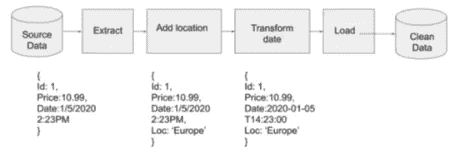
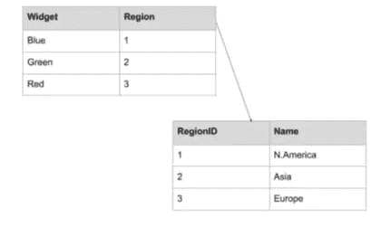
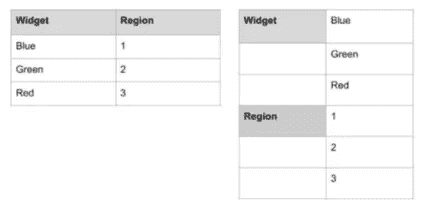
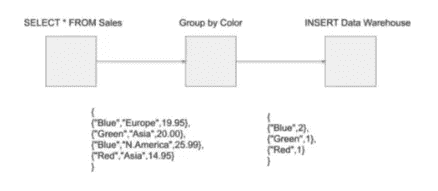
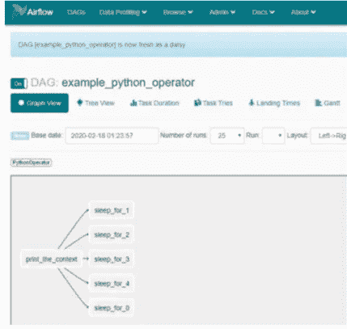
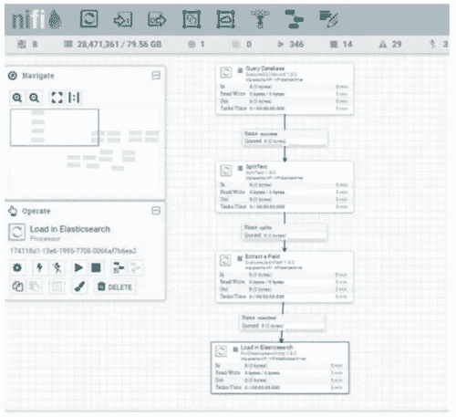

# 什么是数据工程？

> 原文：<https://medium.com/codex/what-is-data-engineering-407bcf860baf?source=collection_archive---------9----------------------->

虽然数据工程不是一个新领域，但它最近似乎已经从幕后走出来，开始占据中心舞台。在本概述中，您将了解数据工程师的工作，数据工程和数据科学之间的区别，以及数据工程中使用的一些工具。

# **数据工程师做什么**

**数据工程**是大数据生态系统的一部分，与数据科学密切相关。数据工程师在后台工作，虽然他们没有得到与数据科学家同等的关注，但他们对数据科学的进程至关重要。数据工程师的角色和职责因组织的数据成熟度和人员配备水平而异。但是，有些任务，如数据提取、加载和转换，是数据工程师角色的基础。

在最底层，数据工程包括将数据从一种系统或格式转移到另一种系统或格式。使用更常见的术语，数据工程师从源中查询数据(提取)，对数据执行一些修改(转换)，然后将数据放在用户可以访问并知道它是生产质量(负载)的位置。术语提取、转换和加载通常缩写为 **ETL** 。然而，数据工程的这个定义是宽泛和简单的。借助一个例子，让我们更深入地了解一下数据工程师是做什么的。

一家在线零售商有一个网站，你可以在那里购买各种颜色的小配件。该网站由一个关系数据库支持。每个交易都存储在数据库中。这家零售商上个季度卖出了多少蓝色小配件？

要回答这个问题，您可以在数据库上运行 SQL 查询。这还没上升到需要数据工程师的程度。但是随着站点的增长，在生产数据库上运行查询不再可行。此外，记录事务的数据库可能不止一个。数据库可能位于不同的地理位置，例如，北美的零售商可能与亚洲、非洲和欧洲的零售商拥有不同的数据库。

现在，您已经进入了数据工程领域。为了回答关于蓝色小部件销售的问题，数据工程师将为每个地区创建到所有事务数据库的连接，提取数据，并将其加载到数据仓库中。从那里，你现在可以计算所有售出的蓝色部件的数量。

公司更希望找到以下问题的答案，而不是找到售出的蓝色小部件的数量:

*   哪些地方卖的小工具最多？
*   销售小配件的高峰时间是什么时候？
*   有多少用户将小工具放在购物车中，然后再移除？
*   哪些小部件组合一起出售？

回答这些问题需要的不仅仅是提取数据并将其加载到单个系统中。在提取和加载之间需要一个转换。不同地区的时区也不同。例如，仅美国就有四个时区。因此，您需要将时间字段转换为标准。您还需要一种方法来区分每个地区的销售额。这可以通过向数据添加位置字段来实现。该字段应该是空间的(在坐标中或作为众所周知的文本),还是只是可以在数据工程管道中转换的文本？

在这里，数据工程师需要从每个数据库中提取数据，然后通过为位置添加一个附加字段来转换数据。为了比较时区，数据工程师需要熟悉数据标准。对于时间，国际标准化组织(ISO)有一个标准——ISO 8601。

因此，要回答前面列表中的问题，我们需要:

*   从每个数据库中提取数据
*   添加一个字段来标记数据中每个交易的位置
*   将日期从当地时间转换为 ISO 8601 时间
*   将数据加载到数据仓库中。

提取、加载和转换数据的组合是通过创建数据管道来完成的。数据进入管道时是原始的，或者说是脏的，因为数据中可能有丢失的数据或错别字，这些数据在流经管道时会被清除。之后，它从另一端进入数据仓库，在那里可以被查询。下图显示了完成任务所需的管道:

**图 1 —添加位置和修改日期的管道**

了解更多关于什么是数据工程，以及数据工程师做什么，你应该开始了解数据工程师需要获得的责任和技能。我们来详细阐述一下那些技巧。

## **成为数据工程师所需的技能和知识**

在前面的例子中，很明显数据工程师需要熟悉许多不同的技术——我们甚至没有提到业务流程或需求。

在数据管道的开始，数据工程师需要知道如何从不同格式的文件或不同类型的数据库中提取数据。这意味着数据工程师需要了解用于执行许多不同任务的几种语言，如 SQL 和 Python。在数据管道的转换阶段，数据工程师需要熟悉数据建模和结构。他们还需要了解业务，以及他们希望从数据中提取什么知识和洞察力，因为这将影响数据模型的设计。

将数据加载到数据仓库意味着需要一个带有模式的数据仓库来保存数据。这通常也是数据工程师的职责。数据工程师需要了解数据仓库设计的基础知识，以及在构建过程中使用的数据库类型。

最后，运行数据管道的整个基础设施也可能是数据工程师的责任。他们需要知道如何管理 Linux 服务器，以及如何安装和配置 Apache Airflow 或 NiFi 等软件。随着组织转向云，数据工程师现在需要熟悉在组织使用的云平台上旋转基础设施，无论是亚马逊、谷歌云平台还是 Azure。

通过一个数据工程师工作的例子，我们现在可以开发一个更广泛的数据工程的定义。

> **信息**
> 
> 数据工程是数据基础设施的开发、操作和维护，无论是在本地还是在云中(或者混合云或多云)，包括数据库和管道来提取、转换和加载数据。

# **数据工程对数据科学**

*数据工程让数据科学成为可能*。同样，根据组织的成熟度，数据科学家可能需要清理和移动分析所需的数据。这不是对数据科学家时间的最佳利用。数据科学家和数据工程师使用类似的工具(例如 Python)，但是他们专攻不同的领域。数据工程师需要了解数据格式、模型和结构，以便有效地传输数据，而数据科学家则利用它们来构建统计模型和数学计算。

数据科学家将连接到数据工程师构建的数据仓库。从那里，他们可以提取机器学习模型和分析所需的数据。数据科学家可能将他们的模型整合到数据工程管道中。数据工程师和数据科学家之间应该有密切的关系。了解科学家需要的数据只会有助于数据工程师提供更好的产品。

在下一节中，您将了解更多关于数据工程师最常用的工具。

# **数据工程工具**

为了构建数据管道，数据工程师需要选择合适的工具。数据工程是整体大数据生态系统的一部分，必须考虑大数据的三个 V:

*   **量**:数据量大幅增长。从数据库中移动一千条记录需要不同的工具和技术，而不是移动数百万行或一分钟处理数百万个事务。
*   **多样性**:数据工程师需要在不同位置处理各种数据格式的工具(数据库、API、文件)。
*   **速度**:数据的速度一直在增加。跟踪社交网络上数百万用户的活动或世界各地用户的购买情况需要数据工程师经常以接近实时的方式进行操作。

## **编程语言**

数据工程的通用语言是 SQL(结构化查询语言)。无论您使用的是低代码工具还是特定的编程语言，几乎都无法回避对 SQL 的了解。扎实的 SQL 基础使数据工程师能够优化查询速度，并有助于数据转换。SQL 在数据工程中如此普遍，以至于数据湖和非 SQL 数据库都有工具允许数据工程师用 SQL 查询它们。

大量开源的数据工程工具使用 Java 和 Scala (Apache 项目)。Java 是一种流行的、主流的、面向对象的编程语言。Java 似乎正在慢慢被运行在 Java 虚拟机(JVM)上的其他语言所取代。Scala 就是其中之一，其他运行在 JVM 上的语言包括 Clojure 和 Groovy。Apache NiFi 允许您用 Java、Clojure、Groovy 和 Jython 开发定制的处理器。虽然 Java 是一种面向对象的语言，但是已经有了向函数式编程语言发展的趋势，Clojure 和 Scala 就是其中的成员。

另一种在数据工程中广泛使用的语言是 **Python** ，这将是我们这里的重点。使用 Python 进行数据工程是有据可查的，拥有庞大的用户群，并且是跨平台的。Python 已经成为数据科学和数据工程的默认语言。Python 有大量的标准库和第三方库。Python 中的数据科学环境是其他语言无法比拟的。pandas、matplotlib、numpy、scipy、scikit-learn、tensorflow、pytorch 和 NLTK 等库构成了一个极其强大的数据工程和数据科学环境。

## **数据库**

在大多数生产系统中，数据将存储在关系数据库中。大多数专有解决方案将使用 Oracle 或 Microsoft SQL Server，而开源解决方案倾向于使用 MySQL 或 PostgreSQL。这些数据库按行存储数据，非常适合记录事务。表之间也有关系，利用主键将数据从一个表连接到另一个表，从而使它们成为关系。下表显示了一个简单的数据模型和表之间的关系:

**图 2 —在 Region = RegionID 上连接的关系表**

数据仓库中最常用的数据库是 Amazon Redshift、Google BigQuery、Apache Cassandra 和其他 NoSQL 数据库，如 Elasticsearch。Amazon Redshift、Google BigQuery 和 Cassandra 偏离了关系数据库的传统行，以列格式存储数据，如下所示:

**图 3 —以列格式存储的行**

列数据库更适合快速查询，因此非常适合数据仓库。所有这三个列数据库都可以使用 SQL 进行查询——尽管 Cassandra 使用的是 Cassandra 查询语言，这是相似的。

与柱状数据库形成对比的是文档或 NoSQL 数据库，如 Elasticsearch。Elasticsearch 其实是一个基于 Apache Lucene 的搜索引擎。它类似于 Apache Solr，但是更加用户友好。Elasticsearch 是开源的，但它确实有专有的组件——最显著的是用于机器学习、图形、安全和警报/监控的 X-Pack 插件。Elasticsearch 使用弹性查询 DSL(特定领域语言)。它不是 SQL，而是一种 JSON 查询语言。Elasticsearch 将数据存储为文档，虽然它有父子文档，但它是一个非关系数据库(像列数据库一样)。

一旦数据工程师从数据库中提取数据，他们将需要转换或处理它。对于大数据，使用数据处理引擎会有所帮助。

## **数据处理引擎**

数据处理引擎允许数据工程师以批处理或流的形式转换数据。这些引擎允许并行执行转换任务。最受欢迎的引擎是阿帕奇火花。Apache Spark 允许数据工程师用 Python、Java 和 Scala 编写转换。

Apache Spark 支持 Python 数据帧，是 Python 程序员的理想工具。Spark 也有弹性分布式数据集(rdd)。rdd 是不可变的分布式对象集合。您主要通过加载外部数据源来创建它们。rdd 允许快速和分布式处理。RDD 中的任务在集群中的不同节点上运行。与数据帧不同，它们不会试图猜测数据中的模式。

其他流行的流程引擎包括 Apache Storm，它利用 spouts 读取数据，利用 bolts 执行转换。通过连接它们，您构建了一个处理管道。Apache Flink 和 Samza 是更现代的流和批处理框架，允许您处理无限的流。无界流是指没有终点的数据，例如，温度传感器就是一种无界流。它不断报告温度。如果您使用 Apache Kafka 从系统中传输数据，Flink 和 Samza 是很好的选择。

## **数据管道**

将事务数据库、编程语言、处理引擎和数据仓库结合在一起就产生了流水线。例如，如果您从数据库中选择小部件销售的所有记录，通过 Spark 运行它，将数据减少到小部件和计数，然后将结果转储到数据仓库，您就有了一个管道。但是，如果每次想要运行时都必须手动执行，那么这个管道就不是很有用。数据管道需要一个调度程序来允许它们以指定的时间间隔运行。完成这项工作最简单的方法是使用 **crontab** 。为您的 Python 文件安排一个 cron 作业，然后坐下来观察它每隔 *X* 小时运行一次。

管理 crontab 中的所有管道变得很困难。你如何记录管道的成功和失败？你怎么知道什么跑了，什么没跑？你如何处理反压力——如果一个任务运行得比下一个快，你如何阻止数据，这样它就不会淹没任务？随着您的管道变得更加先进，您将很快超越 crontab，并且需要一个更好的框架。

## **阿帕奇气流**

用 Python 构建数据工程管道最流行的框架是 **Apache Airflow** 。Airflow 是 Airbnb 打造的工作流管理平台。Airflow 由 web 服务器、调度器、metastore、排队系统和执行器组成。您可以将 Airflow 作为单个实例运行，或者您可以将它分解成一个包含许多 executor 节点的集群——这很可能是您在生产中运行它的方式。气流使用**有向无环图** ( **DAGs** )。

DAG 是指定任务的 Python 代码。图是由关系或依赖关系连接的一系列节点。在气流中，它们是有方向的，因为它们沿着一个方向流动，每个任务都跟在它的从属任务之后。使用前面的示例管道构建带有 Apache Airflow 的数据管道，第一个节点将执行一个 SQL 语句来获取所有的小部件销售。这个节点将连接到下游的另一个节点，后者将聚合小部件和计数。最后，这个节点将连接到最后一个节点，后者将数据加载到仓库中。管道 DAG 如下图所示:

**图 4 —显示节点间数据流的 DAG。任务从左到右沿着箭头(有方向)进行**

以下是《气流》中 DAG 的截图:

**图 5 —显示 DAG** 详细信息的气流 GUI

GUI 不像 NiFi 那样完美，这一点我们将在下面讨论。

## **阿帕奇尼菲**

Apache NiFi 是构建数据工程管道的另一个框架，它也使用 Dag。Apache NiFi 由美国国家安全局(National Security Agency)构建，在多个联邦机构中使用，它更容易设置，对新的数据工程师很有用。GUI 非常优秀，虽然您可以使用 Jython、Clojure、Scala 或 Groovy 来编写处理器，但是您可以通过对现有处理器的简单配置来完成很多工作。以下屏幕截图显示了 NiFi GUI 和一个示例 DAG:

**图 6 —从数据库中提取数据并将其发送给 Elasticsearch** 的示例 NiFi 流程

Apache NiFi 还允许集群和管道的远程执行。它有一个内置的调度程序，并提供管道的背压和监控。此外，Apache NiFi 使用 NiFi 注册表进行版本控制，并且可以使用 MiNiFi 在边缘上收集数据。

另一个基于 Python 的数据工程管道工具是 Luigi，由 Spotify 开发。Luigi 也使用图形结构，并允许您连接任务。它有一个很像 Airflow 的 GUI，是使用 Python 进行数据工程的一个很好的选择。

# **总结**

希望您现在对什么是数据工程有了更好的理解。数据工程角色和职责因组织数据基础设施的成熟度而异。但数据工程，最简单地说，就是创建管道，将数据从一种来源或格式转移到另一种来源或格式。这可能涉及也可能不涉及数据转换、处理引擎和基础设施的维护。

数据工程师使用各种编程语言，但最常用的是 Python、Java 或 Scala，以及专有和开源的事务数据库和数据仓库，包括内部和云中的，或者混合使用。数据工程师需要精通许多领域——编程、操作、数据建模、数据库和操作系统。这种广度是这个地区如此有趣、令人兴奋和富有挑战性的部分原因。对于那些愿意接受挑战的人来说，数据工程是一个有益的职业。

要继续阅读保罗·克里克德的书[用 Python 进行数据工程](https://packt.live/3qQsMni)，请订阅 Packt library 并解锁大量电子书和视频。