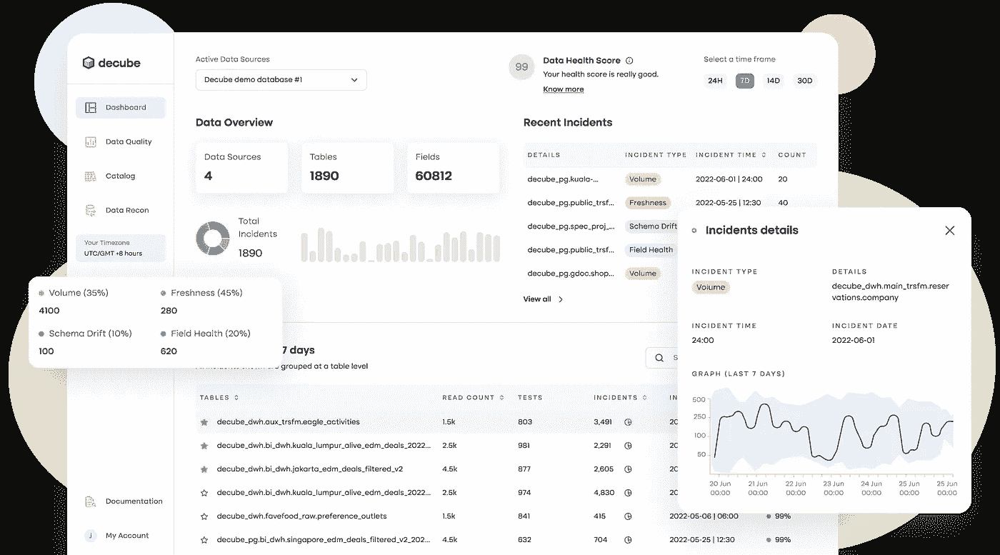
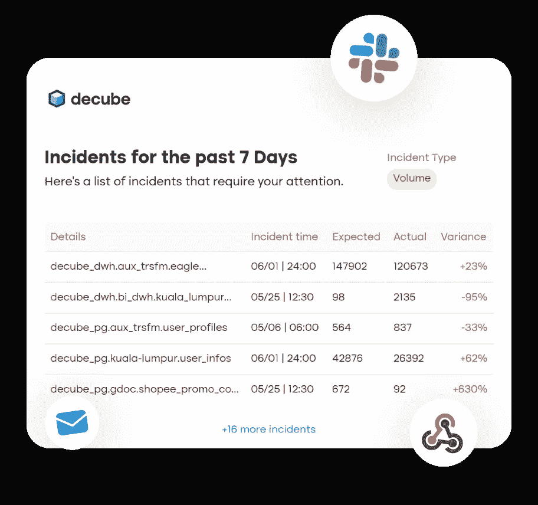

# 什么是数据可观测性，我需要它吗？

> 原文：<https://medium.com/codex/what-is-data-observability-do-i-need-it-e90e0a2bbb93?source=collection_archive---------0----------------------->

## 迈向数据驱动的第一步

图片提供: [KevinKu](https://unsplash.com/@ikukevk) 上 [Unsplash](https://unsplash.com/photos/w7ZyuGYNpRQ)

我的职业生涯始于第一代分析师，专注于编写 SQL 脚本、学习 R 和发布仪表板。随着事情的进展，我进入了数据科学和数据工程领域，我的重点转移到管理 ML 模型和数据管道的生命周期。2022 年是我在数据行业的第 16 个年头，我仍在学习提高效率和影响力的新方法。今天，我是其中一家独角兽公司的数据科学和数据工程部门的负责人，我想分享我的发现和我接下来的发展方向。

当我放眼全局时，我意识到大多数公司面临的问题都非常相似。他们对数据驱动的愿景已经变成了 BHAG——发音为“蜜蜂女巫”(**B**ig**H**airy**A**uda cious**G**oal)。我们数据人喜欢模式，所以这里是我的发现:

1.  在 10 次评审会议中有 5 次，我目睹了人们质疑数据/报告/仪表板的可靠性。此外，hod 还会试图让其他人相信他们的数据是最准确或最可靠的:)
2.  很多时候，HOD 来了，说数据没有更新。数据团队已经在着手修复报告/数据表。
3.  一个新产品在一周前推出，然而，我们还没有弄清楚它的性能。数据团队正在修改查询，并将很快更新 CXO 团队。
4.  每个人都围绕编写复杂的 ML(机器学习)模型建立了专业知识，然而很少有人谈论或部署推理监控。如果不进行有效的监控或观察，在接下来的几周/几个月中，模型漂移或性能漂移的可能性很高。
5.  很少有公司部署解决方案或模型来检测性能异常。

名单很长，我相信你可以联系或补充更多。

简而言之，我发现数据可靠性是一个巨大的挑战，需要一个易于使用、理解、部署且投资不多的解决方案。

大家好，我是 **Jatin Solanki** ，我的任务是构建和开发一个解决方案，让您的数据更加可靠。

## **需要什么来使您的数据更加可靠？**

随着公司准备获得竞争优势和现成产品，数据基础架构的复杂性正在激增。

每个公司都会经历一个数据成熟度矩阵。为了达到部署人工智能模型或自助服务模型的水平，您需要投资一个强大的基础。

> 在我看来，基础始于可靠的数据来源或确定的事实来源。如果你的数据模型中包含了错误的数据，那么它就不会有影响力。你知道那是垃圾`in`垃圾`out`

概括地说，您可以实施以下几项检查来确保数据的可靠性:

*   **Volume:** 它确保所有的行/事件都被捕获或摄取。
*   **新鲜度:**数据的新近度。如果您的数据每 xx 分钟更新一次，该测试将确保数据更新，否则将引发一个事件。
*   **模式变更**:如果有模式变更或推出了新特性，您的数据团队需要注意更新脚本。
*   **分布**:所有事件都在可接受范围内。例如，如果一个关键值不应该包含*空值*，那么该测试确保对任何*空值或缺失值*发出警报。
*   这是一个必须拥有的模块，然而，我们总是低估这些模块。Lineage 为上游和下游的数据团队提供了方便的信息。
*   **协调**:我认为是侦察或寻找两个给定数据集之间的差异。这可以用来理解`staging`和`production`或者`source`和`destination`的区别。这也可以有效地运行一些财务侦察，如销售表的支付网关。

## 接下来呢？我们如何实现这一点？

人们面临的最常见的问题是:

> 构建还是购买

我是开源技术的忠实粉丝，然而，在一些关键模块中，我更喜欢购买开箱即用的解决方案，因为它是可扩展的，并且已经在市场上测试过。内部开发可能每月花费您大约 2000 美元，其中包括几个小时的工程师时间和云成本。

如果你倾向于购买现成的解决方案，这里有几个因素应该是你的清单的一部分。

*   应该能够连接到需要最少配置的流行资源。
*   自动提取信息，不需要额外的代码。
*   没有代码或 CLI(我把它留给你)
*   沿袭和目录模块。
*   数据协调以及调度功能。
*   异常检测
*   当然，当然，我们之前讨论的所有测试以及警报应该能够告诉我们在哪里进行`debug`。

一个强大的平台提供了对所有事件的轻松访问，还可以评估数据运行状况。

它应该能够自动检测我的关键数据资产，并进行健康检查。

唯一一个对警报进行分组的平台，而不是推送 100 多个警报。

最后，该解决方案将帮助您减少数据质量事故，并使您的数据更加可靠。

## **那么，我需要一个数据观察平台吗？**

如果您对以下任何问题或场景的回答是“是”，那么您应该立即采购或部署数据可观测性解决方案。

1.  仪表板没有定期更新？
2.  不知道哪个报道准确？
3.  业务利益相关者最先了解数据事件。
4.  绩效统计会议中的问题。
5.  数据团队中至少有 2 名成员。
6.  部署商业智能工具。

> 由于软件开发人员利用 DataDog、Dynatrace 等解决方案来确保 web/app 正常运行，数据领导者应投资于数据可观测性解决方案，以确保数据的可靠性。

*有兴趣了解更多关于数据可观测性的知识吗？联系* [*me*](http://www.linkedin.com/in/jatinsolanki) *或者您可以访问我们的* [*网站*](http://www.decube.io) *了解更多信息。*

*附:我们最近推出了我们的* [*社区版*](https://decube.io/community-edition)