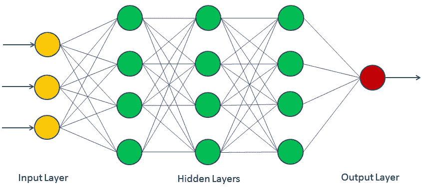
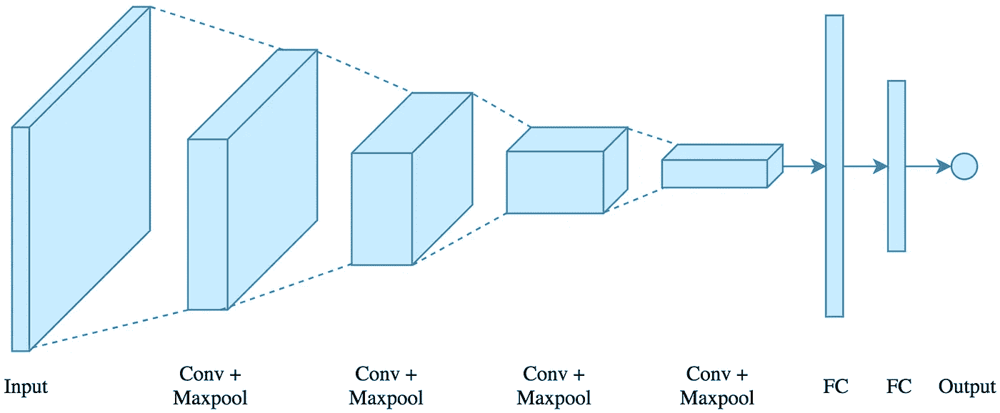
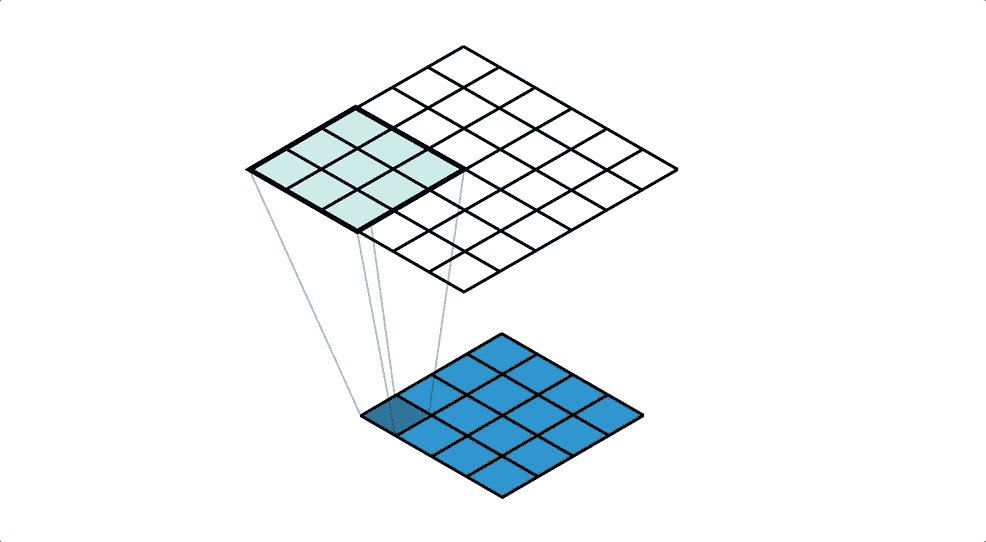

# 什么是深度学习？直观的介绍

> 原文：<https://medium.com/codex/what-is-deep-learning-an-intuitive-introduction-441cc8fa8df6?source=collection_archive---------4----------------------->

## [法典](http://medium.com/codex)

## 这比你想象的要容易得多

最近几天，现代科技世界有了很多进步，比如自动驾驶汽车、面部识别系统、聊天机器人等等。这些很酷的发明只有在深度学习的帮助下才有可能实现。阅读这篇文章，了解什么是深度学习，以及它使深度学习如此受欢迎的支持因素。

# 深度学习

深度学习是机器学习(ML)的一个子集，它通过从例子或以前的数据点中学习，为我们提供给定输入集的某些预测。这就是整个概念的内容。从技术上来说，深度学习是机器学习的更高形式，它复制了人脑执行复杂任务的工作。深度学习比机器学习强大得多，因为它能够对结构化(具有列和行的数据，例如，住房数据等)进行准确的预测。)和非结构化数据(例如音频模式、图像等。).在知道了深度学习的概念之后，它突然把我们带到了所谓的人工神经网络(ANN)或只是神经网络(NN)的概念，它解释了深度学习的机制。

# 神经网络

在深入研究神经网络的概念之前，让我们想象一个场景，并观察人体如何对其做出反应。想象你把手放在燃烧的火上。在几分之一秒内，你手中的感觉器官通过所谓的神经元将信号传输到大脑。然后，人脑通过神经元再次发出让我们把手从火上拿开的信息，最终我们把手从火上拿开。在这种情况下，充当重要单元的主要代理是神经元。人类神经元的集合称为生物神经网络。生物神经网络的相同概念适用于人工神经网络。

为了更好地理解这个概念，让我们用人工神经网络来处理同样的情况。让我们把触摸火时获得的信号作为输入。然后，输入信号由一种类似的神经元结构进行处理，这种神经元结构被称为单元。代替大脑，单位采取最优决策，决定是否将手从火上拿开(0/1)。

从技术上讲，神经网络是生物神经网络的复制，它使用多层单元过滤输入，并给出准确的预测。每个单元相互连接，从而形成一个网络。神经网络的架构如下所示:

如您所见，神经网络分为输入层、隐藏层和输出层。

## **输入图层**

这一层包含被插入神经网络的数据的数据点。

## **隐藏层**

这是神经网络最重要的一层，因为所有的功能和过程都发生在这一层。每层由所谓的激活函数激活，如 ReLU(校正线性单元)、Sigmoid(概率曲线)和 Softmax。

## **输出层**

顾名思义，这一层显示了给定的一组输入经过一系列处理后的最终输出。

请记住，每个单元或节点都有自己的输入值、权重(在网络的隐藏层中转换输入数据的参数或值)以及显著影响最终结果的偏差值。

# 人工神经网络的类型

总共有七种类型的人工神经网络，但这里我们将只讨论最著名的两种人工神经网络。它们是卷积神经网络(CNN)和递归神经网络(RNN)。

## **卷积神经网络**

卷积神经网络是一种最常用于分析和处理视觉图像问题的神经网络。就像神经网络是如何受到人脑的设计和功能的启发一样，CNN 类似于人类或动物视觉皮层的架构。CNN 的架构是这样的:

**卷积层(Conv):** 卷积层在滤波器的帮助下执行卷积运算，并产生一个称为特征图或激活图的输出。发生在卷积层内部的卷积操作如下所示:

**池化层(max pool):**CNN 中的池化层充当空间大小减小的代理，最终导致网络计算量的减小。它独立地在每个功能图或激活图上执行其功能。池层可以分为两种类型，它们是平均池和最大池。最常用的池函数是最大池函数(这也是图中使用的)。最大池计算并选择由过滤器分隔的每个要素地图中每个面片的最大值。另一方面，平均池只是计算和选择由过滤器分隔的每个特征图中的每个面片的平均值。Max pooling 函数执行的计算如下所示:

**全连接层(FC):** 将特征图汇集成矩阵后，将其转换成单个长特征向量或一维数组，用于输入到下一层。这个过程叫做展平。然后，它连接到称为全连接层的最终模型。在大多数模型中，全连接层位于网络的末端。

CNN 的应用包括图像分类、人脸识别、人体姿态估计等等。

## **递归神经网络(RNN)**

递归神经网络主要用于处理和建立序列数据的模型。它在解决自然语言处理(NLP)任务中起着重要的作用。递归神经网络也主要用于时间序列分析和预测。最流行的递归神经网络是长短期记忆(LSTM)算法。共有五种类型的 RNN(注意:Tx =输入数量，Ty =输出数量):

*   **一对一** (Tx = Ty = 1)。示例:传统神经网络
*   **一对多** (Tx = 1，Ty > 1)。例如:音乐一代
*   **多对一** (Tx > 1，Ty = 1)。示例:情感分析
*   **多对多** (Tx = Ty)。示例:命名实体识别
*   **多对多** (Tx 不等于 Ty)。示例:机器翻译

RNN 最重要的优势是他们能够为称为时间序列的序列数据建立模型，这一优势被认为是最重要的，因为对于时间序列分析，每个样本值都依赖于前一个样本值。RNN 最大的缺点是他们的计算时间非常慢。

# 深度学习为什么会腾飞？

深度学习和神经网络背后的概念和数学早在 1943 年就被发明了，但是，直到 2000 年和更早的最近几年，没有人知道这样的概念是否存在。使用深度学习作为解决问题的工具的真正激增是在 2010 年及其后。为什么会这样呢？深度学习进步的驱动力是我们目前拥有的海量数据。几十年前，我们确实有数据，但规模非常小，当传统的最大似然算法(如 SVM、逻辑回归)应用于这些小规模数据时，它们的表现并不明显。这种情况在过去几年里并不存在。在过去的十年中，数字化的增加和人们对电子设备的使用帮助收集和存储了大量的数据。与此同时，具有强大计算能力的巨大算法发明，帮助深度学习算法提供了远远超过传统 ML 算法的结果。所以，我们可以简单地说:

> 规模推动深度学习进步

你可能会问，如果没有大量的数据呢？答案是，那么深度学习就不会存在了。这是深度学习的唯一缺点。

# 最后的想法！

希望你喜欢这篇文章。在这篇文章中，我们几乎涵盖了深度学习的所有基本基础，但仍有许多内容有待探索。神经网络的数学部分和它们的类型可能有点难，但是不要犹豫去触及它。深度学习最有趣的部分是它的实际含义，当然还有编码。在深度学习的帮助下，我们能够创建令人敬畏和酷的应用程序，如图像检测、预测和许多更精彩的事情。在我即将发布的帖子中，我将指导你完成编码部分，请跟随我，不要错过任何一篇。

**快乐深度学习！**