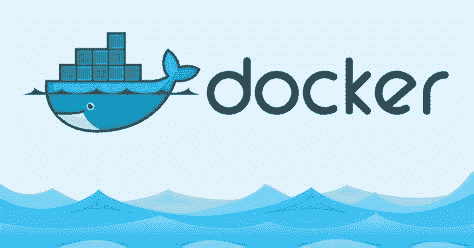

# Docker 是什么？

> 原文：<https://medium.com/codex/what-is-docker-37adda5a1464?source=collection_archive---------13----------------------->

Docker 是一个开源的容器化软件，用于将应用程序捆绑到可以打包并在任何地方运行的容器中。Docker 通常用于容器的应用程序开发、部署和管理环境。Docker 的一个常见用例是将您的应用程序作为 web 应用程序托管，或者在您的 CI/CD 管道上运行测试。

通常，当开发人员创建一个应用程序或脚本时，他们能够运行…