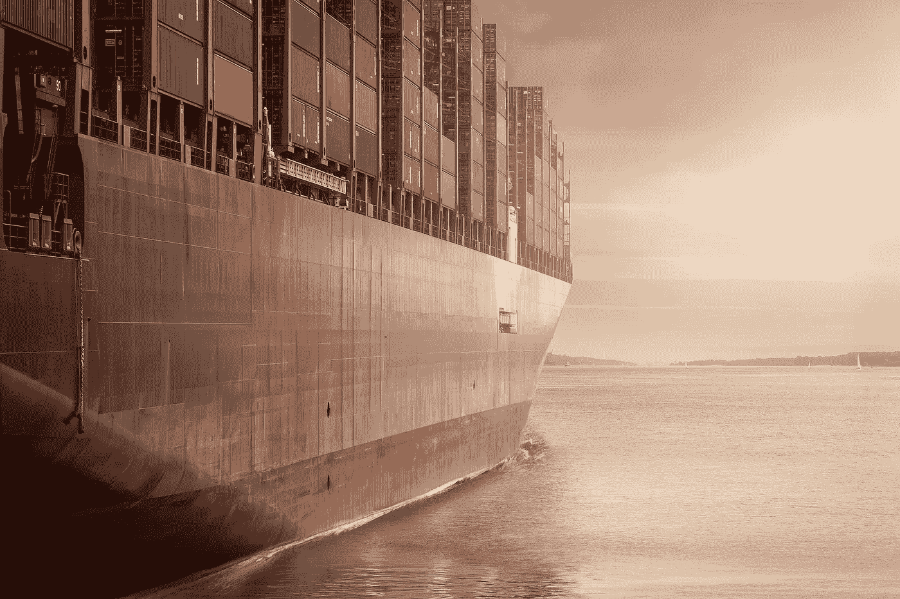
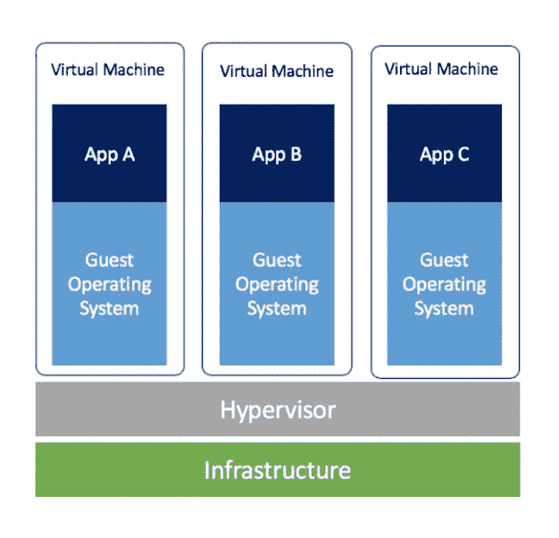
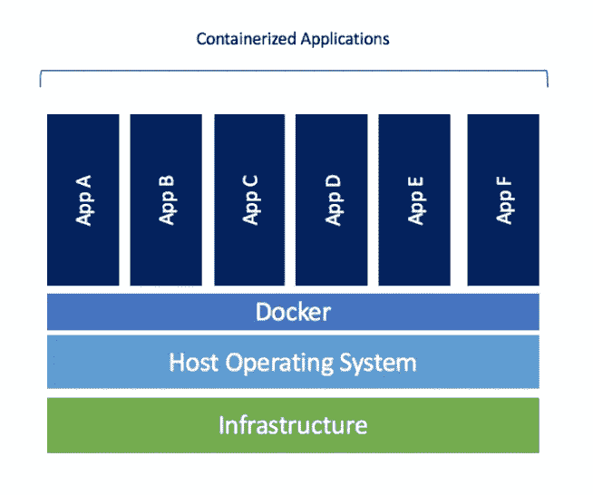
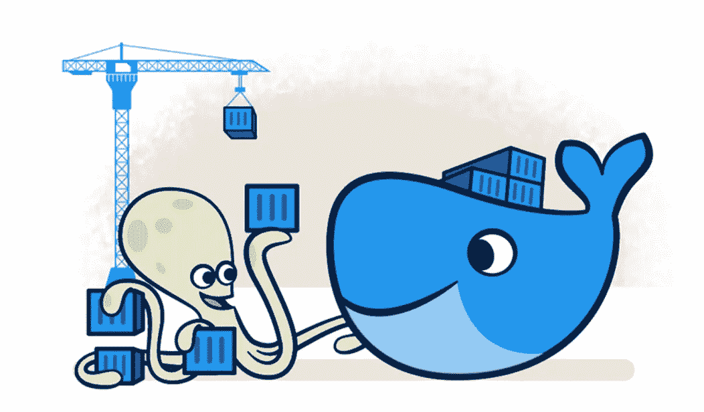

# Docker 是什么，我们为什么需要它？

> 原文：<https://medium.com/codex/what-is-docker-and-why-do-we-need-it-7dedc616366e?source=collection_archive---------1----------------------->

在本文中，我们将简要介绍 Docker 是什么以及我们为什么需要它。但首先，让我们定义问题陈述，看看 Docker 是如何解决的

[图像来源](https://www.pexels.com/photo/business-cargo-cargo-container-city-262353/)

# 问题陈述

假设您正在开发一个应用程序，该应用程序需要使用多种技术来开发不同的组件，如前端、后端、数据库等。一切似乎都很好，但是当您在您的机器上使用所有这些技术时，最常见的问题是一种技术需要一个版本的依赖项，而其他一些技术需要不同的依赖项才能工作。此外，您的应用程序在其他人的机器上可能无法以相同的方式运行，或者当您将它部署到具有不同操作系统或硬件的不同环境中时，它可能无法运行。

为了解决所有这些常见的问题，我们使用了一种叫做虚拟化的东西，让我们更详细地讨论一下

# 解决方案:虚拟化

***虚拟化*** 是使用软件在计算机硬件上创建一个抽象层的过程，该抽象层允许将单个计算机的硬件元素分成多个虚拟计算机。虚拟化的主要思想是将应用程序的组件及其依赖关系隔离到独立的自包含单元中，这些单元可以在任何地方运行，没有任何依赖关系或操作系统冲突。

现在我们知道了虚拟化的含义，我们可以使用它来解决上述问题。通过利用虚拟化概念，有两种方法可以实现这一点:

## **1。虚拟机**

虚拟机本质上是真实计算机的模拟，它像真实计算机一样执行程序。虚拟机使用**H*ypervisor*在物理机之上运行。反过来，管理程序在主机上运行。**

一个**H*y 虚拟机管理器*** 是一个运行在虚拟机之上的软件、固件或硬件。主机为虚拟机提供资源，包括 RAM 和 CPU。这些资源在虚拟机之间进行分配，并且可以基于在单个虚拟机上运行的应用程序进行分配。

[图像来源](https://www.docker.com/blog/containers-replacing-virtual-machines/)

尽管现在虚拟机已经通过使我们的应用隔离运行解决了这个问题，它们有自己的依赖关系/库和操作系统要求，但这里的主要问题是它们非常沉重，因为每个虚拟机都有自己的客户操作系统，从而消耗主机资源的更高部分，因此需要花费大量时间来启动或创建。这就是集装箱的用武之地。

## **2。集装箱**

容器是一种轻量级的、更灵活的处理虚拟化的方式，由于它们不使用像 hypervisor 这样的软件，您可以享受更快的资源供应和新应用程序的更快可用性。与提供硬件级虚拟化的虚拟机不同，容器提供操作系统级虚拟化，因此它们非常简单且易于使用。

[图片来源](https://www.docker.com/blog/containers-replacing-virtual-machines/)

由于容器是轻量级的，与虚拟机相比，它们消耗的主机资源要少得多。您可以在工作时轻松共享容器，并确保与您共享的每个人都获得以相同方式工作的相同容器，而不管依赖关系或操作系统之间的版本冲突。

# 现在，什么是 Docker？

Docker 是一个工具，它帮助开发、运输和运行容器上的应用程序，并使您能够将应用程序从基础设施中分离出来，以便您可以快速交付软件。

[图片来源](https://www.docker.com/)

它提供了在隔离环境中打包和运行应用程序的能力，即:集装箱。隔离和安全性允许您在给定的主机上同时运行许多容器。

# 一些基本的码头术语

## 码头引擎

Docker 引擎是负责创建和管理所有容器和其他 Docker 对象的核心容器化技术。它充当客户端-服务器应用程序，包括:

1.  Docker 守护进程**是一个在后台运行的守护进程，它监听任何 API 请求并相应地管理 Docker 对象**
2.  一组**API**，用于与 Docker 守护进程通信
3.  **Docker CLI 客户端**，帮助用户与 Docker 守护进程通信，并通过使用这些 Docker APIs 执行用户的请求

## Docker 图像

Docker 映像只是一个模板，它包括一组用于创建实际容器的指令或命令。我们可以使用同一个 docker 映像来创建多个 docker 容器

## 码头集装箱

Docker 容器是基于映像的实际实例，它打包了应用程序需要的所有依赖项和库，并以松散耦合的隔离方式运行它

# 参考

1.  [https://docs.docker.com/get-started/overview/](https://docs.docker.com/get-started/overview/)
2.  https://www.ibm.com/cloud/blog/containers-vs-vms
3.  【https://opensource.com/resources/virtualization 

 [## 阿帕奇卡夫卡:基本介绍

### 在这篇博文中，我将对阿帕奇卡夫卡和术语做一个简单的介绍…

medium.com](/nerd-for-tech/a-basic-introduction-to-kafka-a7d10a7776e6) 

*关注更多与 Docker 和软件工程相关的文章:)*

**你也可以在** [GitHub](https://github.com/ahmedgulabkhan)
[dev . to](https://dev.to/ahmedgulabkhan)上找到我