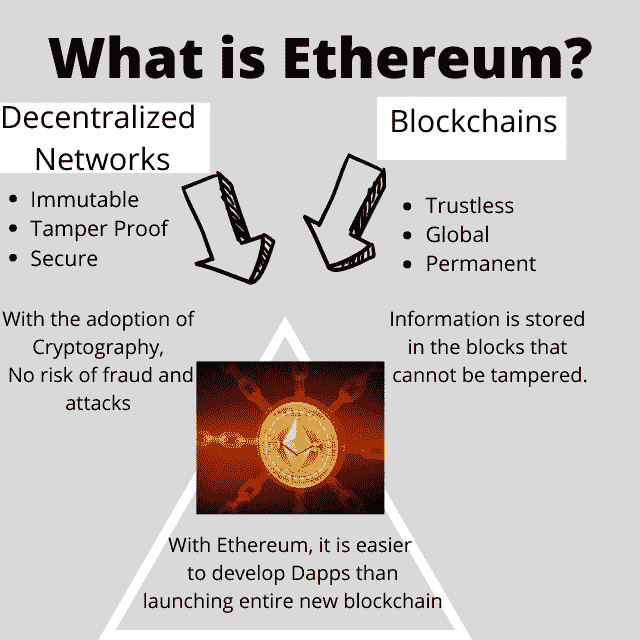

# 什么是以太坊及其流行用例？终极指南

> 原文：<https://medium.com/codex/what-is-ethereum-and-its-popular-use-cases-ultimate-guide-ed73f8983bd4?source=collection_archive---------19----------------------->

# 以太坊是什么？

本质上，以太坊是一个巨大的、分散的超级计算机，使用区块链技术来运行。一些关键的发展使以太坊成为一个独一无二的项目，它包含了建立一个新的、更好的、更安全的、隐私的和以信任为导向的互联网所需的所有构件。

**以太坊中令人兴奋的因素是什么？**

先说它“去中心化”的道理。计算机或节点网络运行这台全球计算机，而节点分散在世界各地(更具体地说，它运行在区块链上)。这意味着没有人可以拔掉插头并停止它的运作。任何希望从任何连接到互联网的计算机上运行网络节点的人都可以这样做，而无需寻求许可。此外，因为它是分散的，所以不容易被黑客攻击，因为没有单点故障。

**谁控制着它？**

那么，以太坊归谁管？答案是没有人拥有它。没有一个单一的实体来管理它；取而代之的是，它现在由一群软件工程师管理，他们在自己的电脑上编写代码并运行网络节点。以太坊是一个真正分散的项目，通过众包许多有经验的计算机程序员的工作来构建。以太坊基金会是一个非营利组织，旨在建立一个更加全球可访问、自由和值得信赖的互联网，协调各方努力改进以太坊技术。

这是一个开放的项目，任何人都可以使用这台全球计算机。许多人可以随心所欲地使用它，任何人都可以阅读计算机正在执行的代码或创建计算机能够实现的新代码。这个特性意味着你可以在上面运行你的程序，并使用其他人创建的应用程序。以太坊代码是开源的，可以在 github.com/ethereum 的[找到。](https://github.com/ethereum)

用户可以在不使用中介的情况下相互通信，消除了对第三方的需求。当您选择与构建在以太坊上的第三方应用程序交互时，您可以直接读取代码，以确保程序执行它所说的内容。没有中间人，没有惊喜。

以太坊密码是不可撤销的。事务、保存的数据和编写的程序都是永久的。一旦部署到全局计算机上，就不能修改它们。这个特性意味着你不仅可以验证任何程序的代码并理解它的功能，而且你可以确信一旦你验证了它，没有人能够修改它。无法更新已在使用的代码。

这台电脑的交互非常安全。与电脑的所有交易(无论是部署新代码、使用当前应用还是转移价值)都经过加密签名，这意味着它们不能被更改或复制。

您保留您的价值，因为您拥有您的数据。在以太坊上，用户可以选择提供和保留哪些数据，从而完全控制谁可以使用他们的数据以及用于什么目的。用户还将能够保留(并从中获利)他们的数据可能产生的任何价值，类似于他们在脸书或 Twitter 上发布的所有数据，这是一座广告金矿。

# 以太坊用例:

以太坊希望提供一个平台，任何人都可以在这个平台上构建价值和数据交换应用。它的技术建立在“智能合约”的基础上，基于以太坊的程序执行金融和信息交易。

让我们举个例子。假设 X 先生在自家屋顶安装了太阳能系统，他的邻居 Y 先生想用它给家里的电器充电。但是，账单金额要少得多，而且他们不想每次都转账。为了顺利和无缝的支付，他们可以在以太坊上写一份智能合同，以检查所用的能源，并将其乘以按市场价格计算的电费。它会自动从 Y 先生的账户转账到 X 先生的账户，不涉及第三方或额外费用。

以下是以太坊的流行应用。

**(1)身份管理:**以太坊网络上的每个用户对其与智能合约或其他用户的所有交互进行数字签名，身份可以与一个用户相关联。该用户所做的所有操作都将与其身份相关联。— Peer Mountain 和 Hu-manity 是两个位于区块链的身份管理项目。

另请参阅:

[自我主权身份(SSI)在数字身份安全方面的优势](https://blockchainshiksha.com/self-sovereign-identity/)

**(2)透明和信任:**只要协议可以使用编程语言来陈述，智能合同就可以取代(并用于执行)各方之间的合同。它也可以用来实现透明。例如，假设您想向一个非营利组织捐款，但想确保这笔钱用于帮助非洲的清洁水倡议。在以太坊上，你可以创建一个应用程序来跟踪你的钱的实时使用情况。

**(3)治理:**以太坊是处理大规模投票系统的优秀平台。由于以太坊生态系统上的每个用户都可以安全地连接和交互，因此它可以用于构建公司治理、选举、决策和共识协议的投票系统。

**(4)版权/所有权库:**您在通过以太坊网络发送的交易中包含的数据将永久保存在以太坊区块链上。它们是不可更改的，带有时间戳，表明它们是何时添加的，并且不能撤销。出于这些原因，您可以在以太坊区块链注册您的知识产权(IP)或歌曲或书籍的版权，并相信没有人可以删除它，并且您可以随时证明您是此类作品的作者或所有者。

## 以太坊网络怎么用？

使用以太坊的第一步是创建你自己的以太坊钱包，并购买一些以太(ETH)来进行你最重要的交易。你可以通过比特币基地等交易所这样做。完成钱包后，您可以使用以太坊应用程序，并在帐户之间移动以太。

在下一篇文章中，我们将看到以太坊是如何工作的？

*原载于 2022 年 7 月 25 日*[*【https://blockchainshiksha.com】*](https://blockchainshiksha.com/ethereum-and-its-popular-use-cases-ultimate-guide/)*。*