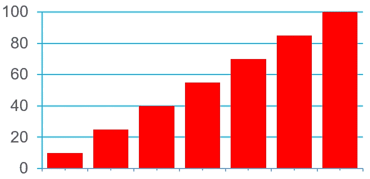

# 什么东西插入 DOM 更快——HTML 还是 DOM 节点？

> 原文：<https://medium.com/codex/what-is-faster-to-insert-into-dom-html-or-dom-nodes-ff11586f8570?source=collection_archive---------6----------------------->

`innerHTML`、`insertAdjacentHTML()`、`appendChild()`、`append()`、`prepend()`、`insertAdjacentElement()`、`replaceChildren()`对比。

HTML 元素拥有相当多的方法，用于在其中或周围添加 HTML 内容。将内容添加到 HTML 页面中的特定容器元素是一项非常常见的任务。因此，在这篇文章中，我将探索最有用的方法——