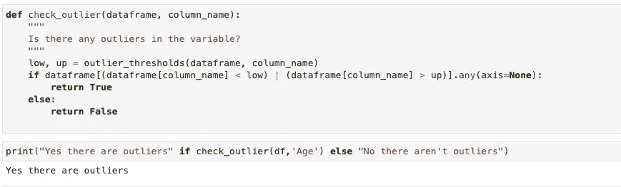
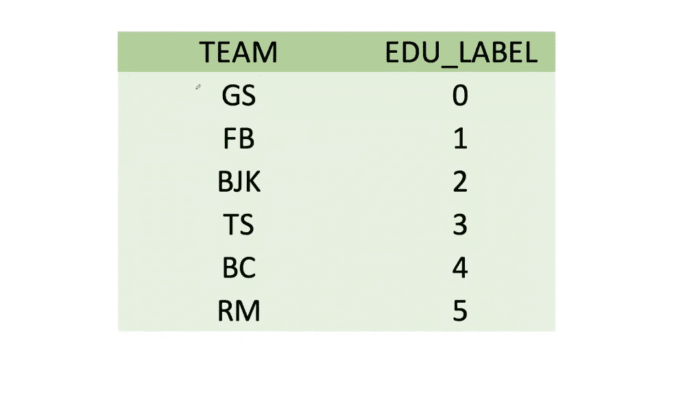

# 什么是特征工程？

> 原文：<https://medium.com/codex/what-is-feature-engineering-11729cc57d89?source=collection_archive---------4----------------------->

特征工程的端到端基本概念和 Python 中的应用示例:异常值、缺失值、编码器、特征缩放、特征提取

如果你与 ML 或 AI 主题相关，你肯定听说过“特征工程”。在开始写作之前，我想引用托马斯·莱德曼的话。

> 如果你的数据不好，你的机器学习工具就没用了。—莱德曼

CS 的基本规则是。这是我从我最喜欢的讲师那里听到的:垃圾进垃圾出！

我为这篇论文准备了一个笔记本。你可以通过使用[这个链接](https://www.kaggle.com/enesbaysan/what-is-feature-engineering)来访问它。


照片由[在](https://unsplash.com/@thisisengineering?utm_source=unsplash&utm_medium=referral&utm_content=creditCopyText) [Unsplash](https://unsplash.com/?utm_source=unsplash&utm_medium=referral&utm_content=creditCopyText) 上绘制

# 什么是特征工程？

我多次听到人们说，也许你也听说过:机器学习过程的最大部分是准备数据。有时术语会让我们困惑，我们可以使用数据预处理来代替特征工程，有时正好相反。这场令人困惑的讨论有很多参与者。在此主题下，我们为要素设置数据类型，我们可以管理缺失数据，我们可以检测异常值并从旧要素创建全新的要素。


图片来自[此处](https://community.hitachivantara.com/servlet/rtaImage?eid=ka02S0000009ldV&feoid=00N1J00000Gc1BT&refid=0EM2S000000P6bL)。

## 数据区中特征的含义是什么？

在特性工程方面，我们称之为列特性。每行是一个观察值，每列是每个观察值的一个特征。例如，在下面的示例中,**名称**列表示观察的名称。我们可以使用这个专栏创建一个全新的功能。我可以创建一个在名称功能中搜索标题的功能，如；先生、太太等。然后我可以把他们归类为先生或夫人等。这是特征工程的一个子领域。我们称之为“特征提取”。


我们经常替换这些而不是彼此；列、变量、特征。

这些是特征工程的主要课题:

*   极端值
*   缺少值
*   编码
*   特征缩放
*   特征抽出
*   功能交互

我们将在本文中看到上面的一些。

# 极端值

显著偏离数据总体趋势的值称为异常值。离群值会破坏变量(特征)之间的关系。我们在下面看到一个例子。


图片来自 [VBO](https://www.veribilimiokulu.com/) |圈起来的值是异常值。

线性模型更容易受到异常值的影响。此外，树模型受异常值的影响较小。

我们可以通过以下方法来衡量异常值:

*   部门/领域知识
*   标准偏差方法
*   z 分数法
*   箱线图法(IQR 法)

我们可以用这些来处理异常值问题:

*   从数据集中移除包含异常值的观测值。我基本上不喜欢选择这个选项。它会在数据集中产生偏差，并严重影响模型。
*   带阈值的重新分配。在这个选项中，我们用上限和下限来改变异常值。

## 用箱线图法(IQR 法)处理异常值的应用实例

在本文中，我们将看到这种测量异常值的方法。在这个例子中，我将使用 Titanic 数据集。

让我们从解释盒图技术开始。我们说异常值超出了这种技术的盒图限制。

*   最大值(上限)= Q3 + (1.5 * IQR)
*   最小值(较低)= Q1-(1.5 * IQR)

IQR 的意思是四分位数范围。这意味着数据集的 75%值减去 25%值。此外，你可以检查可汗学院获得更多关于方块图和 IQR 的信息。我喜欢他们的解释。


图片来自[VBO](https://www.veribilimiokulu.com/)|***上半部分必须包含 Q3***

通过使用“seaborn”包，我们可以很容易地在 Python 中应用这种 boxplot 可视化技术。


我将使用 Python 创建一个应用示例。首先，我们看一下数据集。


我将创建一个函数来获取检测异常值限制的上限值和下限值。为了得到百分位值，我将使用`quantile`方法。


我们得到了箱线图技术的极限。现在，我们可以通过使用这些限制来检测异常值。在解决异常值问题之前，我将定义另一个函数来检查变量中是否有异常值。



我们可以通过使用下面的函数来捕捉异常值。此外，如果我们想得到他们的指数，我们可以通过给索引参数。


正如我上面提到的，我不喜欢选择从数据集中删除离群值。但是我想也许你想删除它们，所以我为它定义了一个函数。


我更喜欢下面；随着阈值而变化。该函数通过使用上面定义的`outlier_thresholds`函数获得限值。然后，它会根据上限更改较高的异常值，并对较低值应用相同的规则。


我们检查是否有任何异常值，我们得到了“假”。

## 多变量异常值分析:局部异常值因子


照片来自 [VBO](https://www.veribilimiokulu.com/)

这种技术提供了同时分析特征效果的机会。因此，当一个特征是单一的时，它可能没有异常值。但是当与其他功能交互时，它会产生离群值。基本上，它通过使用位置根据密度对观察值进行评分。然后，我们可以通过使用分数来抓住异常值。我们使用 sklearn 中的`neigbors.LocalOutlierFactor`在 Python 中使用这种技术。你可以在笔记本上找到这样的例子。我不会在这里长篇大论地解释。

LOF 的一个例子。我们假设有两个变量。年龄和怀孕计数。

*   当 17 岁在年龄变量中是单一的时，它不是一个异常值。
*   当怀孕计数在怀孕计数变量中为单个时，3 次怀孕计数不是异常值。
*   但是；17 岁怀孕 3 次是个例外。这是局部异常因素的一个例子。他们单身时不是局外人，但在一起时，他们就是局外人。

# 缺少值

在本节中，我们将讨论缺失值项。是什么，有问题吗？，以及我们如何处理这个问题。


照片由 [Aida L](https://unsplash.com/@aidamarie_photography?utm_source=unsplash&utm_medium=referral&utm_content=creditCopyText) 在 [Unsplash](https://unsplash.com/s/photos/missing-value?utm_source=unsplash&utm_medium=referral&utm_content=creditCopyText) 上拍摄

缺失值项表示某些观测值包含缺失值，如:**南，空**等。这对我们的机器学习模型来说可能是个问题。此外，一些 ML 模型不能处理缺失值。它们会产生偏见等。

我们可以用以下方法解决这个问题:

*   消除
*   归罪
*   预测方法(KNN 等。)

## 熊猫身上缺失的价值观

在熊猫中，我们可以通过使用`isnull`方法得到缺失值。我们在下面看到一些缺失值的方法。


## 消除

如果我们直接删除丢失的值，我们可以打破数据集中的结构。我们应该检查它们的随机性。如前所述，如果我们直接删除它们，我们可以打破数据集的结构。

我们使用`dropna`方法来删除丢失的值。

```
df.dropna()
```

## 归罪

如果我们想估算缺失值，我们可以使用`fillna`方法。此方法通过参数填充所有缺少的值。


此外，我们可以只估算一个我们想要的变量。为此，我们需要对变量应用`fillna`方法。我们可以用平均值、中间值等来填充。


## 预测方法(KNN)

我们可以使用预测方法来输入缺失值。在本例中，我们将使用 KNN。

KNN 不能区分男性和女性术语。它需要使用 0 和 1。为此，我要把所有变量转换成二进制。为此，我们可以使用`pd.get_dummies`方法。稍后我们将看到它的细节。


现在，我将在 0 和 1 之间调整所有变量。


我准备好使用 KNN 了。我们可以在“age_inputed_knn”列中看到估算值。


我没有深究 KNN 是什么。事实上，这不是本文的主题。仅仅为了提供简单的信息:`scaler.inverse_transform(dff)`代码段返回给我们转换前的原始数据。

如果您想了解关于 KNN 的更多详细信息，您可以查看以下内容:

*   [使用 K 近邻算法的机器学习基础知识](https://towardsdatascience.com/machine-learning-basics-with-the-k-nearest-neighbors-algorithm-6a6e71d01761)
*   [k 近邻算法](https://en.wikipedia.org/wiki/K-nearest_neighbors_algorithm)
*   [KNN 算法的简单理解和实现！](https://www.analyticsvidhya.com/blog/2021/04/simple-understanding-and-implementation-of-knn-algorithm/)
*   [KNN 插补指南](/@kyawsawhtoon/a-guide-to-knn-imputation-95e2dc496e)

# 编码

编码改变了变量的表示方式。我们有三种类型的编码。

*   标签编码
*   一键编码
*   稀有编码

## 标签编码

我们通过标签编码将分类变量转换成数值。如果我们要转换的变量只有两类，例如，性别、怀孕、糖尿病等。编码是二进制编码。

下面是一个二进制编码的例子。转换为二元变量的性别变量:IS_FEMALE。如果观察值为女性，则值为 1 否则为 0。我们可以理解为，如果 IS_FEMALE 变量中的值为 0，则是男性观察。


照片来自 [VBO](https://www.veribilimiokulu.com/)

有一点很重要。我们应该标记编码序数变量或二进制变量。如果变量是名义上的，我们就不应该做标签编码。这是一次性编码的主题。我们可以在下面的序数变量上看到另一个标签编码的例子。


照片来自 [VBO](https://www.veribilimiokulu.com/)

最后一个不使用标签编码的例子。我们不能对下面的变量进行标签编码。因为它是一个名义变量。



图片来自 [VBO](https://www.veribilimiokulu.com/)

## 一键编码

我们可以对变量进行一次性编码，不管是名义变量还是序数变量。我们将分类变量的类转换成新的变量，如下所示。


照片来自 [VBO](https://www.veribilimiokulu.com/)

我们可以通过在熊猫身上使用`get_dummies`方法来应用这一点。


但是还有一点很重要。我们需要注意虚拟变量。

## 虚拟可变危险

虚拟变量是从彼此创建变量而导致的危险情况。例如，假设我们有一个“性别”变量。如果我们一次性编码这个变量，我们将有 2 个新的变量:男性和女性。在这种情况下，这些变量将相互补充。所以，如果男性是 0，那么女性肯定是 1 或者相反。这是虚拟变量危险。如何避免这种情况？


我们可以从要一次性编码的变量中过滤出一个类。然后，我们可以理解，如果我们从变量中创建的所有类变量都是 0，那么它的值就是我们已经过滤掉的值。下面我们可以看到一个例子。最后一次观察的值为 0。因此，今天是星期四。我们可以通过`get_dummies`方法中的`drop_first`参数来避免虚拟变量。


## 稀有编码

在某些问题中，分类变量可能有太多的类别。我们使用这种技术来避免不必要的变量创建。例如，我们在下面的一些课程中看到非常低的频率。


图片来自 [VBO](https://www.veribilimiokulu.com/)

我们不想为这些类(D，E，G 等)创建新的编码变量。).这是稀有编码的主要目标:不要为频率低的类创建新的编码变量。对于这种情况，我设置了一个限制。如果频率低于 20，将它们归入稀有类。然后，一键编码这个变量。因此，我们不会得到不必要的变量。


图片来自 [VBO](https://www.veribilimiokulu.com/)

事实上，目前我还不知道一个处理这个问题的函数或库。但是我们可以使用下面的函数来处理这种罕见的编码。

```
def rare_analyser(dataframe, target, cat_cols):
    for col in cat_cols:
        print(col, ":", len(dataframe[col].value_counts()))
        print(pd.DataFrame({"COUNT": dataframe[col].value_counts(),
                            "RATIO": dataframe[col].value_counts() / len(dataframe),
                            "TARGET_MEAN": dataframe.groupby(col)[target].mean()}), end="\n\n\n")def rare_encoder(dataframe, cat_cols, rare_perc):
    temp_df = dataframe.copy()
    rare_columns = [col for col in cat_cols if (temp_df[col].value_counts() / len(temp_df) < 0.01).sum() > 1]for col in rare_columns:
        tmp = temp_df[col].value_counts() / len(temp_df)
        rare_labels = tmp[tmp < rare_perc].index
        temp_df[col] = np.where(temp_df[col].isin(rare_labels), 'Rare', temp_df[col])return temp_df
```

# 特征缩放

我们进行特征缩放以避免同一数据集中变量之间的测量差异。在某些技术中，变量尺度的差异会影响模型训练时间。此外，还会产生偏见。为了避免这些，我们调整了变量。


照片来自 [VBO](https://www.veribilimiokulu.com/)

通常，我们使用以下技术进行缩放:

*   标准缩放器
*   鲁棒定标器
*   最小-最大缩放器
*   计算尺

## 标准缩放器

它被称为标准。

```
z = (x - u) / s
```

我们可以通过 Python 中的`sklearn.preprocessing`中的`StandardScaler`来做到这一点。


## 鲁棒定标器

这种技术可以抵抗异常值。减去中间值，然后除以 IQR。我们可以通过 Python 中的`sklearn.preprocessing`中的`RobustScaler`来做到这一点。


## 最小-最大缩放器

该技术将变量转换为传递给 scale 函数的最小值和最大值之间的值。我们可以通过 Python 中的`sklearn.preprocessing`中的`MinMaxScaler`来做到这一点。


# 特征抽出

这个术语的意思是从原始数据中提取新的变量。

例如，假设我们没有性别变量，我们需要知道我们的乘客是男是女。我将从 Name 变量创建一个新变量。如果它包含“先生”，我会标记为“男性”。如果它包含“夫人”或“小姐”，我就标‘女’吧。我们可以说这个过程的特征提取。


# 最后

现在我看到我那么多朋友，他们都在做 ML 模特，却不知道自己在做什么。机器在学习，但他们没有！我不想用 ML 模型做黑箱。因此，首先我从学习 ML 的关键概念开始。我喜欢写作。希望你也喜欢。我尽力了。我们所解释的要点在 ML 的基本主题中。如前所述，如果我们的数据杂乱或糟糕，我们的 ML 模型会误导我们。在开始创建 ML 模型之前，我们应该记住这些概念。

亲切的问候。


照片由 [Ariel](https://unsplash.com/@arielbesagar?utm_source=unsplash&utm_medium=referral&utm_content=creditCopyText) 在 [Unsplash](https://unsplash.com/s/photos/black-box?utm_source=unsplash&utm_medium=referral&utm_content=creditCopyText) 上拍摄

# 数据集:

*   泰坦尼克号:[https://www.kaggle.com/heptapod/titanic](https://www.kaggle.com/heptapod/titanic)
*   小贴士:来自海边