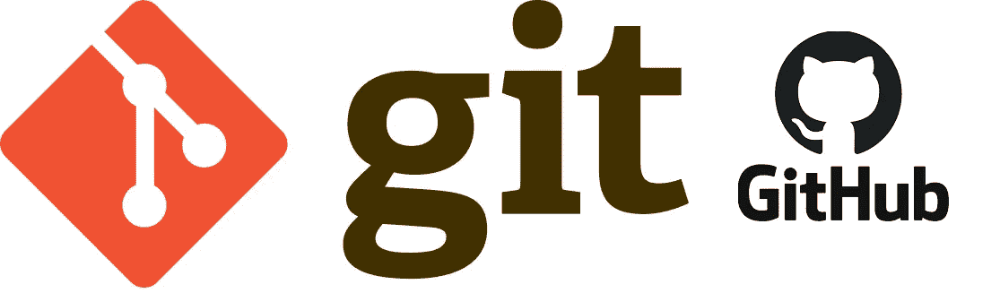

# Git 是什么？—初学者指南

> 原文：<https://medium.com/codex/what-is-git-a-beginners-guide-4054454c3be1?source=collection_archive---------18----------------------->

Git 是一个免费的开源版本控制系统，你可以下载到你的计算机中，它可以跟踪你对代码/项目所做的更改。重要的是要知道 Git 不同于 GitHub 和 GitLab。GitHub、GitLab 是基于 web 的存储库(托管服务),有助于代码管理和与远程存储库共享本地文件更改。许多公司都在使用 Git，包括谷歌、微软、推特…