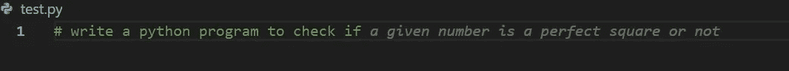
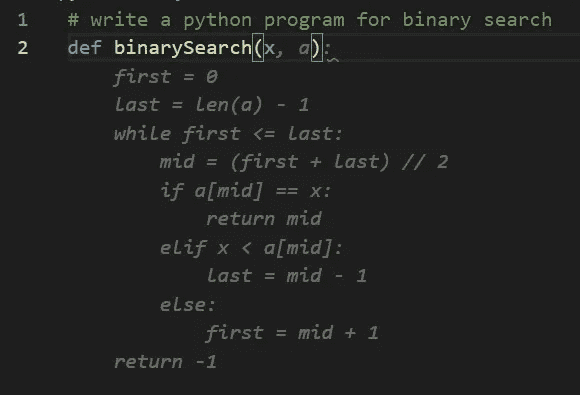
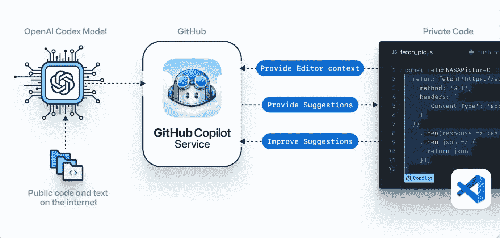
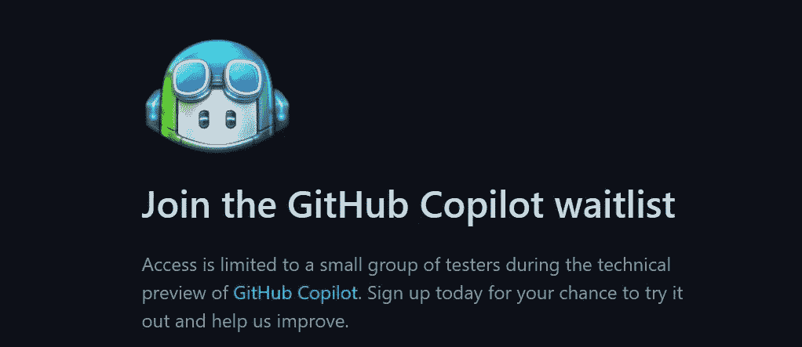

# 有 GitHub 副驾驶的航班

> 原文：<https://medium.com/codex/what-is-github-copilot-6c3e99ba7c41?source=collection_archive---------8----------------------->

先说 GitHub 吧……

GitHub 是软件工程师中最受欢迎的平台。它是一个基于 Git 的互联网主机提供商，提供软件开发和版本控制。它提供 Git 的分布式版本控制和源代码管理(SCM)功能，以及它自己的功能。对于每个项目，它都提供了访问控制和各种协作工具，比如 bug 跟踪、特性请求、任务管理、持续集成和 wikis。

如果这是 GitHub，什么是副驾驶？它只是航空界对飞机上第二个飞行员的一个简单称呼。

# **那么什么是 GitHub Copilot 呢？**

> GitHub Copilot 是一个 AI pair 程序员，可以帮助你以更少的工作量更快地编写代码。GitHub Copilot 从注释和代码中提取上下文，并即时建议单独的行和整个功能。GitHub Copilot 由 OpenAI Codex 提供支持，OpenAI 创建了一个新的 AI 系统。GitHub Copilot 技术预览版作为 Visual Studio Code、Neovim 和 JetBrains suite 套件的扩展提供。

如果你仍然困惑，看看下面的代码。我创建了一个 test.py 文件，并开始输入程序。如您所见，它试图理解您的目标，并尽可能生成最佳代码。在我的场景中，它试图自动完成潜在的 option 语句。

它实际上是如何工作的？

为了在深入研究其工作原理之前提供一些视角，让我们尝试用 Python 开发一个二分搜索法解决方案。

在 python 编程语言中自动完成著名的二分搜索法。

正如你在上面看到的，我开始编码，然后它提示我问题的潜在解决方案。

**GitHub 副驾驶有多好？**

> 我们最近对一组 Python 函数进行了基准测试，这些函数在开源 repos 中有很好的测试覆盖率。我们把函数体清空，让 GitHub Copilot 来填充。该模型在第一次尝试中有 43%的正确率，在允许尝试 10 次的情况下有 57%的正确率。而且它一直在变得越来越聪明。

**它支持的编程语言/框架**

> 我们最近对一组 Python 函数进行了基准测试，这些函数在开源 repos 中有很好的测试覆盖率。我们把函数体清空，让 GitHub Copilot 来填充。该模型在第一次尝试中有 43%的正确率，在允许尝试 10 次的情况下有 57%的正确率。而且它一直在变得越来越聪明。

我已经用下面的语言测试过了，效果很好，尽管准确性有所不同。Python、JavaScript、C++、Go、TypeScript、Ruby、Java、ReactJs、HTML、CSS 等等。

# 它是如何工作的？

GitHub Copilot 接受了数十亿行公共代码的训练。它给你的建议是适应你的代码的，但是它背后的处理最终是被别人写的代码告知的。正如你在上面看到的，它使用了一种叫做 OpenAI Codex 的东西。这个 OpenAI Codex 是在公开可用的源代码和自然语言上训练的，所以它理解编程和人类语言。GitHub Copilot 编辑器扩展将您的评论和代码发送到 GitHub Copilot 服务，然后该服务使用 OpenAI Codex 来合成和建议单独的行和整个功能。

一般来说，它规定

*   编辑器上下文
*   建议
*   改进建议

为了生成建议，GitHub Copilot 会将您正在编辑的文件的一部分传输到服务中。此上下文用于为您综合建议。GitHub Copilot 还记录建议是被接受还是被拒绝。这种遥测技术用于改进 AI 系统的未来版本，以便 GitHub Copilot 在未来可以为所有用户提供更好的建议。未来，我们将让用户选择如何控制他们的[遥测](https://docs.github.com/en/github/copilot/about-github-copilot-telemetry)的使用。

# 如何入门 GitHub Copilot？

这是你一直期待的部分，对吗？截至目前，GitHub Copilot 仅免费提供给有限数量的测试人员，因为它处于技术预览阶段。不要灰心丧气；你可以加入候补名单，有机会测试它。[请务必点击此链接加入等候名单](https://copilot.github.com/)。

# **最后的想法**

我认为/相信，这是 ML 最好的实现之一。当它试图理解带有评论和建议的行时，我被它的准确性震惊了。

当这个博客更新的时候，Copilot 开始商业化，现在每个人都可以使用了。

**重要链接**

[GitHub Copilot 你的 AI 对程序员](https://copilot.github.com/)

[GitHub Copilot 文档](https://github.com/github/copilot-docs)