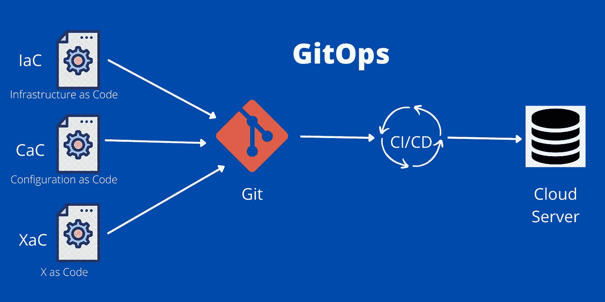

# 什么是 GitOps？

> 原文：<https://medium.com/codex/what-is-gitops-d24510475dbf?source=collection_archive---------9----------------------->

每个人都知道基础设施即代码(IaC ), IaC 帮助了许多开发人员。但是，IaC 中有一些需要改进的地方。

GitOps

DevOps 在软件行业非常受欢迎。DevOps 减轻了开发者和运营团队的工作。DevOps 用于应用程序代码开发。现在，行业中出现了另一个术语 GitOps。GitOps 用于基础设施创建。本文解释了什么是 GitOps，它是如何工作的，以及如何…