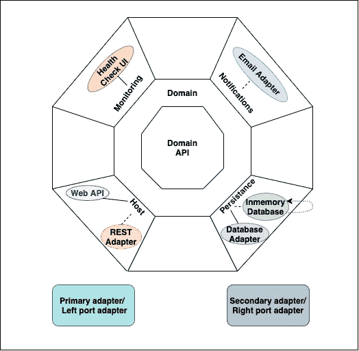

# 什么是六边形建筑

> 原文：<https://medium.com/codex/what-is-hexagonal-architecture-e7cf80b69539?source=collection_archive---------3----------------------->

大多数软件应用程序都是使用六边形架构模型设计的。在这样的模型中，您将输出和输入放在设计的边缘。中央逻辑或应用程序的核心逻辑独立于任何外部干预。

边缘的输出和输入意味着它们的处理程序的交换是在不改变核心代码的情况下完成的。使用六边形架构的主要吸引力在于它使得代码测试更加容易。

测试变得更加稳定，因为能够换成赝品。六边形建筑明显不同于分层建筑。在分层架构中，为了支持测试，您可以使用依赖注入和其他技术。UI 也可以在六边形模型中交换。

这些是创造六边形建筑的核心原因。在本帖中，我们将详细了解什么是六边形架构，它有什么好处。

**目录**

1.  什么是六边形建筑？
2.  六边形架构的优势
3.  六角形建筑的缺点
4.  六边形建筑的层次
5.  结论

# 什么是六边形建筑？

阿利斯泰尔·考克伯恩在 2005 年提出了六边形架构。六边形架构是一种架构模式，有助于解决传统架构(以数据库为中心的架构)中与应用程序维护相关的问题。六角形架构(也称为端口和适配器模式)背后的核心概念是应用程序是系统的中心。端口将到达或离开应用程序的输入和输出与外部技术、交付机制和工具隔离开来。

为了更好地理解这个概念，让我们快速查看下图。

如图所示，有两个六边形，一个在另一个里面。内六角描绘了应用程序的核心、应用程序逻辑和业务。适配层位于核心和外部六边形之间。六边形的每一边代表一个端口。

正因为六边形有六条边，并不意味着六边形结构中只能有六个端口。六边形只是用来用简单的语言表示整个概念。考克伯恩选择了一个六边形的平边，而不是一个圆，来具体表示港口的位置。

# 六边形架构的优势

*   **即插即用:**这种架构为我们提供了在开发过程中根据需求添加和移除适配器的能力。例如，我们可以在不改变逻辑的情况下将 GraphQL 适配器与 REST 适配器互换
*   **可测试性:**我们可以毫不费力地为每个组件编写测试用例，因为它解耦了所有的层。
*   适应性/增强:我们总是可以添加一种新的方式来轻松地与应用程序交互。
*   **可持续性**:维护变得更加容易，因为所有的第三方库都可以保存在基础设施层。
*   **数据库独立:**我们可以很容易地切换数据库提供商，因为数据库与数据访问是分离的。
*   **干净的代码:** UI 很容易实现，因为业务逻辑远离了 React、Angular 或 Blazor 等表示层。
*   组织良好:新开发人员将很容易上手，并对项目有更好的理解，因为它组织良好。

# 六角形建筑的缺点

*   领域层变得很重，因为这一层实现了大量的逻辑。
*   随着我们用多层抽象来构建应用程序，复杂程度将会急剧增加。
*   拥有许多间接层和隔离层通常会增加构建和维护应用程序的成本。这个成本超过了抽象的好处。
*   大多数 web 应用程序永远不需要切换数据库和框架。它们只能通过浏览器使用。创建有可能替换任何实现的应用程序是一个崇高的目标。然而，大多数应用程序不需要这种级别的适应性。因此，构建如此理想的应用程序是浪费时间。

# 六边形建筑的层次

*   **领域 API 层:**这一层是中心层，不依赖任何其他层。因为主适配器和辅助适配器应该能够实现该契约，所以它是域层交互(端口)的契约。这也被称为依赖性反转原理域层(DIP)。
*   **领域层(业务层):**这些层保持干净，没有任何其他依赖。他们有商业逻辑。
*   **Rest 适配器层:**Rest 适配器层也叫左端口适配器。主适配器是实现 restful 服务的层，如 GET、POST、PUT、DELETE 等。
*   **持久性适配器层:**这是 Rest 适配器，也称为右端口适配器或辅助适配器。这是实现实体框架核心的层，它以前实现了一个存储库设计模式。DbSet 是存储库，DbContext 是工作单元(UOW)。引导/表示层:-这是项目的最后一层。一切从这里开始。

# 结论

六边形架构是构建 web 应用程序的流行方法之一。何时何地使用这种架构完全取决于项目的类型。将应用程序分成不同的责任层是好的，但是过早地使用抽象将导致徒劳的结果。

*原载于*[*https://www . partech . nl*](https://www.partech.nl/nl/publicaties/2021/06/what-is-hexagonal-architecture)*。*