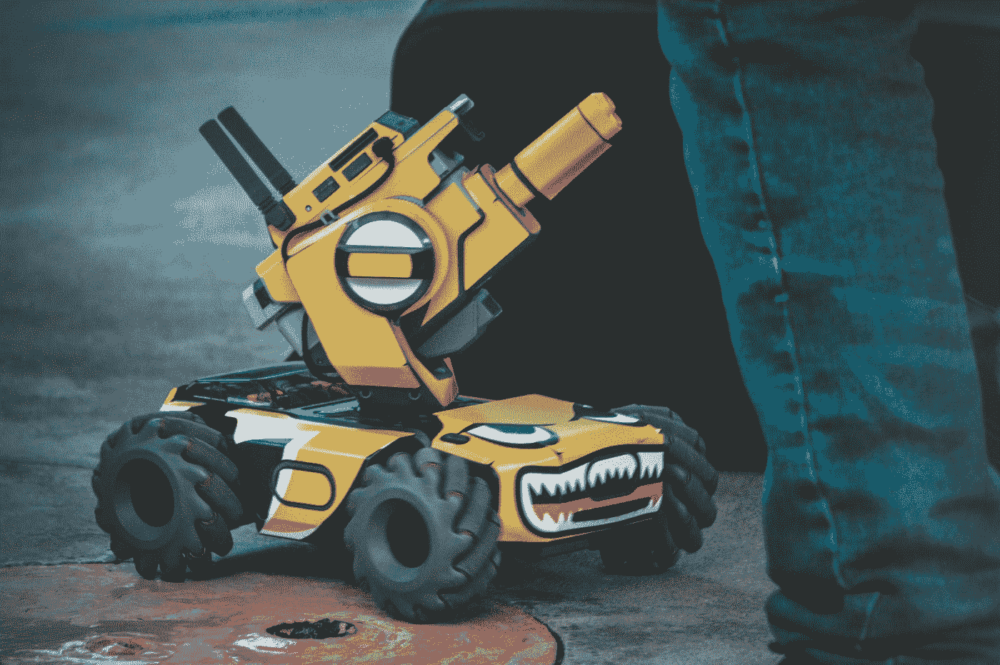

# 什么是图像分类？

> 原文：<https://medium.com/codex/what-is-image-classification-e0e1447fec6d?source=collection_archive---------13----------------------->

[豪尔赫·萨帕塔](https://unsplash.com/@jorgezapatag?utm_source=medium&utm_medium=referral)在 [Unsplash](https://unsplash.com?utm_source=medium&utm_medium=referral) 上拍照

人工智能可以有很大帮助的一个常见问题是识别和分类图像。例如，考虑手写或扫描文本的自动识别、面部识别、驾驶辅助系统、车牌识别、医学成像、照片库的自动组织、社交媒体、搜索图像中的对象、分割图像中的对象或纹理，或者自动计数……