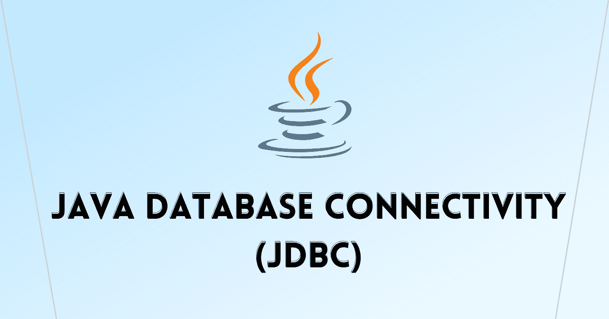
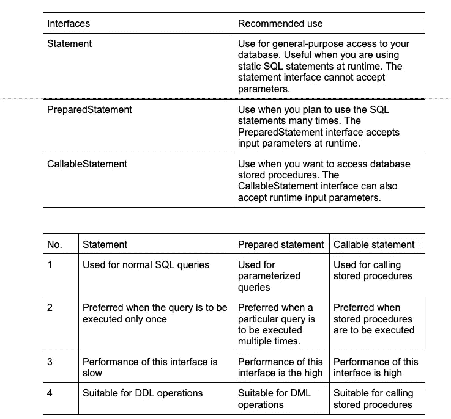

# 什么是 Java 数据库连接(JDBC)？

> 原文：<https://medium.com/codex/what-is-java-database-connectivity-jdbc-efd72a7817ce?source=collection_archive---------5----------------------->

JDBC 代表 Java 数据库连接，它是一个标准的 [**Java API**](https://docs.oracle.com/javase/7/docs/api/) ，用于 Java 编程语言和各种数据库之间独立于数据库的连接。

JDBC 是一种规范，它提供了一套完整的接口，允许对底层数据库进行可移植的访问。

# 数据库服务器和客户端概述

一个 [**数据库**](https://www.oracle.com/in/database/what-is-database/#:~:text=A%20database%20is%20an%20organized,database%20management%20system%20(DBMS).) 是一个数据仓库。数据被永久地存储在数据库中，我们可以在以后需要的时候使用查询命令来检索它。数据库客户端用于从表中检索数据并提供给用户。

# JDBC 的使用

Java 可用于编写不同类型的可执行文件，例如:

*   Java 应用程序
*   Java 小程序
*   Java Servlets
*   Java 服务器页面(JSP)
*   企业 JavaBean s(EJB)

所有这些不同的可执行文件都能够使用 JDBC 驱动程序来访问数据库并利用存储的数据。

JDBC 提供了与 ODBC 相同的功能，允许 Java 程序包含独立于数据库的代码。

# JDBC 图书馆

JDBC 库包括与数据库使用相关的每个任务的 API:

*   与数据库建立连接
*   创建 SQL 语句
*   在数据库中执行 SQL 查询
*   查看和修改结果记录

# JDBC 建筑

在 [**Java**](https://www.scaler.com/topics/java/) 中，应用程序有两种类型，CUI 也称为命令界面，GUI 也称为图形用户界面。java 应用程序连接到 JDBC API，该 API 是用于存储和检索用户信息的 java-SQL。

这个 JDBC API 由 JDBC 驱动管理器管理，驱动管理器又分为三种类型。第一个 JDBC 驱动程序由 oracle 组成，第二个由 SQL server 组成，第三个 JDBC 驱动程序由 ODBC 数据源组成。

JDBC 架构由两层组成:

**JDBC 空气污染指数:**

*   它提供应用程序到 JDBC 管理器的连接。
*   JDBC API 使用驱动程序管理器和特定于数据库的驱动程序来提供到异构数据库的透明连接。

**JDBC 驱动程序 API:**

*   这支持 JDBC 管理器到驱动程序的连接。
*   JDBC 驱动程序管理器确保使用正确的驱动程序来访问每个数据源。驱动程序管理器能够支持连接到多个异构数据库的多个并发驱动程序。

# JDBC 司机

JDBC 驱动程序实现了在 [JDBC API](https://docs.oracle.com/javase/8/docs/technotes/guides/jdbc/) 中定义的接口，用于与数据库服务器交互。

*   类型 1: JDBC-ODBC 桥驱动程序——用于开发和测试目的
*   类型 2:JDBC-本地 API-当类型 3 和 4 不可用时使用
*   类型 3: JDBC-net 纯 java-当一个程序需要访问多个数据库时使用
*   类型 4: 100%纯 Java——当我们需要访问多个数据库时使用

# JDBC 声明

一旦获得连接，我们就可以与数据库进行交互。

JDBC 语句、CallableStatement 和 PreparedStatement 接口定义了使您能够发送 SQL 或 Pl/SQL 命令以及从数据库接收数据的方法和属性。

**声明**:

*   语句用于执行静态 SQL 语句并返回其产生的结果。
*   在使用 statement 对象执行 SQL 语句之前，需要使用 connection 对象的 createStatement()方法创建一个对象。
*   语句 createStatement9)引发 SQLException。
*   创建一个语句对象，用于向数据库发送 SQL 语句。
*   不带参数的 SQL 语句通常使用对象来执行。
*   如果多次执行同一个 SQL 语句，使用 PreparedStatement 对象可能会更有效。

**程序**:

> *Statement stmt = con . create Statement()；//每次解析和执行*
> 
> *long t1 = system . current time millis()；*
> 
> *for(int I = 1；I<= 1000；i++){*
> 
> *stmt . execute update(" INSERT INTO table 1 VALUES("+I+"，"+I * 10+")；*
> 
> *}*
> 
> *long T2 = system . current time millis()；*
> 
> *system . out . println(" Time = "+(T2-t1))；*

**产量:** 1500

**准备报表:**

*   SQL 语句被预编译并存储在对象中。
*   然后，可以使用该对象多次有效地执行该语句。
*   在使用 PreparedStatement 对象执行 SQL 语句之前，需要使用 connection 对象的 prepareStatement()方法创建一个对象。
*   prepared statement prepare statement(字符串 sql)引发 SQLException。
*   创建用于向数据库发送参数化 SQL 语句的 PreparedStatement 对象。
*   带有或不带有 IN 参数的 SQL 语句可以预编译并存储在 PreparedStatement 对象中。然后，可以使用该对象多次有效地执行该语句。

**程序:**

> *prepared statement stmt = con . prepare statement(" INSERT INTO table 2 VALUES(？,?)");*
> 
> *long t1 = system . current time millis()；*
> 
> *for(int I = 1；I<= 1000；i++){*
> 
> *stmt.setInt(1，I)；*
> 
> *stmt.setInt(2，I * 10)；*
> 
> *stmt . execute update()；*
> 
> *} //解析一次，执行多次*
> 
> *long T2 = system . current time millis()；*
> 
> *system . out . println(" Time = "+(T2-t1))；*

**输出:** 718

## **可调用语句**

*   用于执行 SQL 存储过程的接口。
*   存储过程是一组使用 PL/SQL 编写并存储在数据库中的语句。
*   当客户端联系服务器时，存储过程被执行，结果被发送到客户端。
*   CallableStatement prepareCall(字符串 sql)引发 SQLException
*   创建用于调用数据库存储过程的对象。
*   对象提供了设置其输入和输出参数的方法，以及执行对存储过程的调用的方法。

# JDBC 交易

如果您的 JDBC 连接处于默认的自动提交模式，那么每个 SQL 语句都会在完成后提交给数据库。这对于简单的应用程序来说可能没问题，但是有三个原因可以解释为什么您可能想要关闭自动提交并管理自己的事务:

*   为了提高性能
*   维护业务流程的完整性
*   使用分布式事务

**交易:**

*   事务使您能够控制是否以及何时将更改应用于数据库。它将单个 SQL 语句或一组 SQL 语句视为一个逻辑单元，如果任何语句失败，整个事务都会失败。
*   要启用手动事务支持，而不是 JDBC 驱动程序默认使用的自动提交模式，请使用 connection 对象的 setAutoCommit()方法。如果向 setAutoCommit()方法传递一个布尔值 false，则关闭自动提交。您可以传递一个布尔值 true 来再次打开它。

# 结论

希望这篇关于 JDBC 的文章对您理解 Java 数据库连接有所帮助。

**阅读更多—**[**sharding sphere—JDBC 驱动**](/codex/shardingsphere-jdbc-driver-released-a-jdbc-driver-that-requires-no-code-modifications-5464c30bcd64)