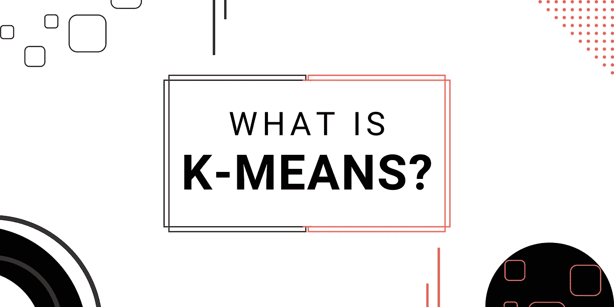

# 什么是 K-Means？

> 原文：<https://medium.com/codex/what-is-k-means-c62c5a3cf8b1?source=collection_archive---------22----------------------->

## 机器学习算法导论

**K-Means 聚类**是一种**无监督学习**方法，用于**机器学习**和**数据科学**解决聚类问题。

在这篇文章中，我会给你一个详细的解释和这个模型是如何工作的。

# 什么是 K-Means 算法？

**无监督学习**方法 K-Means 聚类将未标记数据集划分为各种聚类。k 指定了在整个过程中必须产生的预定义集群的数量；例如，如果 K=2，将创建两个集群，如果 K=3，将创建三个集群，以此类推。

它允许我们将数据聚类到不同的组中，并提供了一种简单的技术来确定未标记数据集中的组的类别，而无需任何训练。

这是一种基于质心的方法，因此每个聚类都有自己的质心。这种技术的主要目的是降低数据点和它们所属的聚类之间的距离总和。

# K-Means 算法是如何工作的？

以下阶段将解释 K-Means 算法如何工作:

*   选择数字 K 来决定集群的数量。
*   选择随机 K 点或质心。(它可以是输入数据集中的其他数据)。
*   将每个数据点分配到离它最近的质心，形成 K 个聚类。
*   计算方差并重新定位每个聚类的质心。
*   重复第三步，将每个数据点重新分配给簇的新的最近质心。

# 模型的目标

该方法从一个未标记的数据集开始，将其分成 k 个聚类，然后重复该过程，直到找不到更好的聚类。

**k-means** 聚类技术主要实现两个目标:

*   迭代地确定 K 个中心点或质心的理想值。
*   离每个数据点最近的 k 中心被分配给它。靠近给定 k 中心的数据点创建一个聚类。

# k-均值聚类的局限性

以下是 K 均值聚类的一些缺点:

*   可能很难预测聚类的数量或 k 的值
*   例如，分类的数量对结果有很大的影响。
*   广泛的数据对最终结果有重大影响。
*   在某些情况下，集群显示复杂的空间视点，因此集群不是最佳选择。

**如果你喜欢我的文章和对社区的努力，你可以支持和鼓励我，只需为我买咖啡**

# 结论

所以我希望今天你们能很好地理解，在不久的将来 **K-Means** 我会写更多的文章，我会写**解释** **更多的** **模型**并且会写**文章**让**用**源代码**实现 K-Means** 。