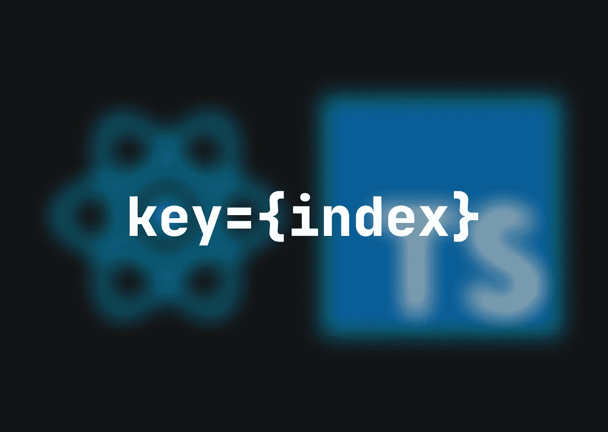

# 什么是“关键”,为什么它在 React 中很重要？

> 原文：<https://medium.com/codex/what-is-key-and-why-is-it-important-in-react-49839a3354a2?source=collection_archive---------8----------------------->

在列表中使用 TypeScript 的`map`函数呈现新组件时，我经常看到以下错误:`Warning: Each child in a list should have a unique “key” attribute.`我通常通过使用`map`函数的`index`参数作为 UI 元素上的`key`来删除这个警告。在本文中，我们将讨论`key`的重要性，以及为什么将`index`用作`key`是不好的做法。



考虑这样一种情况，您只需要将用户名的第一个字母大写来呈现彩色圆圈

```
🤙 **INDEX IS ENOUGH IN THIS CASE**{users.map((user: User, index: number) => (
  <div key={index} className='circle'>
    {user?.name?.charAt(0)?.toUpperCase()}
  </div>
))}
```

你不想从列表中添加、编辑或删除，只是用提供的信息呈现元素。

如果您想动态地将组件添加到渲染数组中，将每个组件添加到列表的开头，该怎么办？这里，`index`失去了一些魅力，因为`key 0`(第一个元素)之前的东西现在是`key 1`(变成了第二个元素)。有点奇怪，对吧？

```
🙃 **INDEX BECOMES WEIRD IF YOU WANT TO ADD ELEMENTS TO YOUR RENDERED ARRAY**const addUser = () => {
  setUsers([{ name: 'New user' }, ...users])
}return (
  <button onClick={() => addUser()}>Add user</button>
  {users.map((user: User, index: number) => (
    <div key={index} className='circle'>
      {user?.name?.charAt(0)?.toUpperCase()}
    </div>
  ))}
)
```

如果添加带有某种数据状态的附加项，这个问题会变得很明显。让我们假设您想要在每个用户头像圈旁边输入用于更新用户名的字段。由于上述情况，如果您在保存之前添加新元素，已经输入的用户名将与您的列表不同步。

```
❌ **THIS IS TOTALLY WRONG WITH THE INDEX KEY**const addUser = () => {
  setUsers([{ name: 'New user' }, ...users])
}return (
  <button onClick={() => addUser()}>Add user</button>
  {users.map((user: User, index: number) => (
    <div key={index}>
      <div className='circle'>
        {user?.name?.charAt(0)?.toUpperCase()}
      </div>
      <input />
    </div>
  ))}
)
```

问题是，当您向阵列中添加新用户时，您的`key`总是会改变(之前的`0`变成`1`，以此类推)。

我认为为呈现的元素使用一个唯一的键，比如一个`id`，是阻止这种行为的最好方法。

```
🚀 **WITH ID, THE PROBLEM IS ELIMINATED**const addUser = () => {
  setUsers([{ name: 'New user' }, ...users])
}return (
  <button onClick={() => addUser()}>Add user</button>
  {users.map((user: User, index: number) => (
    **<div key={user.id}>**
      <div className='circle'>
        {user?.name?.charAt(0)?.toUpperCase()}
      </div>
      <input />
    </div>
  ))}
)
```

👋我希望这在你寻找新的学习材料时对你有用。感谢您花时间阅读这篇文章！[订阅我的邮件列表](/@daanworks/subscribe)如果你想在以后读到更多这样的故事！